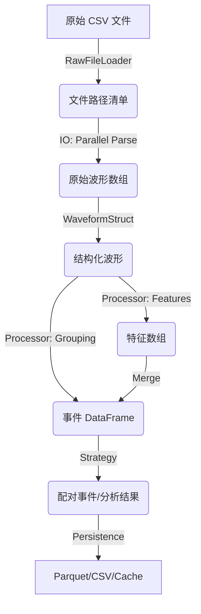

# WaveformAnalysis 架构设计文档

本文档详细说明了 `WaveformAnalysis` 工具包的规范化架构设计、核心模式以及数据流向。

---

## 1. 设计哲学

- **插件化 (Plugin-based)**: 受 `strax` 启发，将处理逻辑拆分为独立的插件，每个插件声明其“提供什么”和“依赖什么”。
- **无状态上下文 (Stateless Context)**: 核心调度器不再依赖全局可变状态（如 `self.char`），而是通过显式传递 `run_id` 来隔离不同运行的数据。
- **流式处理 (Streaming)**: 采用生成器模式，数据以分块（Chunk）形式流过处理链，极大地降低了内存占用。
- **血缘追踪 (Lineage Tracking)**: 通过哈希插件代码、版本和配置参数，确保数据的可追溯性和缓存的准确性。
- **零拷贝缓存 (Zero-copy Caching)**: 使用 `numpy.memmap` 实现磁盘数据的瞬时加载。

---

## 2. 核心架构组件

### 2.1 上下文层 (Context Layer)
- **`Context`**: 系统的核心协调者。它管理插件注册、配置分发、依赖解析以及存储调度。
- **显式 Run ID**: 所有数据操作均需指定 `run_id`，数据存储在 `_results[(run_id, data_name)]` 中。
- **重入保护 (Re-entrancy Guard)**: 自动检测并阻止插件依赖链中的循环调用。
- **依赖解析 (DAG)**: 自动构建有向无环图，确定插件的执行顺序。

### 2.2 插件层 (Plugin Layer)
- **`Plugin`**: 逻辑单元。
    - `provides`: 插件产出的数据名称。
    - `depends_on`: 插件所需的输入数据。
    - `options`: 插件的配置项（带类型验证和默认值）。
    - `version`: 插件版本号，参与血缘哈希计算。
    - `is_side_effect`: 标记插件是否具有副作用（如生成绘图、导出文件）。
    - `compute`: 核心计算逻辑。
    - `on_error` / `cleanup`: 生命周期钩子，确保异常处理和资源释放。

### 2.3 存储层 (Storage Layer)
- **`MemmapStorage`**: 负责将结构化数组持久化为二进制文件。
- **原子性与并发安全**: 
    - **原子写入**: 所有数据和元数据均先写入 `.tmp` 文件，完成后通过 `rename` 替换，确保不会产生部分写入的损坏文件。
    - **文件锁**: 使用 `.lock` 文件实现简单的进程间互斥，防止多个进程同时写入同一个缓存键。
    - **完整性校验**: 加载时验证文件大小是否等于 `count * itemsize`，并检查 `STORAGE_VERSION`。
- **侧效应隔离**: 副作用插件的输出被隔离在 `_side_effects/{run_id}/{plugin_name}` 目录下。
- **自动缓存机制**: `Context` 在运行插件前会检查磁盘缓存，如果血缘哈希匹配，则直接加载 `memmap`。

### 2.4 时间分块层 (Chunking Layer)
- **`Chunk`**: 数据的基本载体。它不仅包含 NumPy 数组，还封装了时间边界 (`start`, `end`) 和运行信息。
- **时间区间操作**: 提供 `split`, `merge`, `clip` 等操作，确保在处理连续时间流数据时的正确性。
- **严格校验**: 自动检查数据的单调性、重叠以及是否超出分块边界，是保证物理分析准确性的基石。

### 2.5 数据访问层 (Data Access Layer)
- **`WaveformDataset`**: 高级封装层，提供链式调用接口。
    - 兼容性：通过 Property 映射 `self.char` 到 `Context` 的无状态存储。
    - 灵活性：支持在链式调用中临时切换 `run_id`。
- **`IO Module`**: 
    - **流式解析**: `parse_files_generator` 支持分块读取 CSV。
    - **并行化**: 支持多进程并行解析。
- **`DAQ Adapters`**: 统一不同硬件厂商的数据组织格式。

---

## 3. 关键机制说明

### 3.1 血缘哈希 (Lineage Hash)
数据的唯一标识由以下因素决定：
1. 插件的类名。
2. 插件的版本号 (`version`)。
3. 插件所使用的配置参数（经过验证的 `Option`）。
4. 插件输出的 **标准化 DType** (`dtype.descr`)。
5. 所有上游依赖的血缘哈希。

这意味着如果你修改了阈值、更改了处理算法或升级了插件版本，系统会自动识别并重新计算，而不会错误地使用旧缓存。

### 3.2 安全性与鲁棒性
- **输出契约校验**: 自动验证插件返回的数据类型是否符合声明。
- **原子性写入**: 使用 `.tmp` 临时文件确保数据写入的完整性，防止因崩溃产生损坏的缓存。
- **并发保护**: 通过文件锁机制确保多进程环境下的缓存一致性。
- **Generator 一次性消费语义**: 
    - 插件返回的生成器被包装在 `OneTimeGenerator` 中。
    - 强制执行“一次消费”原则，防止因多次迭代导致的静默数据丢失。
    - 消费过程中自动触发磁盘持久化，后续访问将自动切换为高性能的 `memmap`。
- **血缘校验**: 加载缓存时验证元数据中的血缘信息，若逻辑发生变更（如版本升级）则自动失效并重算。
- **签名校验 (`WATCH_SIG_KEY`)**: 基于输入文件的修改时间 (mtime) 和大小 (size) 计算 SHA1 签名，确保缓存数据与原始文件的一致性。

**缓存检查工具**: 提供 `ds.print_cache_report()` 方法，允许用户在执行流水线前预览各步骤的缓存状态（内存/磁盘/有效性）。

### 3.3 性能优化路径
- **向量化**: 尽可能使用 Numpy 广播机制（如 `compute_stacked_waveforms`）。
- **并行化**: IO 密集型任务使用 `ThreadPoolExecutor`，计算密集型任务可选 `ProcessPoolExecutor`。
- **加速器**: 针对热点循环（如波形归一化）提供可选的 `Numba` 加速路径。

---

## 4. 数据流向图

---

## 5. 目录规范

- `waveform_analysis/core/`: 存放核心逻辑（Dataset, Loader, IO, Processor）。
- `waveform_analysis/utils/`: 存放通用工具（DAQ 适配器, 绘图, 向量化算法）。
- `waveform_analysis/fitting/`: 存放物理拟合模型。
- `tests/`: 严格对应的单元测试与集成测试。
- `docs/`: 模块化文档，涵盖架构、缓存、内存优化等专题。
