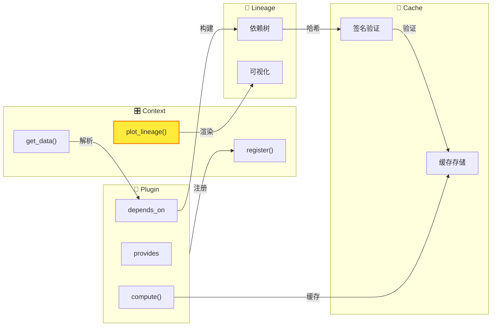

# 📚 WaveformAnalysis 文档中心

欢迎使用 WaveformAnalysis 文档！这是一个用于处理和分析 DAQ 系统波形数据的 Python 包。

---

## 🎯 核心架构概览



**四大核心组件**：

| 组件 | 职责 | 关键方法 |
|------|------|----------|
| **Context** | 中央调度器，管理插件和数据流 | `register()`, `get_data()`, `plot_lineage()` |
| **Plugin** | 数据处理单元，声明输入输出 | `provides`, `depends_on`, `compute()` |
| **Lineage** | 血缘追踪，可视化数据流 | 支持 LabVIEW / Plotly / Mermaid 三种模式 |
| **Cache** | 智能缓存，基于血缘签名验证 | 内存缓存 + 磁盘持久化 |

**亮点功能** - 一行代码可视化数据血缘：

```python
ctx.plot_lineage("df_paired", kind="plotly", interactive=True)
```

👉 详见 [血缘可视化指南](features/context/LINEAGE_VISUALIZATION_GUIDE.md)

---

## 🚀 快速开始

> ✅ 推荐路径：新代码请使用 **Context**。

**快速示例**:

```python
from waveform_analysis.core.context import Context
from waveform_analysis.core.plugins.builtin.cpu import (
    RawFilesPlugin,
    WaveformsPlugin,
    StWaveformsPlugin,
    BasicFeaturesPlugin,
)

ctx = Context(config={"data_root": "DAQ", "daq_adapter": "vx2730"})
ctx.register(RawFilesPlugin())
ctx.register(WaveformsPlugin())
ctx.register(StWaveformsPlugin())
ctx.register(BasicFeaturesPlugin())

# 处理数据
run_id = "run_001"
basic_features = ctx.get_data(run_id, "basic_features")
heights = [ch["height"] for ch in basic_features]
areas = [ch["area"] for ch in basic_features]
```

---

## 🧭 选择入口

如果你不确定从哪里开始，可以按角色选择入口：

- **第一次使用** → [用户指南](user-guide/README.md)
- **想了解功能全貌** → [功能特性](features/README.md)
- **需要插件细节** → [插件详解](plugins/README.md)
- **准备开发扩展** → [开发者指南](development/README.md)
- **只看 CLI** → [命令行工具](cli/README.md)

---

## 📂 文档导航

### ✨ [功能特性](features/README.md)
> 面向使用者：Context/Plugin 功能与使用说明

**包含**:
- 🎛️ [Context 功能](features/context/README.md) - 配置管理 | 执行预览 | 依赖分析 | 血缘可视化
- 🧭 [时间查询](features/core/README.md) - 时间字段统一 | 绝对时间查询 | DAQ 时间基准
- 🔌 [插件功能](features/plugin/README.md) - 信号处理 | 流式处理 | Strax 适配
- 🔧 [高级功能](features/advanced/README.md) - 并行执行 | 进度追踪 | CSV 处理
- 🛠️ [工具函数](features/utils/README.md) - DAQ 适配器 | 事件筛选 | 波形预览

---

### 🔌 [插件详解](plugins/README.md)
> 面向使用者：内置插件的具体用法与实现细节

**包含**:
- ⚙️ [内置插件](plugins/README.md) - 电荷计算方法对比 | Waveform Width 插件

---

### 🛠️ [开发者指南](development/README.md)
> 面向开发者：系统架构、插件开发和代码规范

**包含**:
- 🏗️ [架构设计](architecture/README.md) - 系统架构 | 工作流程 | 项目结构
- 🔧 [插件开发](development/plugin-development/README.md) - 入门教程 | 完整指南
- 📚 [API 参考](api/README.md) - API 文档 | 配置参考
- 📝 [开发规范](development/contributing/README.md) - 导入风格 | 代码约定

---

### 🔧 [命令行工具](cli/README.md)
> 命令行接口使用指南

**包含**:
- 📊 [waveform-process](cli/WAVEFORM_PROCESS.md) - 数据处理和 DAQ 扫描
- 💾 [waveform-cache](cli/WAVEFORM_CACHE.md) - 缓存管理和诊断
- 📝 [waveform-docs](cli/WAVEFORM_DOCS.md) - 文档自动生成

---

### 📝 [更新记录](updates/README.md)
> 版本更新和功能改进记录

---

## 🎯 按场景查找

| 我想... | 文档 |
| --- | --- |
| 可视化插件依赖 | [血缘图预览](features/context/LINEAGE_VISUALIZATION_GUIDE.md) |
| 预览执行计划 | [预览执行](features/context/PREVIEW_EXECUTION.md) |
| 使用信号处理插件 | [信号处理插件](features/plugin/SIGNAL_PROCESSING_PLUGINS.md) |
| 查看内置插件详解 | [插件详解](plugins/README.md) |
| 查看 DAQ 运行概览 | [DAQ 运行分析器](features/utils/DAQ_ANALYZER_GUIDE.md) |
| 并行处理数据 | [执行器管理](features/advanced/EXECUTOR_MANAGER_GUIDE.md) |
| 开发自定义插件 | [插件开发教程](features/plugin/SIMPLE_PLUGIN_GUIDE.md) |
| 理解系统架构 | [系统架构](architecture/ARCHITECTURE.md) |

---

## 🎓 推荐学习路径

### 新手路径
```
快速上手 → 常见示例 → Context 使用
```

### 使用者路径
```
血缘图预览 → 预览执行 → 使用内置插件 → 并行处理
```

### 开发者路径
```
插件开发教程 → 系统架构 → API 参考 → 开发规范
```

---

## 💡 常见问题

**Q: 从哪里开始？**
A: 使用者从 [功能特性](features/README.md) 开始，开发者从 [开发者指南](development/README.md) 开始。

**Q: 如何可视化插件依赖？**
A: 查看 [血缘图预览](features/context/LINEAGE_VISUALIZATION_GUIDE.md)。

**Q: 如何开发插件？**
A: 从 [最简单的插件教程](features/plugin/SIMPLE_PLUGIN_GUIDE.md) 开始。

---

## 🔧 文档维护

更新面包屑导航：
```bash
python3 scripts/update_breadcrumbs.py        # 实际更新
python3 scripts/update_breadcrumbs.py --dry-run  # 预览模式
```

---

## 📞 获取帮助

- **问题反馈**: GitHub Issues
- **功能请求**: GitHub Discussions
- **文档改进**: 欢迎提交 Pull Request

---

**快速链接**: [功能特性](features/README.md) | [插件详解](plugins/README.md) | [开发者指南](development/README.md) | [命令行工具](cli/README.md) | [更新记录](updates/README.md)
