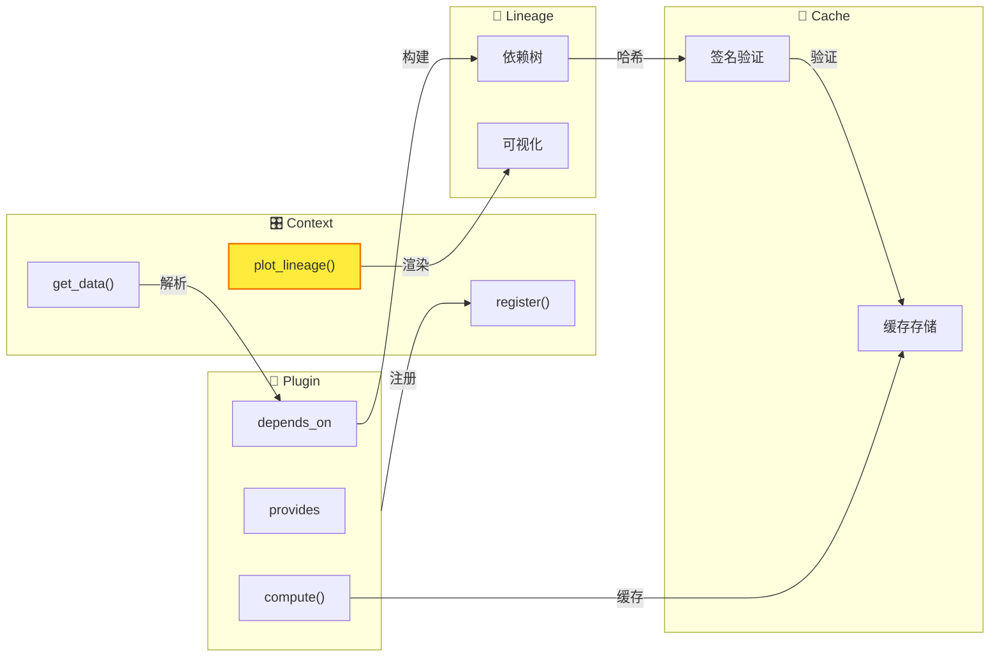

# WaveformAnalysis 文档中心

WaveformAnalysis 是一个用于处理和分析 DAQ 系统波形数据的 Python 包。

## 🎯 核心架构概览



**四大核心组件**：

| 组件 | 职责 | 关键方法 |
|------|------|----------|
| **Context** | 中央调度器，管理插件和数据流 | `register()`, `get_data()`, `plot_lineage()` |
| **Plugin** | 数据处理单元，声明输入输出 | `provides`, `depends_on`, `compute()` |
| **Lineage** | 血缘追踪，可视化数据流 | 支持 LabVIEW / Plotly / Mermaid 三种模式 |
| **Cache** | 智能缓存，基于血缘签名验证 | 内存缓存 + 磁盘持久化 |

**亮点功能** - 一行代码可视化数据血缘：

```python
ctx.plot_lineage("df_paired", kind="plotly", interactive=True)
```

👉 详见 [血缘可视化指南](features/context/LINEAGE_VISUALIZATION_GUIDE.md)

---

## 🚀 快速开始

> **新手推荐**：[快速开始指南](user-guide/QUICKSTART_GUIDE.md) - 5 分钟上手，只看一页就能跑起来

> ✅ 推荐路径：新代码请使用 **Context**。

推荐使用 **Context** API 进行数据处理：

**快速示例**:

```python
from waveform_analysis.core.context import Context
from waveform_analysis.core.plugins.builtin.cpu import (
    RawFilesPlugin,
    WaveformsPlugin,
    StWaveformsPlugin,
    BasicFeaturesPlugin,
)

ctx = Context(config={"data_root": "DAQ", "daq_adapter": "vx2730"})
ctx.register(RawFilesPlugin())
ctx.register(WaveformsPlugin())
ctx.register(StWaveformsPlugin())
ctx.register(BasicFeaturesPlugin())

# 处理数据
run_id = "run_001"
basic_features = ctx.get_data(run_id, "basic_features")
heights = [ch["height"] for ch in basic_features]
areas = [ch["area"] for ch in basic_features]
```

## 文档导航

根据你的需求选择入口：

| 角色 | 入口 | 说明 |
|------|------|------|
| 新手 | [用户指南](user-guide/README.md) | 快速上手和常见示例 |
| 使用者 | [功能特性](features/README.md) | Context/Plugin 功能与使用说明 |
| 使用者 | [插件详解](plugins/README.md) | 内置插件的具体用法与实现细节 |
| 开发者 | [开发者指南](development/README.md) | 系统架构、插件开发和代码规范 |
| 运维 | [命令行工具](cli/README.md) | CLI 使用指南 |

### 功能特性

- [Context 功能](features/context/README.md) - 配置管理、执行预览、依赖分析、血缘可视化
- [插件功能](plugins/README.md) - 信号处理、流式处理、Strax 适配
- [高级功能](features/advanced/README.md) - 并行执行、进度追踪、CSV 处理
- [工具函数](features/utils/README.md) - DAQ 适配器、事件筛选、波形预览

### 开发者资源

- [架构设计](architecture/README.md) - 系统架构、工作流程、项目结构
- [插件开发](development/plugin-development/README.md) - 入门教程、完整指南
- [API 参考](api/README.md) - API 文档、配置参考
- [开发规范](development/contributing/README.md) - 导入风格、代码约定

### 命令行工具

- [waveform-process](cli/WAVEFORM_PROCESS.md) - 数据处理和 DAQ 扫描
- [waveform-cache](cli/WAVEFORM_CACHE.md) - 缓存管理和诊断
- [waveform-docs](cli/WAVEFORM_DOCS.md) - 文档自动生成

## 按场景查找

| 场景 | 文档 |
|------|------|
| 可视化插件依赖 | [血缘图预览](features/context/LINEAGE_VISUALIZATION_GUIDE.md) |
| 预览执行计划 | [预览执行](features/context/PREVIEW_EXECUTION.md) |
| 使用信号处理插件 | [信号处理插件](plugins/tutorials/SIGNAL_PROCESSING_PLUGINS.md) |
| 查看 DAQ 运行概览 | [DAQ 运行分析器](features/utils/DAQ_ANALYZER_GUIDE.md) |
| 并行处理数据 | [执行器管理](features/advanced/EXECUTOR_MANAGER_GUIDE.md) |
| 开发自定义插件 | [插件开发教程](plugins/tutorials/SIMPLE_PLUGIN_GUIDE.md) |
| 理解系统架构 | [系统架构](architecture/ARCHITECTURE.md) |

## 学习路径

### 新手

1. [快速上手](user-guide/QUICKSTART_GUIDE.md)
2. [常见示例](user-guide/EXAMPLES_GUIDE.md)
3. [Context 使用](features/context/README.md)

### 使用者

1. [血缘图预览](features/context/LINEAGE_VISUALIZATION_GUIDE.md)
2. [预览执行](features/context/PREVIEW_EXECUTION.md)
3. [内置插件](plugins/README.md)
4. [并行处理](features/advanced/EXECUTOR_MANAGER_GUIDE.md)

### 开发者

1. [插件开发教程](plugins/tutorials/SIMPLE_PLUGIN_GUIDE.md)
2. [系统架构](architecture/ARCHITECTURE.md)
3. [API 参考](api/README.md)
4. [开发规范](development/contributing/README.md)

## 常见问题

**Q: 从哪里开始？**

使用者从 [功能特性](features/README.md) 开始，开发者从 [开发者指南](development/README.md) 开始。

**Q: 如何可视化插件依赖？**

查看 [血缘图预览](features/context/LINEAGE_VISUALIZATION_GUIDE.md)。

**Q: 如何开发插件？**

从 [插件开发教程](plugins/tutorials/SIMPLE_PLUGIN_GUIDE.md) 开始。

## 获取帮助

- 问题反馈: GitHub Issues
- 功能请求: GitHub Discussions
- 文档改进: 欢迎提交 Pull Request

## 更多

- [更新记录](updates/README.md) - 版本更新和功能改进记录
