# 分析查询与批量运行

**导航**: [文档中心](../README.md) > [系统架构与数据模型](README.md) > 分析查询与批量运行

Accessor 位于正式产物之后，负责加载、连接、筛选和展示已有结果。它不声明 `provides`，不进入
Plugin DAG，也不建立新的正式缓存身份；但它可以调用 Context，因此缺失的正式输入仍可能按已有
DAG 被计算出来。

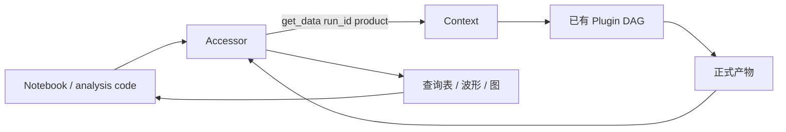

## 1. 职责边界

### 1.1 Plugin、Accessor 与 View

| 层 | 负责 | 不负责 |
| --- | --- | --- |
| Plugin | 计算一个可复用正式产物，声明依赖、version 和输出契约 | 面向一次交互临时组合多个结果 |
| Accessor | 按 ID 加载、连接、筛选、比较和绘图 | 发布新 DAG 节点或隐藏可复用算法 |
| RecordsView | 按 `record_id` 解释 records-backed 波形 | 构建 records/pool 或替代波形 Plugin |

Accessor 的“只读”指它不改写正式产物、不定义新的 lineage，并非禁止执行。第一次查询某个尚未缓存的
正式产物时，`Context.get_data()` 会正常执行该产物的 Plugin DAG。

### 1.2 何时应新增 Plugin

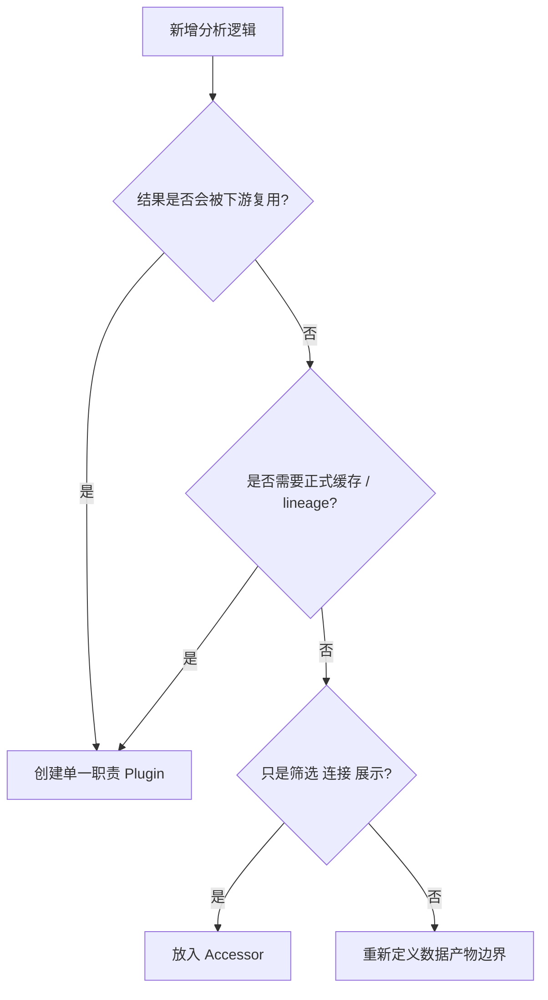

如果计算结果会成为另一个 Plugin 的输入、需要独立版本和缓存，或其算法语义需要跨分析复用，它就
不是 Accessor 的临时查询，应发布为正式产物。

## 2. 数据获取模型

### 2.1 显式 Context 与 run_id

Accessor 必须绑定 Context 和明确的 `run_id`。内部数据获取仍使用公开入口：

```python
class ExampleAccessor:
    def __init__(self, ctx, run_id: str):
        self.ctx = ctx
        self.run_id = run_id

    def rows(self):
        entities = self.ctx.get_data(self.run_id, "peaklets")
        relations = self.ctx.get_data(self.run_id, "peaklet_components")
        return entities, relations
```

不允许通过 Context 私有 `_data`、Plugin 实例属性、内部 records bundle 或缓存文件路径取数。私有
对象没有公开的 run、lineage 和 schema 校验，跨版本或并行运行时容易错配。

### 2.2 按需加载顺序

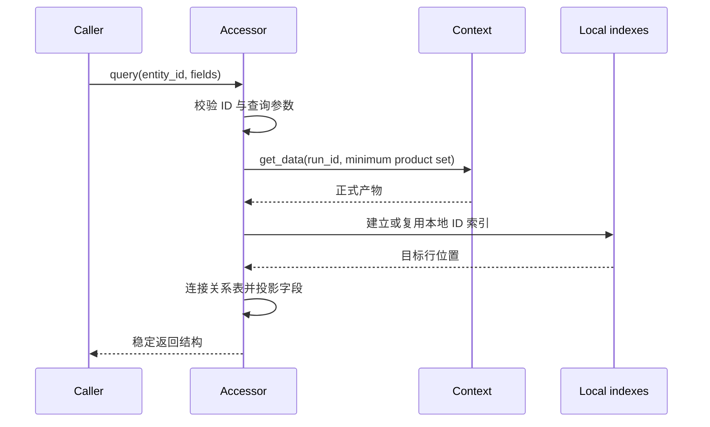

查询先确定最小产物集合，再批量加载并建立索引。属性或生成器不应在每次迭代中重复调用
`get_data`；对 N 个 ID 的查询应优先使用批量索引，而不是产生 N+1 次全表扫描。

### 2.3 本地索引与正式缓存

| 数据 | 生命周期 | 是否正式产物 |
| --- | --- | --- |
| Context 返回的 Plugin 结果 | 由 run、lineage 和 Storage 管理 | 是 |
| Accessor 的 `id -> row` 字典 | Accessor 实例或一次查询 | 否 |
| 临时筛选 mask | 单次方法调用 | 否 |
| 为绘图准备的 DataFrame | 调用返回值 | 否 |
| Accessor 内短期波形切片缓存 | Accessor 实例，需受容量控制 | 否 |

Accessor 本地缓存只优化查询，不替代 Context 缓存。若 Context 配置、run 或输入产物发生变化，应新建
Accessor 或显式清空本地索引，不能继续复用绑定旧数据的实例。

## 3. 查询组合

### 3.1 主实体、关系表和派生表

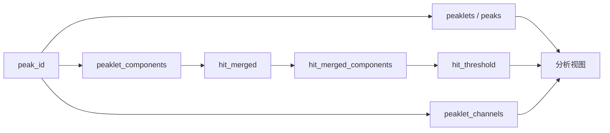

成员关系表回答“由哪些实体组成”，派生聚合表回答“按某维度汇总后是什么”。Accessor 应按问题读取
对应正式产物，不能用 `peaklet_channels` 反推成员，也不能每次从成员临时重复计算已有通道聚合。

### 3.2 波形获取

需要 record 波形时，Accessor 使用 `records_view(ctx, run_id)` 并选择明确的 pool；需要 peaklet
求和波形时，读取 `peaklet_waveforms + peaklet_waveform_pool`。两组访问不能共享 ID 空间。

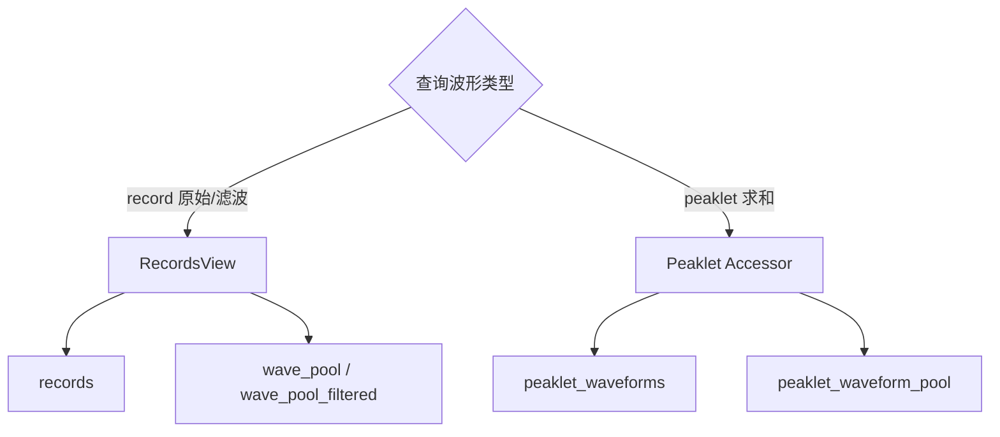

### 3.3 当前入口的职责

| 入口 | 主问题 | 典型正式输入 |
| --- | --- | --- |
| RecordsView | 按 record ID 获取原始/滤波 wave 与 signal | `records`、对应 wave pool |
| PeakChannelAccessor | 按 peak/peaklet ID 获取通道贡献和波形 | `peaklet_channels`、关系产物、波形产物 |
| S1S2PairAccessor | 查询已有 S1/S2 配对结果及相关实体 | 配对产物与对应 peak 产物 |

公开签名和字段以总站“Accessor 接口”与 RecordsView 参考页为准；本页只定义共同架构边界。

## 4. 返回契约

Accessor 方法应明确：

1. 输入使用哪个 ID 空间，是否接受标量与批量 ID；
2. 返回数组、结构化表、DataFrame 或绘图对象；
3. 字段、单位、排序和输入顺序是否保留；
4. 未知 ID 是抛出 `KeyError`、忽略还是返回空结果；
5. 空输入返回何种带 schema 的空结构；
6. 波形是否 baseline corrected、polarity normalized、padded 或复制。

未定义这些行为会让 Notebook 只能依赖当前实现偶然产生的类型和顺序，后续无法稳定演进。

## 5. 性能边界

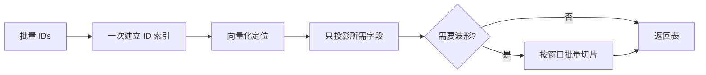

- 对同一正式产物只调用一次 `get_data`，再在内存中复用引用；
- 大数组优先字段投影和批量 mask，避免逐行 Python 对象；
- 波形只在需要时加载，并限制批量大小与时间窗；
- 绘图降采样和交互选择属于展示策略，不应改变正式数值产物；
- 性能测试同时记录 Context 加载次数、Accessor 索引构建时间和峰值内存。

## 6. 故障原因

| 现象 | 可能原因 | 检查 |
| --- | --- | --- |
| 查询返回空 | ID 不属于当前 run、输入产物为空或 source 选择错误 | run_id、ID 空间、最小输入集合 |
| 每次属性访问都很慢 | 重复 `get_data`、全表扫描或重复建索引 | 调用次数与本地索引生命周期 |
| 字段来自旧版本 | Accessor 复用旧实例或正式缓存未失效 | 产物 lineage、Plugin version、本地缓存 |
| 通道结果缺少成员 | 把聚合表当关系表，或 `(board, channel)` 连接错误 | `peaklet_components` 与 `peaklet_channels` |
| 波形属于错误实体 | records/pool 配错、peak ID 与 record ID 混用 | 波形配对、ID 字段和 run_id |
| Accessor 查询触发大量计算 | 请求的正式输入未缓存，或查询加载了超出需要的目标 | `preview_execution` 与数据加载清单 |

## 7. 维护检查

1. 每个方法记录所需正式产物，不读取私有运行时对象。
2. Context 和 `run_id` 显式传递，不使用模块级当前 run。
3. ID、空输入、未知 ID、排序、字段和波形语义有测试。
4. 本地索引不跨 run 或 lineage 复用。
5. 新可复用计算及时提升为 Plugin，不在 Accessor 中形成第二套缓存体系。

参见[数据产物与波形访问](DATA_PRODUCTS.md)了解 ID join 与不同索引产物和 pool 的配对。

---

## 批量运行：多 Run 调度与执行

> **状态：开发中。** 本节区分当前代码已经实现的行为与尚未稳定的契约。`BatchProcessor` 可以组织
> 多 run 请求、自定义回调、配置网格、并发、重试和取消，但接口与存储策略仍可能继续收敛。

多 run 执行由一组独立的单 run 请求组成。每个任务继续通过 Context 解析 Plugin DAG、lineage 和
缓存；BatchProcessor 在该边界之外负责调度和汇总。

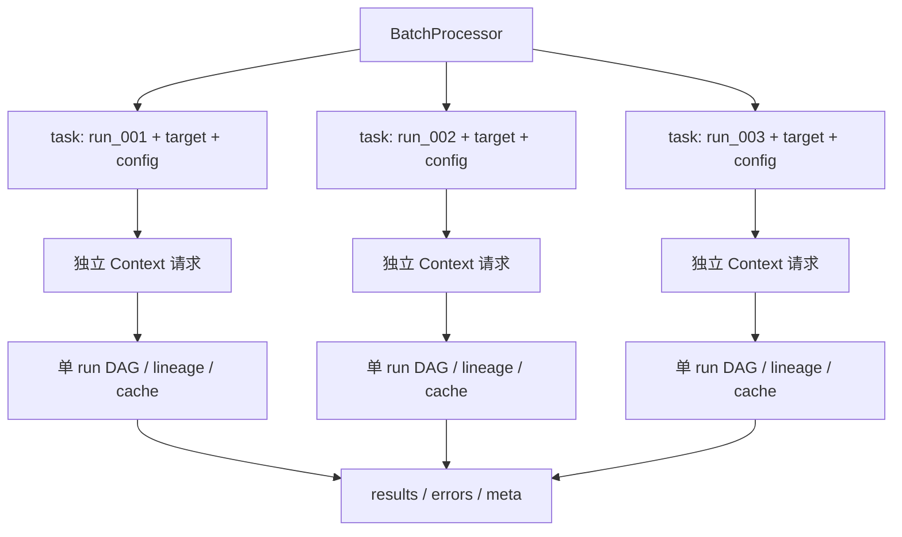

### 8. 当前能力

#### 8.1 三类批量入口

| 入口 | 任务定义 | 当前返回 |
| --- | --- | --- |
| `process_runs` | 对每个 run 请求同一 `data_name` | `results`、`errors`、`meta`、`ordered_run_ids` |
| `process_func` | 对每个 run 调用 `func(context, run_id)` | 同上 |
| `process_runs_with_config_grid` | 对多组 Plugin 配置分别执行 run 列表 | 配置列表与每组 batch 结果 |

`process_runs` 和 `process_func` 都支持线程/进程、错误策略、进度、Jupyter 轮询、重试和临时存储
策略；显式 `CancellationToken` 当前只由 `process_runs` 接收。配置网格按配置项外层顺序执行，每一组
配置内部再处理 run 列表。

#### 8.2 返回状态

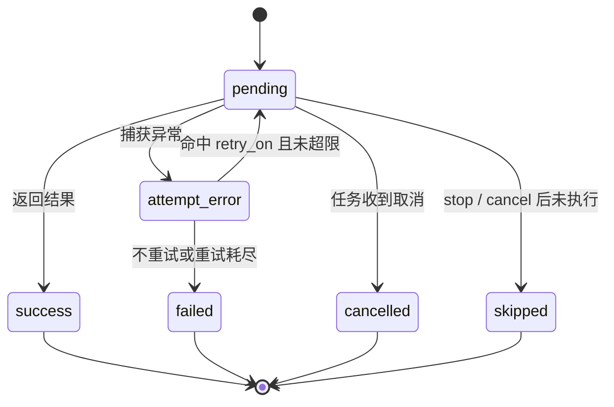

每个 run 的 `meta` 当前记录 `status`、`elapsed` 和 `attempts`。`errors` 保存异常类型、消息和
traceback；`ordered_run_ids` 保留调用端输入顺序，因为并发完成顺序不稳定。

### 9. 单 Run 执行单元

#### 9.1 任务身份

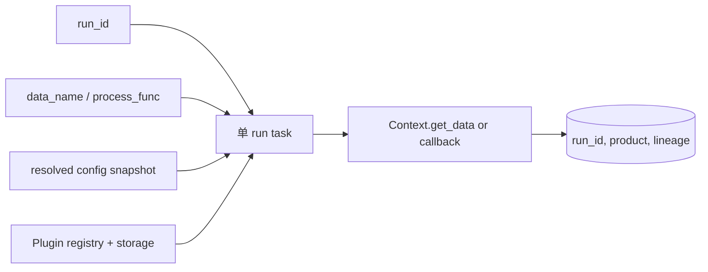

Plugin 的一次 `compute(context, run_id, ...)` 仍只处理一个 run。同一 DAG 可以对多个 run 重复
解析，但缓存键和实体 ID 空间按 run 隔离。

#### 9.2 跨 Run ID

| 使用方式 | 是否安全 | 原因 |
| --- | --- | --- |
| `(run_id, peak_id)` | 是，仍需记录 lineage/配置条件 | run 明确限定局部 ID |
| 只保存 `peak_id` | 否 | 不同 run 可产生相同局部 ID |
| 把两个 run 的实体数组直接拼接 | 仅在增加 run 字段并统一 schema 后 | 否则来源无法恢复 |
| 将一个 run 的关系表 join 到另一个 run | 否 | 父子 ID 空间不同 |

### 10. 串行、线程与进程

#### 10.1 执行模式

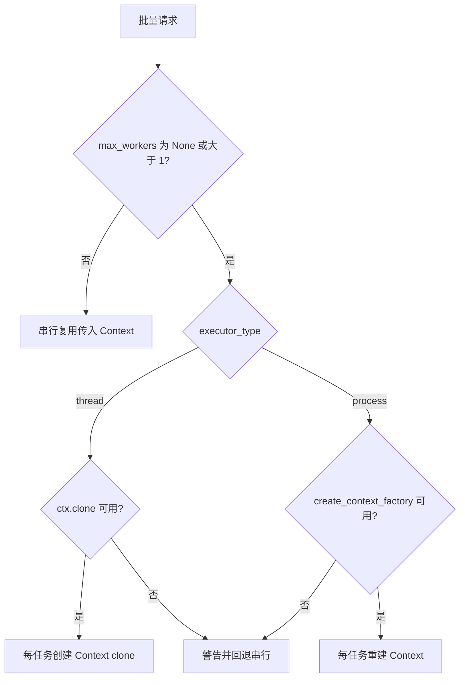

| 模式 | Context 来源 | 主要约束 |
| --- | --- | --- |
| 串行 | 直接使用 `BatchProcessor.context` | 同一时刻只处理一个 run |
| 线程 | 默认尝试 `ctx.clone`，或显式 `context_factory` | Context 实例按任务隔离；共享 Storage 需支持并发 |
| 进程 | 默认尝试 `ctx.create_context_factory()` | 工厂、Plugin 注册和自定义回调必须可序列化/重建 |

并发请求没有可用工厂时，当前实现发出警告并回退到串行，而不是让多个 worker 共享同一个可变 Context。

#### 10.2 Context 隔离

Context 包含内存结果、resolved config 缓存、run config 缓存、性能统计和 Plugin 实例。多个 worker
直接共享同一实例会让运行时状态互相覆盖。clone/factory 复制注册与配置，但为任务建立独立运行状态；
持久化 Storage 是否共享由存储策略决定。

### 11. 存储目录策略

#### 11.1 当前代码行为

| `storage_dir_strategy` | 当前并行行为 | 稳定性说明 |
| --- | --- | --- |
| `shared` | 保留 Context 原存储目录 | 已实现；并发写安全取决于 Storage |
| `per_worker` | 每次任务尝试创建临时 `batch_cache_*` 目录 | 已实现，任务结束可清理 |
| `readonly` | 当前与 `per_worker` 走同一临时目录分支 | **名称未形成强制只读契约** |

串行模式下，非 `shared` 策略当前会被忽略并回退为 `shared`。因此不能根据参数名假设
`readonly` 已禁止计算或写入；需要真正只读语义的调用方目前应在执行前验证目标缓存，并避免把该
名称作为安全边界。

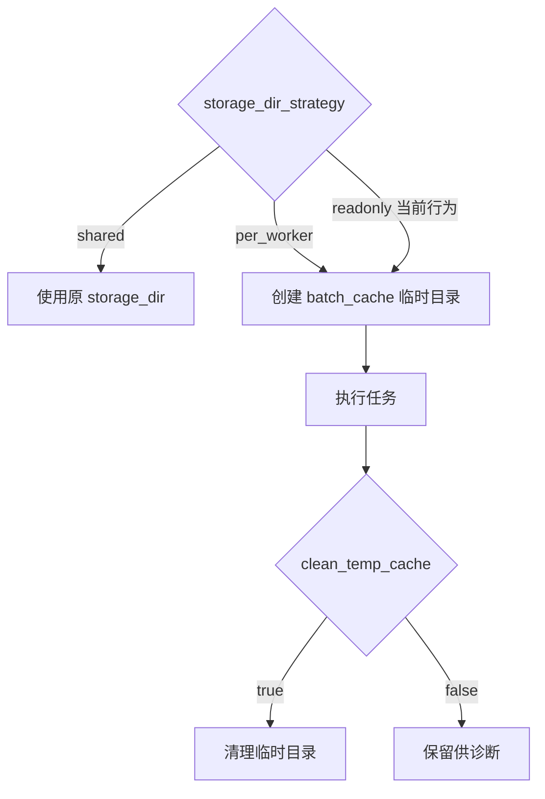

### 12. 配置网格

#### 12.1 任务矩阵

两个 run 与两组配置形成四个逻辑任务：

| 配置索引 | Plugin 配置 | run |
| ---: | --- | --- |
| 0 | `{threshold: 5}` | `run_001` |
| 0 | `{threshold: 5}` | `run_002` |
| 1 | `{threshold: 8}` | `run_001` |
| 1 | `{threshold: 8}` | `run_002` |

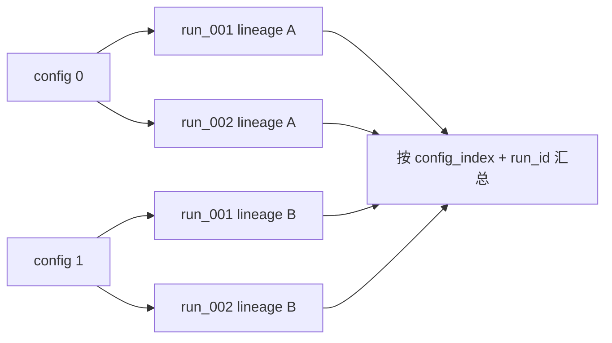

每组配置通过 `ctx.set_config(config, plugin_name=plugin_name)` 应用。tracked 配置变化产生新的
lineage；汇总结果必须保留 `config_index`、原始配置和 run_id，不能只按数组位置解释来源。

#### 12.2 当前限制

配置网格目前不是一个全局二维调度器：外层配置串行推进，每一组内部才使用 `process_runs` 的并发
策略。使用同一 Context 的串行路径会逐组修改 Plugin 配置；调用方不应在网格执行期间并发复用该
Context 做其他请求。

### 13. 重试、取消与错误策略

#### 13.1 重试

`retries` 是额外尝试次数，只有异常属于 `retry_on` 指定类型时才重试。每次并行尝试重新调用
`context_factory()`；临时存储可在尝试之间清理。重试不会把失败结果写成成功缓存，但底层 Plugin 在
异常前是否留下不完整外部副作用，仍由其存储原子性保证。

#### 13.2 错误策略

| `on_error` | 行为 |
| --- | --- |
| `continue` | 记录失败，继续其他 run |
| `stop` | 记录当前失败，取消/跳过尚未开始的任务 |
| `raise` | 重新抛出异常并终止调用 |

已开始的并发任务可能无法瞬时停止，因此 `stop` 或取消后仍需根据 `meta` 判断哪些任务 success、failed、
cancelled 或 skipped，不能只看结果字典长度。

### 14. 跨 Run 汇总

跨 run 统计发生在单 run 正式产物完成之后。汇总表至少保留：

| 字段 | 用途 |
| --- | --- |
| `run_id` | 限定实体 ID 和输入采集 |
| `data_name` / operation | 记录目标语义 |
| config 或 `config_index` | 区分扫描条件 |
| lineage 摘要 | 证明结果身份兼容 |
| status / attempts / elapsed | 描述执行结果 |
| error type / message | 支持失败分析与选择性重试 |

若跨 run 汇总本身需要被下游重复使用，应建立独立且可追溯的产物边界；当前 BatchProcessor 返回值是
调度结果，不自动成为 Plugin DAG 中的正式跨 run 产物。

### 15. 批量故障原因

| 现象 | 可能原因 | 检查 |
| --- | --- | --- |
| 请求并行却串行执行 | clone/factory 不可用，触发串行回退 | warning、`max_workers`、Context factory |
| 进程模式启动失败 | 工厂、Plugin 或回调不可序列化 | `create_context_factory` 与自定义函数定义位置 |
| run 之间状态串扰 | worker 共享了可变 Context 或共享外部全局对象 | 每任务 Context 和 Plugin 实例 |
| 缓存写入冲突 | `shared` Storage 不支持当前并发写模式 | 存储目录、原子写和锁行为 |
| `readonly` 仍发生计算 | 当前实现未强制只读，只切换临时目录 | 实际 `_apply_storage_dir_strategy` 行为 |
| 重试后结果重复 | 自定义回调存在非幂等外部副作用 | callback 的写入与去重策略 |
| 汇总缺少部分 run | `stop`、取消或失败只记录在 `meta/errors` | `ordered_run_ids` 与每个状态 |

### 16. 开发中事项

以下内容尚不应写成稳定保证：

1. `readonly` 的强制只读语义和预检行为；
2. 配置网格的跨配置全局调度与资源配额；
3. 分布式执行器、远程队列和跨主机缓存协调；
4. 正式的跨 run 数据产物与 lineage 模型；
5. 失败恢复点、断点续跑和幂等外部副作用协议。

### 17. 批量维护检查

1. 每个任务显式保存 run_id、目标、配置和状态。
2. 并发任务使用独立 Context；共享 Storage 的并发语义经过测试。
3. retry 仅处理明确异常类型，自定义回调说明幂等性。
4. 汇总保留失败和 skipped 项，不把缺失当作空结果。
5. 文档将当前实现与未来设计分开，尤其不把 `readonly` 名称写成已实现保证。

参见[系统架构与数据流](ARCHITECTURE.md)了解 Context 边界，参见
[插件执行链与缓存](PLUGIN_DAG_LINEAGE_CACHE.md)了解每个单 run 任务的结果身份。
