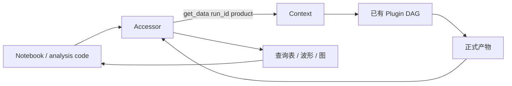
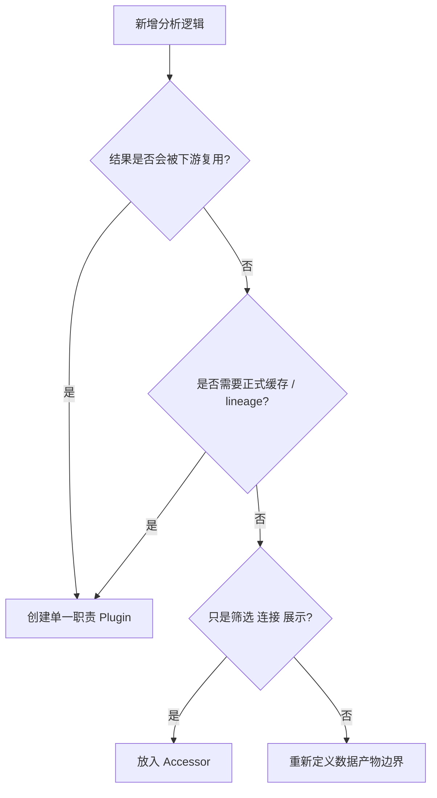
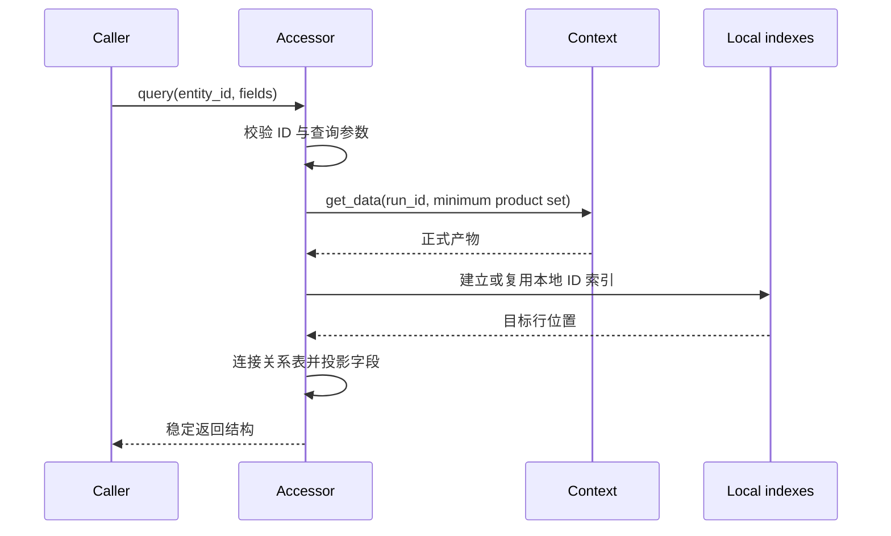
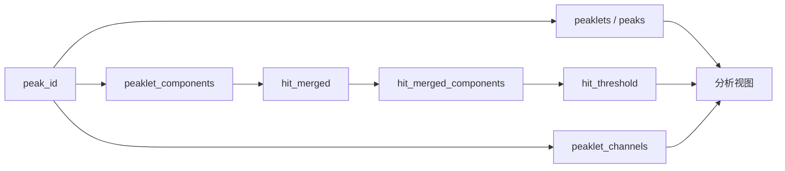
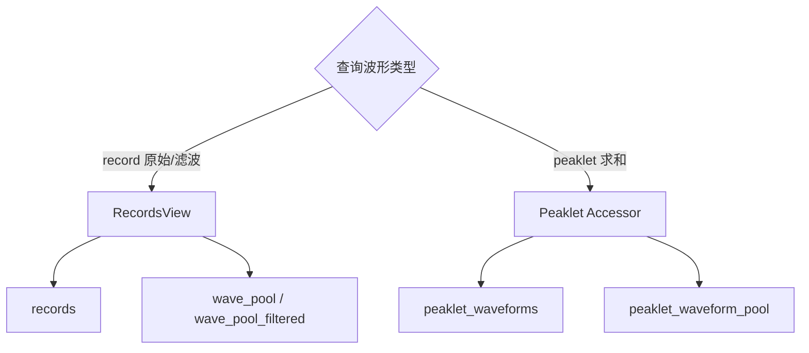
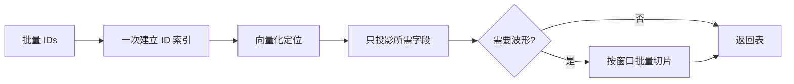

# 分析查询：Accessor 与只读数据访问

**导航**: [文档中心](../README.md) > [系统架构与数据模型](README.md) > 分析查询：Accessor 与只读数据访问

Accessor 位于正式产物之后，负责加载、连接、筛选和展示已有结果。它不声明 `provides`，不进入
Plugin DAG，也不建立新的正式缓存身份；但它可以调用 Context，因此缺失的正式输入仍可能按已有
DAG 被计算出来。



## 1. 职责边界

### 1.1 Plugin、Accessor 与 View

| 层 | 负责 | 不负责 |
| --- | --- | --- |
| Plugin | 计算一个可复用正式产物，声明依赖、version 和输出契约 | 面向一次交互临时组合多个结果 |
| Accessor | 按 ID 加载、连接、筛选、比较和绘图 | 发布新 DAG 节点或隐藏可复用算法 |
| RecordsView | 按 `record_id` 解释 records-backed 波形 | 构建 records/pool 或替代波形 Plugin |

Accessor 的“只读”指它不改写正式产物、不定义新的 lineage，并非禁止执行。第一次查询某个尚未缓存的
正式产物时，`Context.get_data()` 会正常执行该产物的 Plugin DAG。

### 1.2 何时应新增 Plugin



如果计算结果会成为另一个 Plugin 的输入、需要独立版本和缓存，或其算法语义需要跨分析复用，它就
不是 Accessor 的临时查询，应发布为正式产物。

## 2. 数据获取模型

### 2.1 显式 Context 与 run_id

Accessor 必须绑定 Context 和明确的 `run_id`。内部数据获取仍使用公开入口：

```python
class ExampleAccessor:
    def __init__(self, ctx, run_id: str):
        self.ctx = ctx
        self.run_id = run_id

    def rows(self):
        entities = self.ctx.get_data(self.run_id, "peaklets")
        relations = self.ctx.get_data(self.run_id, "peaklet_components")
        return entities, relations
```

不允许通过 Context 私有 `_data`、Plugin 实例属性、内部 records bundle 或缓存文件路径取数。私有
对象没有公开的 run、lineage 和 schema 校验，跨版本或并行运行时容易错配。

### 2.2 按需加载顺序



查询先确定最小产物集合，再批量加载并建立索引。属性或生成器不应在每次迭代中重复调用
`get_data`；对 N 个 ID 的查询应优先使用批量索引，而不是产生 N+1 次全表扫描。

### 2.3 本地索引与正式缓存

| 数据 | 生命周期 | 是否正式产物 |
| --- | --- | --- |
| Context 返回的 Plugin 结果 | 由 run、lineage 和 Storage 管理 | 是 |
| Accessor 的 `id -> row` 字典 | Accessor 实例或一次查询 | 否 |
| 临时筛选 mask | 单次方法调用 | 否 |
| 为绘图准备的 DataFrame | 调用返回值 | 否 |
| Accessor 内短期波形切片缓存 | Accessor 实例，需受容量控制 | 否 |

Accessor 本地缓存只优化查询，不替代 Context 缓存。若 Context 配置、run 或输入产物发生变化，应新建
Accessor 或显式清空本地索引，不能继续复用绑定旧数据的实例。

## 3. 查询组合

### 3.1 主实体、关系表和派生表



成员关系表回答“由哪些实体组成”，派生聚合表回答“按某维度汇总后是什么”。Accessor 应按问题读取
对应正式产物，不能用 `peaklet_channels` 反推成员，也不能每次从成员临时重复计算已有通道聚合。

### 3.2 波形获取

需要 record 波形时，Accessor 使用 `records_view(ctx, run_id)` 并选择明确的 pool；需要 peaklet
求和波形时，读取 `peaklet_waveforms + peaklet_waveform_pool`。两组访问不能共享 ID 空间。



### 3.3 当前入口的职责

| 入口 | 主问题 | 典型正式输入 |
| --- | --- | --- |
| RecordsView | 按 record ID 获取原始/滤波 wave 与 signal | `records`、对应 wave pool |
| PeakChannelAccessor | 按 peak/peaklet ID 获取通道贡献和波形 | `peaklet_channels`、关系产物、波形产物 |
| S1S2PairAccessor | 查询已有 S1/S2 配对结果及相关实体 | 配对产物与对应 peak 产物 |

公开签名和字段以总站“Accessor 接口”与 RecordsView 参考页为准；本页只定义共同架构边界。

## 4. 返回契约

Accessor 方法应明确：

1. 输入使用哪个 ID 空间，是否接受标量与批量 ID；
2. 返回数组、结构化表、DataFrame 或绘图对象；
3. 字段、单位、排序和输入顺序是否保留；
4. 未知 ID 是抛出 `KeyError`、忽略还是返回空结果；
5. 空输入返回何种带 schema 的空结构；
6. 波形是否 baseline corrected、polarity normalized、padded 或复制。

未定义这些行为会让 Notebook 只能依赖当前实现偶然产生的类型和顺序，后续无法稳定演进。

## 5. 性能边界



- 对同一正式产物只调用一次 `get_data`，再在内存中复用引用；
- 大数组优先字段投影和批量 mask，避免逐行 Python 对象；
- 波形只在需要时加载，并限制批量大小与时间窗；
- 绘图降采样和交互选择属于展示策略，不应改变正式数值产物；
- 性能测试同时记录 Context 加载次数、Accessor 索引构建时间和峰值内存。

## 6. 故障原因

| 现象 | 可能原因 | 检查 |
| --- | --- | --- |
| 查询返回空 | ID 不属于当前 run、输入产物为空或 source 选择错误 | run_id、ID 空间、最小输入集合 |
| 每次属性访问都很慢 | 重复 `get_data`、全表扫描或重复建索引 | 调用次数与本地索引生命周期 |
| 字段来自旧版本 | Accessor 复用旧实例或正式缓存未失效 | 产物 lineage、Plugin version、本地缓存 |
| 通道结果缺少成员 | 把聚合表当关系表，或 `(board, channel)` 连接错误 | `peaklet_components` 与 `peaklet_channels` |
| 波形属于错误实体 | records/pool 配错、peak ID 与 record ID 混用 | 波形配对、ID 字段和 run_id |
| Accessor 查询触发大量计算 | 请求的正式输入未缓存，或查询加载了超出需要的目标 | `preview_execution` 与数据加载清单 |

## 7. 维护检查

1. 每个方法记录所需正式产物，不读取私有运行时对象。
2. Context 和 `run_id` 显式传递，不使用模块级当前 run。
3. ID、空输入、未知 ID、排序、字段和波形语义有测试。
4. 本地索引不跨 run 或 lineage 复用。
5. 新可复用计算及时提升为 Plugin，不在 Accessor 中形成第二套缓存体系。

参见[数据产物：实体关系与派生结果](DATA_PRODUCTS.md)了解 ID join，参见
[波形数据：records 与 Wave Pool 的配对访问](RECORDS_WAVE_POOL.md)了解不同索引产物与 pool 的配对。
