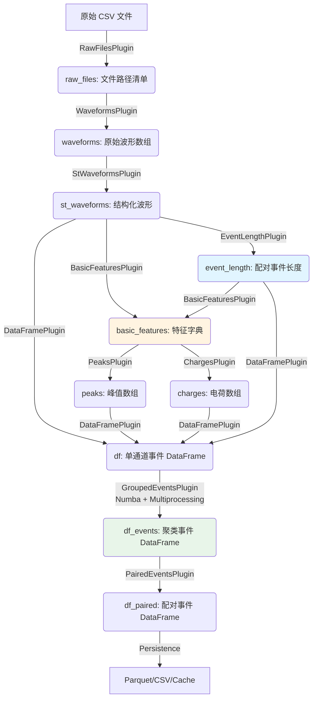

**导航**: [文档中心](../README.md) > [架构设计](README.md) > 系统架构

---

# WaveformAnalysis 架构设计文档

本文档详细说明了 `WaveformAnalysis` 工具包的规范化架构设计、核心模式以及数据流向。

---

## 1. 设计哲学

- **插件化 (Plugin-based)**: 受 `strax` 启发，将处理逻辑拆分为独立的插件，每个插件声明其“提供什么”和“依赖什么”。
- **无状态上下文 (Stateless Context)**: 核心调度器不再依赖全局可变状态（如 `self.char`），而是通过显式传递 `run_id` 来隔离不同运行的数据。
- **流式处理 (Streaming)**: 采用生成器模式，数据以分块（Chunk）形式流过处理链，极大地降低了内存占用。
- **血缘追踪 (Lineage Tracking)**: 通过哈希插件代码、版本和配置参数，确保数据的可追溯性和缓存的准确性。
- **零拷贝缓存 (Zero-copy Caching)**: 使用 `numpy.memmap` 实现磁盘数据的瞬时加载。

---

## 2. 核心架构组件

### 2.1 上下文层 (Context Layer)
- **`Context`**: 系统的核心协调者。它管理插件注册、配置分发、依赖解析以及存储调度。
- **显式 Run ID**: 所有数据操作均需指定 `run_id`，数据存储在 `_results[(run_id, data_name)]` 中.
- **重入保护 (Re-entrancy Guard)**: 自动检测并阻止插件依赖链中的循环调用。
- **依赖解析 (DAG)**: 自动构建有向无环图，确定插件的执行顺序。

### 2.2 插件层 (Plugin Layer)
- **`Plugin`**: 逻辑单元。
    - `provides`: 插件产出的数据名称。
    - `depends_on`: 插件所需的输入数据。
    - `options`: 插件的配置项（带类型验证和默认值）。
    - `version`: 插件版本号，参与血缘哈希计算。
    - `is_side_effect`: 标记插件是否具有副作用（如生成绘图、导出文件）。
    - `compute`: 核心计算逻辑。
    - `on_error` / `cleanup`: 生命周期钩子，确保异常处理和资源释放。

### 2.3 存储层 (Storage Layer)
- **`MemmapStorage`**: 负责将结构化数组持久化为二进制文件。
- **原子性与并发安全**: 
    - **原子写入**: 所有数据和元数据均先写入 `.tmp` 文件，完成后通过 `rename` 替换，确保不会产生部分写入的损坏文件。
    - **文件锁**: 使用 `.lock` 文件实现简单的进程间互斥，防止多个进程同时写入同一个缓存键。
    - **完整性校验**: 加载时验证文件大小是否等于 `count * itemsize`，并检查 `STORAGE_VERSION`。
- **侧效应隔离**: 副作用插件的输出被隔离在 `_side_effects/{run_id}/{plugin_name}` 目录下。
- **自动缓存机制**: `Context` 在运行插件前会检查磁盘缓存，如果血缘哈希匹配，则直接加载 `memmap`。

### 2.4 时间分块层 (Chunking Layer)
- **`Chunk`**: 数据的基本载体。它不仅包含 NumPy 数组，还封装了时间边界 (`start`, `end`) 和运行信息。
- **时间区间操作**: 提供 `split`, `merge`, `clip` 等操作，确保在处理连续时间流数据时的正确性。
- **严格校验**: 自动检查数据的单调性、重叠以及是否超出分块边界，是保证物理分析准确性的基石。

### 2.5 执行器管理层 (Executor Management Layer)
- **`ExecutorManager`**: 全局单例，统一管理线程池和进程池资源。
    - **资源重用**: 支持执行器重用，避免频繁创建和销毁的开销。
    - **引用计数**: 自动管理执行器的生命周期，确保资源正确释放。
    - **上下文管理器**: 提供 `get_executor()` 上下文管理器，自动获取和释放执行器。
    - **预定义配置**: 提供多种预定义配置（IO密集型、CPU密集型等），简化使用。
- **`ExecutorConfig`**: 执行器配置管理。
    - **预定义配置**: `io_intensive`, `cpu_intensive`, `large_data`, `small_data` 等。
    - **自定义配置**: 支持注册自定义执行器配置。
- **便捷函数**:
    - `parallel_map()`: 并行 map 操作，自动选择合适的执行器类型。
    - `parallel_apply()`: 并行 apply 操作，支持 DataFrame 并行处理。

### 2.6 流式处理层 (Streaming Layer)
- **`StreamingPlugin`**: 支持流式处理的插件基类。
    - **Chunk 流处理**: `compute()` 返回 chunk 迭代器，而不是静态数据。
    - **自动并行化**: 支持自动将 chunk 分发到多个工作线程/进程处理。
    - **时间边界对齐**: 自动验证和处理 chunk 的时间边界。
    - **灵活配置**: 可配置 chunk 大小、并行策略和执行器类型。
- **`StreamingContext`**: 流式处理的上下文管理器。
    - **数据流获取**: `get_stream()` 获取数据流，支持时间范围过滤。
    - **Chunk 迭代**: `iter_chunks()` 便捷的 chunk 迭代接口。
    - **流合并**: `merge_stream()` 合并多个数据流。
    - **自动转换**: 自动将静态数据转换为 chunk 流，或将流式数据合并为静态数据。

### 2.7 数据访问层 (Data Access Layer)
    - 兼容性：通过 Property 映射 `self.char` 到 `Context` 的无状态存储。
    - 灵活性：支持在链式调用中临时切换 `run_id`。
- **`IO Module`**:
    - **流式解析**: `parse_files_generator` 支持分块读取 CSV。
    - **并行化**: 使用全局执行器管理器进行多进程并行解析。
- **`DAQ Adapters`** (`utils/formats/`): 统一不同硬件厂商的数据组织格式。
    - **格式规范 (`FormatSpec`)**: 定义 CSV 列映射、时间戳单位、分隔符等。
    - **目录布局 (`DirectoryLayout`)**: 定义目录结构、文件模式、通道识别规则。
    - **适配器 (`DAQAdapter`)**: 结合格式读取器和目录布局的完整适配器。
    - **注册表**: 支持自定义格式和适配器的注册和获取。
    - **内置支持**: VX2730 (CAEN) 数字化仪格式。

### 2.8 数据处理层 (Data Processing Layer)
- **`WaveformStruct`** (`core/processing/processor.py`): 波形结构化处理器，已解耦 DAQ 格式依赖。
    - **配置驱动**: 通过 `WaveformStructConfig` 配置类指定 DAQ 格式。
    - **动态 dtype**: 根据实际波形长度动态创建 `RECORD_DTYPE`。
    - **列映射**: 从 `FormatSpec` 读取列索引（board, channel, timestamp, samples_start, baseline_start/end）。
    - **向后兼容**: 无配置时默认使用 VX2730 格式。
    - **多种创建方式**:
        - 默认: `WaveformStruct(waveforms)` - 使用 VX2730 配置
        - 适配器: `WaveformStruct.from_adapter(waveforms, "vx2730")` - 从适配器名称创建
        - 自定义: `WaveformStruct(waveforms, config=custom_config)` - 使用自定义配置
- **`WaveformStructConfig`**: 波形结构化配置类。
    - **格式规范**: 封装 `FormatSpec` 和波形长度配置。
    - **工厂方法**: `default_vx2730()`, `from_adapter(adapter_name)`。
    - **优先级**: wave_length > format_spec.expected_samples > DEFAULT_WAVE_LENGTH。
- **插件集成**: `StWaveformsPlugin` 支持 `daq_adapter` 配置选项。
    - 与 `RawFilesPlugin` 和 `WaveformsPlugin` 的 `daq_adapter` 选项保持一致。
    - 全局配置: `ctx.set_config({'daq_adapter': 'vx2730'})`。
    - 插件特定配置: `ctx.set_config({'daq_adapter': 'vx2730'}, plugin_name='st_waveforms')`。

### 2.9 时间字段统一 (Time Field Unification)
- **RECORD_DTYPE 双时间字段**: 同时支持绝对时间和相对时间。
    - **`time` (i8)**: 绝对系统时间（Unix 时间戳，纳秒 ns）
    - **`timestamp` (i8)**: ADC 原始时间戳（皮秒 ps，统一为 ps）
    - **转换公式**: `time = epoch_ns + timestamp // 1000`
- **Epoch 自动获取**: 通过 `DAQAdapter.get_file_epoch()` 从文件创建时间获取。
    - 优先使用 `st_birthtime` (macOS)，否则使用 `st_mtime`
    - 返回 Unix 时间戳（纳秒）
- **WaveformStructConfig 扩展**: 新增 `epoch_ns` 属性传递时间基准。
- **自动生效**: `chunk.py`、`query.py` 默认优先使用 `time` 字段；`streaming.py` 默认使用 `timestamp`（ps）。
- **向后兼容**: 无 epoch 时降级为相对时间（`time = timestamp // 1000`）。

---

## 3. 关键机制说明

### 3.1 血缘哈希 (Lineage Hash)
数据的唯一标识由以下因素决定：
1. 插件的类名。
2. 插件的版本号 (`version`)。
3. 插件所使用的配置参数（经过验证的 `Option`）。
4. 插件输出的 **标准化 DType** (`dtype.descr`)。
5. 所有上游依赖的血缘哈希。

这意味着如果你修改了阈值、更改了处理算法或升级了插件版本，系统会自动识别并重新计算，而不会错误地使用旧缓存。

### 3.2 安全性与鲁棒性
- **输出契约校验**: 自动验证插件返回的数据类型是否符合声明。
- **原子性写入**: 使用 `.tmp` 临时文件确保数据写入的完整性，防止因崩溃产生损坏的缓存。
- **并发保护**: 通过文件锁机制确保多进程环境下的缓存一致性。
- **Generator 一次性消费语义**: 
    - 插件返回的生成器被包装在 `OneTimeGenerator` 中。
    - 强制执行“一次消费”原则，防止因多次迭代导致的静默数据丢失。
    - 消费过程中自动触发磁盘持久化，后续访问将自动切换为高性能的 `memmap`。
- **血缘校验**: 加载缓存时验证元数据中的血缘信息，若逻辑发生变更（如版本升级）则自动失效并重算。
- **签名校验 (`WATCH_SIG_KEY`)**: 基于输入文件的修改时间 (mtime) 和大小 (size) 计算 SHA1 签名，确保缓存数据与原始文件的一致性。

**缓存检查工具**: 提供 `ds.print_cache_report()` 方法，允许用户在执行流水线前预览各步骤的缓存状态（内存/磁盘/有效性）。

### 3.3 性能优化路径
- **向量化**: 尽可能使用 Numpy 广播机制（如 `compute_stacked_waveforms`）。
- **并行化**: 
    - **全局执行器管理**: 通过 `ExecutorManager` 统一管理线程池和进程池，支持资源重用和自动清理。
    - **IO 密集型任务**: 使用 `ThreadPoolExecutor`（通过预定义配置 `io_intensive`）。
    - **CPU 密集型任务**: 使用 `ProcessPoolExecutor`（通过预定义配置 `cpu_intensive`）。
    - **自适应选择**: 根据任务类型和数据规模自动选择最优的并行策略。
- **加速器**: 
    - **Numba JIT**: 针对热点循环（如波形归一化、边界查找）提供可选的 `Numba` 加速路径。
    - **多进程加速**: 对于大规模数据集，支持多进程并行处理（如 `group_multi_channel_hits`）。
    - **混合优化**: 结合 Numba 和 multiprocessing，实现最佳性能。

---

## 4. 标准插件链

### 4.1 插件依赖关系

系统定义了以下标准插件，按执行顺序排列：

1. **`RawFilesPlugin`**: 扫描数据目录，生成文件路径清单
   - `provides`: `raw_files`
   - `depends_on`: `[]`

2. **`WaveformsPlugin`**: 从原始文件提取波形数据
   - `provides`: `waveforms`
   - `depends_on`: `["raw_files"]`

3. **`StWaveformsPlugin`**: 将波形数据转换为结构化 NumPy 数组
   - `provides`: `st_waveforms`
   - `depends_on`: `["waveforms"]`
   - 内部存储 `_waveform_struct` 供 `EventLengthPlugin` 使用

4. **`EventLengthPlugin`**: 计算配对事件长度（相邻通道的最小长度）
   - `provides`: `event_length`
   - `depends_on`: `["st_waveforms"]`
   - 优先使用 `StWaveformsPlugin` 存储的 `_waveform_struct`，否则从 `st_waveforms` 重新计算

5. **`BasicFeaturesPlugin`**: 计算基础特征（峰值、电荷）
   - `provides`: `basic_features`
   - `depends_on`: `["st_waveforms", "event_length"]`

6. **`PeaksPlugin`**: 提供峰值数据
   - `provides`: `peaks`
   - `depends_on`: `["basic_features"]`

7. **`ChargesPlugin`**: 提供电荷数据
   - `provides`: `charges`
   - `depends_on`: `["basic_features"]`

8. **`DataFramePlugin`**: 构建单通道事件 DataFrame
   - `provides`: `df`
   - `depends_on`: `["st_waveforms", "peaks", "charges", "event_length"]`

9. **`GroupedEventsPlugin`**: 按时间窗口聚类多通道事件
   - `provides`: `df_events`
   - `depends_on`: `["df"]`
   - 支持 Numba 加速和多进程并行

10. **`PairedEventsPlugin`**: 跨通道配对事件
    - `provides`: `df_paired`
    - `depends_on`: `["df_events"]`

### 4.2 数据流向图

---

## 5. 目录规范

- `waveform_analysis/core/`: 存放核心逻辑
    - `context.py`: Context 核心调度器
    - `plugins.py`: Plugin 基类定义
    - `standard_plugins.py`: 标准插件实现（包括 EventLengthPlugin）
    - `storage.py`: MemmapStorage 存储后端
    - `cache.py`: 缓存管理和血缘追踪
    - `loader.py`: 数据加载器
    - `processor.py`: 信号处理和特征提取（支持 Numba）
    - `analyzer.py`: 事件分析和配对（支持多进程）
    - `executor_manager.py`: 全局执行器管理器
    - `executor_config.py`: 执行器配置定义
    - `streaming.py`: 流式处理框架（StreamingPlugin, StreamingContext）
    - `streaming_plugins.py`: 流式处理插件示例
- `waveform_analysis/utils/`: 存放通用工具
    - `formats/`: DAQ 数据格式适配器
        - `base.py`: 基础类（FormatSpec, ColumnMapping, TimestampUnit, FormatReader）
        - `directory.py`: 目录布局（DirectoryLayout）
        - `adapter.py`: DAQ 适配器（DAQAdapter）
        - `vx2730.py`: VX2730 完整实现
        - `registry.py`: 格式和适配器注册表
    - `daq/`: DAQ 数据分析工具
    - `io.py`: 文件 I/O 工具
    - `preview.py`: 波形预览工具
- `waveform_analysis/fitting/`: 存放物理拟合模型。
- `tests/`: 严格对应的单元测试与集成测试。
- `docs/`: 模块化文档，涵盖架构、缓存、内存优化、执行器管理等专题。

## 6. 最新更新 (Recent Updates)

### 6.1 DAQ 完整适配器层 (2026-01)
- **新增模块**: `waveform_analysis/utils/formats/`
- **核心组件**:
  - `FormatSpec`: 格式规范数据类（列映射、时间戳单位、分隔符）
  - `ColumnMapping`: CSV 列索引配置
  - `TimestampUnit`: 时间戳单位枚举（ps, ns, us, ms, s）
  - `FormatReader`: 格式读取器抽象基类
  - `DirectoryLayout`: 目录结构配置
  - `DAQAdapter`: 完整适配器（FormatReader + DirectoryLayout）
- **内置适配器**: VX2730 (CAEN 数字化仪)
- **集成点**:
  - `io.py`: `parse_and_stack_files()` 支持 `format_type` 参数
  - `daq_run.py`: 使用 `DirectoryLayout` 替代硬编码
  - `loader.py`: 支持 `daq_adapter` 参数
  - `standard.py`: 插件支持 `daq_adapter` 配置选项

### 6.2 缓存管理工具集 (2026-01)
- **新增模块**: `core/storage/cache_*.py`
- **核心组件**:
  - `CacheAnalyzer`: 缓存分析器，扫描和过滤缓存条目
  - `CacheDiagnostics`: 缓存诊断，检测和修复问题
  - `CacheCleaner`: 智能清理，多种清理策略（LRU/OLDEST/LARGEST/版本不匹配/完整性失败）
  - `CacheStatsCollector`: 统计收集和报告
- **使用要点**:
  - 先 `CacheAnalyzer.scan()`，再创建清理计划并预览
  - 支持 `dry_run` 演练、按 run 或数据类型限定范围
- **CLI 命令**: `waveform-cache` (info, stats, diagnose, list, clean)

### 6.3 EventLengthPlugin 独立化
- **问题**: 之前 `event_length` 由 `StWaveformsPlugin` 作为副作用设置，导致从缓存加载时无法正确获取。
- **解决方案**: 创建独立的 `EventLengthPlugin`，使其成为可缓存和自动加载的独立数据项。
- **优势**:
  - 依赖关系更清晰
  - 支持独立缓存和加载
  - 可以从 `st_waveforms` 重新计算（即使没有 `_waveform_struct`）

### 6.4 全局执行器管理框架
- **新增组件**: `ExecutorManager` 和 `ExecutorConfig`
- **功能**:
  - 统一管理线程池和进程池资源
  - 支持执行器重用和自动清理
  - 提供预定义配置（IO密集型、CPU密集型等）
  - 上下文管理器支持，确保资源正确释放
- **集成点**:
  - `processor.py`: `group_multi_channel_hits` 使用执行器管理器
  - `loader.py`: `load_waveforms` 使用执行器管理器
  - `io.py`: `parse_and_stack_files` 使用执行器管理器

### 6.5 性能优化增强
- **Numba 集成**: `group_multi_channel_hits` 支持 Numba JIT 加速边界查找
- **多进程支持**: 大规模数据集支持多进程并行处理
- **混合优化**: 结合 Numba 和 multiprocessing，实现最佳性能
