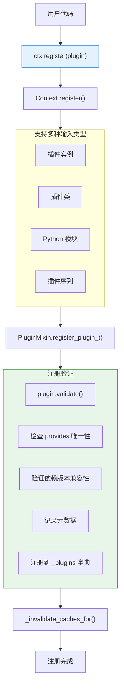
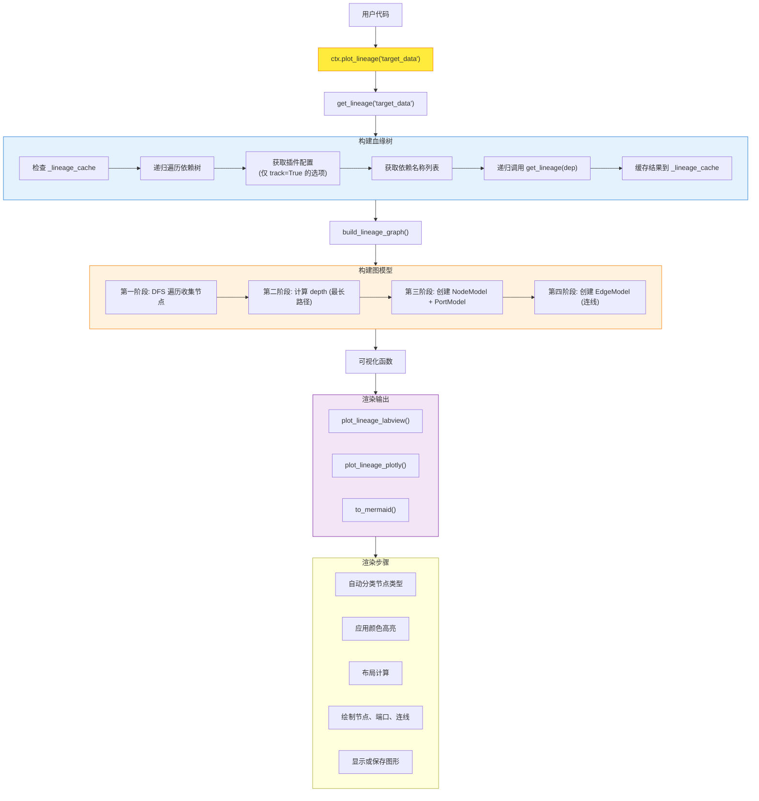
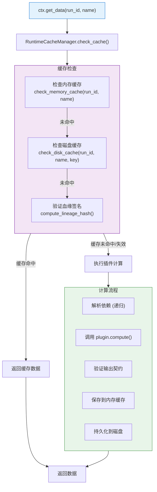
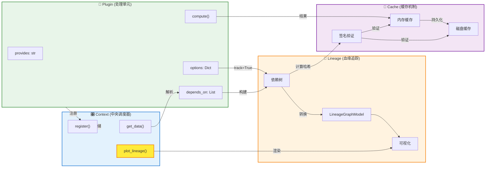

**导航**: [文档中心](../README.md) > [架构设计](README.md) > 系统架构

---

# WaveformAnalysis 架构设计文档

本文档详细说明了 `WaveformAnalysis` 工具包的规范化架构设计、核心模式以及数据流向。

---

## 1. 设计哲学

- **插件化 (Plugin-based)**: 受 `strax` 启发，将处理逻辑拆分为独立的插件，每个插件声明其“提供什么”和“依赖什么”。
- **模块化核心 (Modular Core)**: `core/` 采用分层子目录（storage/execution/plugins/processing/data/foundation），职责清晰、可扩展。
- **无状态上下文 (Stateless Context)**: 核心调度器不再依赖全局可变状态（如 `self.char`），而是通过显式传递 `run_id` 来隔离不同运行的数据。
- **流式处理 (Streaming)**: 采用生成器模式，数据以分块（Chunk）形式流过处理链，极大地降低了内存占用。
- **血缘追踪 (Lineage Tracking)**: 通过哈希插件代码、版本和配置参数，确保数据的可追溯性和缓存的准确性。
- **零拷贝缓存 (Zero-copy Caching)**: 使用 `numpy.memmap` 实现磁盘数据的瞬时加载。

---

## 2. 核心架构组件

### 2.1 上下文层 (Context Layer)
- **`Context`**: 系统的核心协调者。它管理插件注册、配置分发、依赖解析以及存储调度。
- **显式 Run ID**: 所有数据操作均需指定 `run_id`，数据存储在 `_results[(run_id, data_name)]` 中.
- **重入保护 (Re-entrancy Guard)**: 自动检测并阻止插件依赖链中的循环调用。
- **依赖解析 (DAG)**: 自动构建有向无环图，确定插件的执行顺序。

### 2.2 插件层 (Plugin Layer)
- **`Plugin`**: 逻辑单元。
    - `provides`: 插件产出的数据名称。
    - `depends_on`: 插件所需的输入数据。
    - `options`: 插件的配置项（带类型验证和默认值）。
    - `version`: 插件版本号，参与血缘哈希计算。
    - `is_side_effect`: 标记插件是否具有副作用（如生成绘图、导出文件）。
    - `compute`: 核心计算逻辑。
    - `on_error` / `cleanup`: 生命周期钩子，确保异常处理和资源释放。
- **插件分层**:
    - `plugins/core/`: 核心基础设施（`base`, `streaming`, `loader`, `stats`, `hot_reload`, `adapters`）。
    - `plugins/builtin/`: 内置插件，按加速器划分（`cpu/`, `jax/`, `streaming/`）。
- **兼容与扩展**:
    - `StreamingPlugin` 支持 Chunk 流式计算。
    - `StraxPluginAdapter`/`StraxContextAdapter` 提供 strax 插件与 API 兼容。

### 2.3 存储层 (Storage Layer)
- **`MemmapStorage`**: 负责将结构化数组持久化为二进制文件。
- **原子性与并发安全**:
    - **原子写入**: 所有数据和元数据均先写入 `.tmp` 文件，完成后通过 `rename` 替换，确保不会产生部分写入的损坏文件。
    - **文件锁**: 使用 `.lock` 文件实现简单的进程间互斥，防止多个进程同时写入同一个缓存键。
    - **完整性校验**: 加载时验证文件大小是否等于 `count * itemsize`，并检查 `STORAGE_VERSION`。
- **侧效应隔离**: 副作用插件的输出被隔离在 `_side_effects/{run_id}/{plugin_name}` 目录下。
- **自动缓存机制**: `Context` 在运行插件前会检查磁盘缓存，如果血缘哈希匹配，则直接加载 `memmap`。

### 2.4 时间分块层 (Chunking Layer)
- **`Chunk`**: 数据的基本载体。它不仅包含 NumPy 数组，还封装了时间边界 (`start`, `end`) 和运行信息。
- **时间区间操作**: 提供 `split`, `merge`, `clip` 等操作，确保在处理连续时间流数据时的正确性。
- **严格校验**: 自动检查数据的单调性、重叠以及是否超出分块边界，是保证物理分析准确性的基石。

### 2.5 执行器管理层 (Executor Management Layer)
- **`ExecutorManager`**: 全局单例，统一管理线程池和进程池资源。
    - **资源重用**: 支持执行器重用，避免频繁创建和销毁的开销。
    - **引用计数**: 自动管理执行器的生命周期，确保资源正确释放。
    - **上下文管理器**: 提供 `get_executor()` 上下文管理器，自动获取和释放执行器。
    - **预定义配置**: 提供多种预定义配置（IO密集型、CPU密集型等），简化使用。
- **`ExecutorConfig`**: 执行器配置管理。
    - **预定义配置**: `io_intensive`, `cpu_intensive`, `large_data`, `small_data` 等。
    - **自定义配置**: 支持注册自定义执行器配置。
- **便捷函数**:
    - `parallel_map()`: 并行 map 操作，自动选择合适的执行器类型。
    - `parallel_apply()`: 并行 apply 操作，支持 DataFrame 并行处理。

### 2.6 流式处理层 (Streaming Layer)
- **`StreamingPlugin`**: 支持流式处理的插件基类。
    - **Chunk 流处理**: `compute()` 返回 chunk 迭代器，而不是静态数据。
    - **自动并行化**: 支持自动将 chunk 分发到多个工作线程/进程处理。
    - **时间边界对齐**: 自动验证和处理 chunk 的时间边界。
    - **灵活配置**: 可配置 chunk 大小、并行策略和执行器类型。
- **`StreamingContext`**: 流式处理的上下文管理器。
    - **数据流获取**: `get_stream()` 获取数据流，支持时间范围过滤。
    - **Chunk 迭代**: `iter_chunks()` 便捷的 chunk 迭代接口。
    - **流合并**: `merge_stream()` 合并多个数据流。
    - **自动转换**: 自动将静态数据转换为 chunk 流，或将流式数据合并为静态数据。

### 2.7 数据管理与查询层 (Data & Query Layer)
- **时间范围查询** (`core/data/query.py`):
    - `TimeRangeQueryEngine` + `TimeIndex` 支持按时间段检索数据。
    - `time_range` 支持多通道数据与索引缓存（首次查询自动构建索引）。
    - `get_data_time_range_absolute` 支持 `datetime` 绝对时间查询（依赖 epoch）。
- **批量处理与导出** (`core/data/batch_processor.py`, `core/data/export.py`):
    - `BatchProcessor` 并行处理多个 run。
    - `DataExporter`/`batch_export` 统一导出 Parquet/HDF5/CSV/JSON/NumPy。
- **依赖分析** (`core/data/dependency_analysis.py`): DAG 结构与性能瓶颈分析，支持报告输出。
- **Records 视图** (`core/data/records_view.py`): `RecordsView` 提供 records + wave_pool 的零拷贝访问接口，并统一通过 `waves(...)` / `signals(...)` 按稳定 `record_id` 回切波形。
- **`IO Module`** (`utils/io.py`): `parse_and_stack_files`/`parse_files_generator` 支持流式解析与并行加载。
- **`DAQ Adapters`** (`utils/formats/`): 统一不同硬件厂商的数据组织格式。
    - **格式规范 (`FormatSpec`)**: 定义 CSV 列映射、时间戳单位、分隔符等。
    - **目录布局 (`DirectoryLayout`)**: 定义目录结构、文件模式、通道识别规则。
    - **适配器 (`DAQAdapter`)**: 结合格式读取器和目录布局的完整适配器。
    - **注册表**: 支持自定义格式和适配器的注册和获取。
    - **内置支持**: VX2730 (CAEN) 数字化仪格式。

### 2.8 数据处理层 (Data Processing Layer)
- **`WaveformStruct`** (`core/processing/waveform_struct.py`): 波形结构化处理器，已解耦 DAQ 格式依赖。
    - **配置驱动**: 通过 `WaveformStructConfig` 配置类指定 DAQ 格式。
    - **动态 dtype**: 根据实际波形长度动态创建 `ST_WAVEFORM_DTYPE`。
    - **列映射**: 从 `FormatSpec` 读取列索引（board, channel, timestamp, samples_start, baseline_start/end）。
    - **向后兼容**: 无配置时默认使用 VX2730 格式。
    - **多种创建方式**:
        - 默认: `WaveformStruct(waveforms)` - 使用 VX2730 配置
        - 适配器: `WaveformStruct.from_adapter(waveforms, "vx2730")` - 从适配器名称创建
        - 自定义: `WaveformStruct(waveforms, config=custom_config)` - 使用自定义配置
- **`WaveformStructConfig`**: 波形结构化配置类。
    - **格式规范**: 封装 `FormatSpec` 和波形长度配置。
    - **工厂方法**: `default_vx2730()`, `from_adapter(adapter_name)`。
    - **优先级**: wave_length > format_spec.expected_samples > DEFAULT_WAVE_LENGTH。
- **特征计算与事件分析**:
    - 基础特征由 `BasicFeaturesPlugin` 计算（height/amp/area）。
    - `DataFramePlugin` 拼接 DataFrame。
    - `EventAnalyzer` 负责多通道事件分组与配对（Numba/多进程可选）。

**English**: `BasicFeaturesPlugin` computes height/amp/area features.
- **Records + WavePool** (`core/processing/records_builder.py`):
    - 构建 `RecordsBundle(records, wave_pool)` 作为内部共享构建结果。
    - `records` 与 `wave_pool` 现在分别作为正式插件产物暴露，下游通过 `records_view(...)` 组装访问。
    - 适用于大规模数据的零拷贝访问与下游索引。
- **插件集成**: `StWaveformsPlugin` 支持 `daq_adapter` 配置选项。
    - 与 `RawFilesPlugin` 和 `WaveformsPlugin` 的 `daq_adapter` 选项保持一致。
    - 全局配置: `ctx.set_config({'daq_adapter': 'vx2730'})`。
    - 插件特定配置: `ctx.set_config({'daq_adapter': 'vx2730'}, plugin_name='st_waveforms')`。

### 2.9 时间字段统一 (Time Field Unification)
- **时间字段约定**:
    - **`timestamp` (i8)**: ADC 原始时间戳，统一为 ps。
    - **`time` (i8)**: 可选的系统时间（ns），用于绝对时间查询与对齐。
- **Epoch 获取**: `DAQAdapter.get_file_epoch()` 可从文件创建时间推导 `epoch_ns`。
- **WaveformStructConfig**: `epoch_ns` 参与时间转换；当 dtype 包含 `time` 字段时自动填充。
- **时间字段解析**:
    - `chunk.py`/`query.py` 默认使用 `time`，不存在时回退到 `timestamp`。
    - 若没有 `epoch_ns`，`time` 使用 `timestamp // 1000` 的相对时间（ns）。

---

## 3. 组件交互流程

### 3.1 插件注册流程

```mermaid
flowchart TD
    USER["用户代码"] --> REG["ctx.register(plugin)"]

    REG --> PARSE["Context.register()"]

    subgraph PARSE_SUB["支持多种输入类型"]
        P1["插件实例"]
        P2["插件类"]
        P3["Python 模块"]
        P4["插件序列"]
    end

    PARSE --> PARSE_SUB
    PARSE_SUB --> MIXIN["PluginMixin.register_plugin_()"]

    subgraph MIXIN_SUB["注册验证"]
        V1["plugin.validate()"]
        V2["检查 provides 唯一性"]
        V3["验证依赖版本兼容性"]
        V4["记录元数据"]
        V5["注册到 _plugins 字典"]
    end

    MIXIN --> MIXIN_SUB
    MIXIN_SUB --> INVALIDATE["_invalidate_caches_for()"]
    INVALIDATE --> DONE["注册完成"]

    style REG fill:#e3f2fd,stroke:#1976d2
    style MIXIN_SUB fill:#e8f5e9,stroke:#388e3c
```

**流程说明**：
1. 用户调用 `ctx.register()` 注册插件
2. Context 支持多种输入类型：实例、类、模块、序列
3. `PluginMixin.register_plugin_()` 执行验证和注册
4. 注册后自动失效相关缓存，确保数据一致性

### 3.2 血缘追踪流程

```mermaid
flowchart TD
    USER["用户代码"] --> PLOT["ctx.plot_lineage('target_data')"]

    PLOT --> GET_LINEAGE["get_lineage('target_data')"]

    subgraph LINEAGE_BUILD["构建血缘树"]
        L1["检查 _lineage_cache"]
        L2["递归遍历依赖树"]
        L3["获取插件配置<br/>(仅 track=True 的选项)"]
        L4["获取依赖名称列表"]
        L5["递归调用 get_lineage(dep)"]
        L6["缓存结果到 _lineage_cache"]

        L1 --> L2 --> L3 --> L4 --> L5 --> L6
    end

    GET_LINEAGE --> LINEAGE_BUILD
    LINEAGE_BUILD --> BUILD_GRAPH["build_lineage_graph()"]

    subgraph GRAPH_BUILD["构建图模型"]
        G1["第一阶段: DFS 遍历收集节点"]
        G2["第二阶段: 计算 depth (最长路径)"]
        G3["第三阶段: 创建 NodeModel + PortModel"]
        G4["第四阶段: 创建 EdgeModel (连线)"]

        G1 --> G2 --> G3 --> G4
    end

    BUILD_GRAPH --> GRAPH_BUILD
    GRAPH_BUILD --> VIS["可视化函数"]

    subgraph VIS_SUB["渲染输出"]
        V1["plot_lineage_labview()"]
        V2["plot_lineage_plotly()"]
        V3["to_mermaid()"]
    end

    VIS --> VIS_SUB

    subgraph RENDER["渲染步骤"]
        R1["自动分类节点类型"]
        R2["应用颜色高亮"]
        R3["布局计算"]
        R4["绘制节点、端口、连线"]
        R5["显示或保存图形"]
    end

    VIS_SUB --> RENDER

    style PLOT fill:#ffeb3b,stroke:#f57c00
    style LINEAGE_BUILD fill:#e3f2fd,stroke:#1976d2
    style GRAPH_BUILD fill:#fff3e0,stroke:#f57c00
    style VIS_SUB fill:#f3e5f5,stroke:#7b1fa2
```

**流程说明**：
1. `get_lineage()` 递归遍历插件的 `depends_on` 构建依赖树
2. `build_lineage_graph()` 将血缘字典转换为 `LineageGraphModel`
3. 可视化函数根据 `kind` 参数选择渲染方式（LabVIEW/Plotly/Mermaid）
4. 智能颜色高亮自动识别节点类型（原始数据、DataFrame、聚合等）

### 3.3 缓存验证流程

```mermaid
flowchart TD
    USER["ctx.get_data(run_id, name)"] --> CHECK["RuntimeCacheManager.check_cache()"]

    subgraph CACHE_CHECK["缓存检查"]
        direction TB
        MEM["检查内存缓存<br/>check_memory_cache(run_id, name)"]
        DISK["检查磁盘缓存<br/>check_disk_cache(run_id, name, key)"]
        SIG["验证血缘签名<br/>compute_lineage_hash()"]

        MEM -->|未命中| DISK
        DISK -->|未命中| SIG
    end

    CHECK --> CACHE_CHECK

    CACHE_CHECK -->|缓存命中| HIT["返回缓存数据"]
    CACHE_CHECK -->|缓存未命中/失效| COMPUTE["执行插件计算"]

    subgraph COMPUTE_SUB["计算流程"]
        C1["解析依赖 (递归)"]
        C2["调用 plugin.compute()"]
        C3["验证输出契约"]
        C4["保存到内存缓存"]
        C5["持久化到磁盘"]
    end

    COMPUTE --> COMPUTE_SUB
    COMPUTE_SUB --> RETURN["返回数据"]
    HIT --> RETURN

    style USER fill:#e3f2fd,stroke:#1976d2
    style CACHE_CHECK fill:#f3e5f5,stroke:#7b1fa2
    style COMPUTE_SUB fill:#e8f5e9,stroke:#388e3c
```

**流程说明**：
1. 首先检查内存缓存（最快）
2. 内存未命中则检查磁盘缓存
3. 磁盘缓存需验证血缘签名（基于插件版本、配置、上游依赖哈希）
4. 缓存失效或未命中时执行插件计算，结果自动缓存

### 3.4 组件关系总览

```mermaid
flowchart LR
    subgraph Context["🎛️ Context (中央调度器)"]
        REG["register()"]
        GET["get_data()"]
        PLOT["plot_lineage()"]
    end

    subgraph Plugin["🔌 Plugin (处理单元)"]
        PROVIDES["provides: str"]
        DEPENDS["depends_on: List"]
        OPTIONS["options: Dict"]
        COMPUTE["compute()"]
    end

    subgraph Lineage["🔗 Lineage (血缘追踪)"]
        TREE["依赖树"]
        GRAPH["LineageGraphModel"]
        VIS["可视化"]
    end

    subgraph Cache["💾 Cache (缓存机制)"]
        MEM["内存缓存"]
        DISK["磁盘缓存"]
        SIG["签名验证"]
    end

    Plugin -->|注册| REG
    REG -->|存储| Context

    GET -->|解析| DEPENDS
    DEPENDS -->|构建| TREE

    PLOT -->|渲染| VIS
    TREE -->|转换| GRAPH
    GRAPH --> VIS

    OPTIONS -->|track=True| TREE
    TREE -->|计算哈希| SIG
    SIG -->|验证| MEM
    SIG -->|验证| DISK

    COMPUTE -->|结果| MEM
    MEM -->|持久化| DISK

    style Context fill:#e3f2fd,stroke:#1976d2,stroke-width:2px
    style Plugin fill:#e8f5e9,stroke:#388e3c,stroke-width:2px
    style Lineage fill:#fff3e0,stroke:#f57c00,stroke-width:2px
    style Cache fill:#f3e5f5,stroke:#7b1fa2,stroke-width:2px
    style PLOT fill:#ffeb3b,stroke:#f57c00,stroke-width:2px
```

**核心交互点**：
| 交互 | 说明 |
|------|------|
| Plugin → Context | 插件通过 `register()` 注册到 `_plugins` 字典 |
| depends_on → Lineage | `get_lineage()` 递归遍历依赖构建血缘树 |
| options → Cache | 仅 `track=True` 的选项参与血缘哈希计算 |
| Lineage → Cache | 血缘哈希用于缓存键生成和验证 |
| compute() → Cache | 计算结果自动缓存到内存和磁盘 |

---

## 4. 关键机制说明

### 3.1 血缘哈希 (Lineage Hash)
数据的唯一标识由以下因素决定：
1. 插件的类名。
2. 插件的版本号 (`version`)。
3. 插件所使用的配置参数（经过验证的 `Option`）。
4. 插件输出的 **标准化 DType** (`dtype.descr`)。
5. 所有上游依赖的血缘哈希。

这意味着如果你修改了阈值、更改了处理算法或升级了插件版本，系统会自动识别并重新计算，而不会错误地使用旧缓存。

### 4.2 安全性与鲁棒性
- **输出契约校验**: 自动验证插件返回的数据类型是否符合声明。
- **原子性写入**: 使用 `.tmp` 临时文件确保数据写入的完整性，防止因崩溃产生损坏的缓存。
- **并发保护**: 通过文件锁机制确保多进程环境下的缓存一致性。
- **Generator 一次性消费语义**:
    - 插件返回的生成器被包装在 `OneTimeGenerator` 中。
    - 强制执行“一次消费”原则，防止因多次迭代导致的静默数据丢失。
    - 消费过程中自动触发磁盘持久化，后续访问将自动切换为高性能的 `memmap`。
- **血缘校验**: 加载缓存时验证元数据中的血缘信息，若逻辑发生变更（如版本升级）则自动失效并重算。
- **签名校验 (`WATCH_SIG_KEY`)**: 基于输入文件的修改时间 (mtime) 和大小 (size) 计算 SHA1 签名，确保缓存数据与原始文件的一致性。

**缓存检查工具**: 推荐使用 `ctx.preview_execution(..., show_cache=True)`、`ctx.analyze_cache()` 与 `ctx.diagnose_cache()` 来查看当前插件缓存状态、磁盘占用和完整性问题。

### 4.3 性能优化路径
- **向量化**: 尽可能使用 Numpy 广播机制（如 `compute_stacked_waveforms`）。
- **并行化**:
    - **全局执行器管理**: 通过 `ExecutorManager` 统一管理线程池和进程池，支持资源重用和自动清理。
    - **IO 密集型任务**: 使用 `ThreadPoolExecutor`（通过预定义配置 `io_intensive`）。
    - **CPU 密集型任务**: 使用 `ProcessPoolExecutor`（通过预定义配置 `cpu_intensive`）。
    - **自适应选择**: 根据任务类型和数据规模自动选择最优的并行策略。
- **加速器**:
    - **Numba JIT**: 针对热点循环（如波形归一化、边界查找）提供可选的 `Numba` 加速路径。
    - **多进程加速**: 对于大规模数据集，支持多进程并行处理（如 `group_multi_channel_hits`）。
    - **混合优化**: 结合 Numba 和 multiprocessing，实现最佳性能。

---

## 5. 标准插件链

### 5.1 插件依赖关系

系统定义了以下标准插件，按执行顺序排列：

1. **`RawFilesPlugin`**: 扫描数据目录，生成文件路径清单
   - `provides`: `raw_files`
   - `depends_on`: `[]`

2. **`WaveformsPlugin`**: 从原始文件提取波形数据
   - `provides`: `waveforms`
   - `depends_on`: `["raw_files"]`

3. **`StWaveformsPlugin`**: 将波形数据转换为结构化 NumPy 数组
   - `provides`: `st_waveforms`
   - `depends_on`: `["waveforms"]`
4. **`FilteredWaveformsPlugin`** *(可选)*: 对波形进行滤波
   - `provides`: `filtered_waveforms`
   - `depends_on`: `["st_waveforms"]`

5. **`BasicFeaturesPlugin`**: 提供高度/面积数据
   - `provides`: `basic_features`
   - `depends_on`: `["st_waveforms"]`
   - 可选依赖 `filtered_waveforms`（`use_filtered=True`）

6. **`DataFramePlugin`**: 构建单通道事件 DataFrame
   - `provides`: `df`
   - `depends_on`: `["st_waveforms", "basic_features"]`

7. **`GroupedEventsPlugin`**: 按时间窗口聚类多通道事件
   - `provides`: `df_events`
   - `depends_on`: `["df"]`
   - 支持 Numba 加速和多进程并行

8. **`PairedEventsPlugin`**: 跨通道配对事件
   - `provides`: `df_paired`
   - `depends_on`: `["df_events"]`

**可选扩展插件**：
- **`HitFinderPlugin`**: `hit`（依赖 `st_waveforms`）
- **`SignalPeaksPlugin`**: `signal_peaks`（依赖 `filtered_waveforms` + `st_waveforms`）

### 5.2 数据流向图

```mermaid
graph TD
    A[原始 CSV 文件] -->|RawFilesPlugin| B(raw_files: 文件路径清单)
    B -->|WaveformsPlugin| C(waveforms: 原始波形数组)
    C -->|StWaveformsPlugin| D(st_waveforms: 结构化波形)
    D -->|FilteredWaveformsPlugin| E(filtered_waveforms: 滤波波形)
    D -->|BasicFeaturesPlugin| F(basic_features: height/amp/area)
    E -.->|BasicFeaturesPlugin(use_filtered)| F
    D -->|DataFramePlugin| H(df: 单通道事件 DataFrame)
    F -->|DataFramePlugin| H
    H -->|GroupedEventsPlugin<br/>Numba + Multiprocessing| I(df_events: 聚类事件 DataFrame)
    I -->|PairedEventsPlugin| J(df_paired: 配对事件 DataFrame)
    D -->|HitFinderPlugin| K(hit: Hit 列表)
    E -->|SignalPeaksPlugin| L(signal_peaks: 高级峰值)
    J -->|Persistence| M[Parquet/CSV/Cache]

    style E fill:#e1f5ff
    style I fill:#e8f5e9
```

**English**: `basic_features` includes height/amp/area.

---

## 6. 目录规范

- `waveform_analysis/core/`: 核心逻辑（模块化子目录架构）
    - `context.py`: Context 核心调度器
    - `cancellation.py` / `load_balancer.py`: 取消与负载控制
    - `storage/`: memmap 缓存、压缩、完整性、缓存工具
    - `execution/`: 执行器管理与超时控制
    - `plugins/`: 插件核心设施与内置插件（CPU/JAX/Streaming/Legacy）
    - `processing/`: loader/event_grouping/waveform_struct/analyzer/chunk/records_builder
    - `data/`: query/batch_processor/export/dependency_analysis/records_view
    - `foundation/`: exceptions/model/utils/progress/constants 等基础能力
- `waveform_analysis/utils/`: 通用工具
    - `formats/`: DAQ 数据格式适配器
    - `daq/`: DAQ 数据分析工具
    - `io.py`: 文件 I/O 工具
    - `preview.py`: 波形预览工具
- `tests/`: 单元测试与集成测试。
- `docs/`: 架构、缓存、执行器与功能专题文档。

## 7. 最新更新 (Recent Updates)

### 7.1 模块化核心与插件分层 (2026-01)
- `core/` 拆分为 storage/execution/plugins/processing/data/foundation，Context 保持在根目录。
- 内置插件按加速器分层：`builtin/cpu/`, `builtin/jax/`, `builtin/streaming/`。

### 7.2 DAQ 适配器与 WaveformStruct 解耦 (2026-01)
- **新增模块**: `waveform_analysis/utils/formats/`
- **核心组件**: `FormatSpec`/`DirectoryLayout`/`DAQAdapter` 统一格式与目录布局。
- **集成点**: `RawFilesPlugin`/`WaveformsPlugin`/`StWaveformsPlugin` 支持 `daq_adapter` 配置。

### 7.3 时间范围查询与索引 (Phase 2.2)
- `TimeRangeQueryEngine` + `TimeIndex` 支持时间段检索与缓存索引。
- `time_range`/`get_data_time_range_absolute` 支持相对/绝对时间查询。

### 7.4 Strax 适配与热重载 (Phase 2.3 / 3.3)
- `StraxPluginAdapter`/`StraxContextAdapter` 提供 strax 兼容接口。
- `PluginHotReloader` 支持插件热重载与缓存一致性维护。

### 7.5 批量处理与导出 (Phase 3.1 / 3.2)
- `BatchProcessor` 并行处理多个 run，支持错误策略与进度追踪。
- `DataExporter`/`batch_export` 提供统一导出接口。

### 7.6 缓存管理工具集 (2026-01)
- `CacheAnalyzer`/`CacheDiagnostics`/`CacheCleaner`/`CacheStatsCollector` 提供扫描、诊断与清理。
- CLI 支持 `waveform-cache` (info, stats, diagnose, list, clean)。
