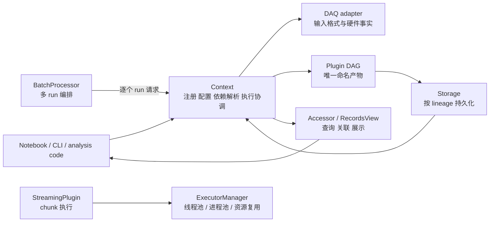
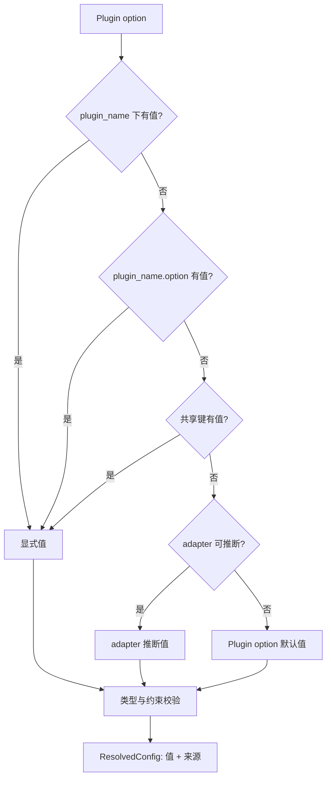
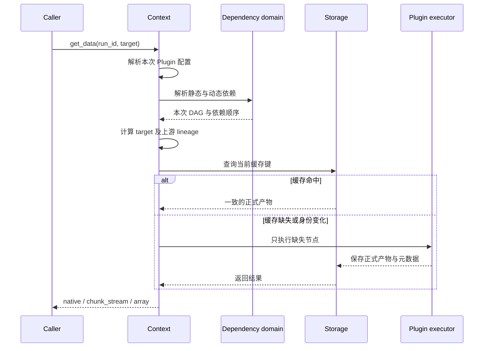
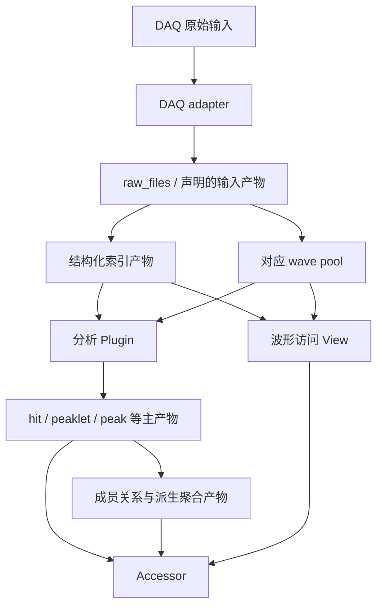

# 系统架构与数据流

**导航**: [文档中心](../README.md) > [系统架构与数据模型](README.md) > 系统架构与数据流

本文定义运行时组件、配置作用域和一次数据请求的完整路径。算法细节属于 Plugin 文档；本页固定
Context、DAQ adapter、Plugin、Storage、Accessor、BatchProcessor 与全局 ExecutorManager 之间的所有权边界。

## 1. 系统边界

WaveformAnalysis 以显式的 `(run_id, data_name)` 请求为起点。Context 不保存“当前 run”，Plugin
不直接解释任意 DAQ 文件，Accessor 也不发布新的处理结果。组件关系如下：


```mermaid
flowchart LR
    USER[Notebook / CLI / analysis code]
    CTX[Context<br/>注册 配置 依赖解析 执行协调]
    ADAPTER[DAQ adapter<br/>输入格式与硬件事实]
    PLUGIN[Plugin DAG<br/>唯一命名产物]
    STORAGE[Storage<br/>按 lineage 持久化]
    ACCESSOR[Accessor / RecordsView<br/>查询 关联 展示]
    BATCH[BatchProcessor<br/>多 run 编排]
    EXECUTOR[ExecutorManager<br/>线程池 / 进程池 / 资源复用]
    STREAM[StreamingPlugin<br/>chunk 执行]

    USER --> CTX
    BATCH -->|逐个 run 请求| CTX
    CTX --> ADAPTER
    CTX --> PLUGIN
    PLUGIN --> STORAGE
    STORAGE --> CTX
    CTX --> ACCESSOR
    ACCESSOR --> USER
    STREAM --> EXECUTOR
```

这张图中的箭头表示调用或数据所有权，不表示所有对象都进入 Plugin DAG。只有正式 Plugin 产物是
DAG 节点；Storage 保存这些节点的结果，Accessor 在图外查询它们，BatchProcessor 在单 run
Context 调用之外安排多个任务。

### 1.1 组件职责矩阵

| 组件 | 接收 | 负责 | 不负责 |
| --- | --- | --- | --- |
| `Context` | `run_id`、目标产物、注册表、配置 | 解析依赖、lineage、缓存和执行计划 | 实现具体算法或保存隐式当前 run |
| DAQ adapter | 原始路径、文件格式、硬件描述 | 将输入差异归一为统一解释 | 计算 hit、peaklet 或分析特征 |
| Plugin | 声明的上游产物、已解析配置 | 发布一个唯一 `provides` 产物 | 跨 run 调度、交互查询或私有跨 Plugin 通信 |
| Storage | 缓存键、数组、元数据 | 保存、加载、校验正式结果 | 决定结果的物理语义 |
| Accessor / View | Context、`run_id`、正式产物和 ID | 加载、连接、筛选、波形访问和展示 | 声明新 DAG 节点或正式缓存身份 |
| `BatchProcessor` | run 列表、目标或回调、调度选项 | 并发、重试、取消、错误和结果汇总 | 改变单 run 的 DAG 与 lineage 语义 |
| `ExecutorManager` | 执行器名称、类型、worker 数与任务 | 统一复用、引用计数、关闭、统计和可选负载均衡 | 决定 Plugin 结果、跨 run 数据或缓存 lineage |

### 1.2 稳定边界

1. 正式计算必须由 Plugin 通过唯一 `provides` 发布。
2. 正式读取必须通过 Context 并显式携带 `run_id`。
3. Plugin 之间只交换已声明产物，不交换 `_results`、bundle 或临时文件引用。
4. 行级实体通过 ID 与关联表连接，不能依赖两个数组“恰好同序”。
5. Storage 复用由 lineage 决定；文件存在本身不构成缓存命中。

## 2. Context 配置模型

Context 同时持有运行环境配置和 Plugin 配置。二者使用同一个配置入口，但消费者、解析方式和是否进入
lineage 不同。配置应先按作用域分类，再讨论最终优先级。

### 2.1 Context 自身配置

Context 自身配置直接控制运行环境，不经过某个 Plugin 的 `options` 解析。

| 配置类别 | 当前键 | 作用 |
| --- | --- | --- |
| 输入与运行配置 | `data_root`、`run_config_path`、`run_config_filename`、`run_config_path_template` | 定位 DAQ 数据和 run 级硬件配置 |
| 存储后端 | `plugin_backends`、`compression`、`compression_kwargs` | 选择产物后端和压缩方式 |
| 完整性 | `enable_checksum`、`verify_on_load`、`checksum_algorithm` | 控制缓存写入和读取校验 |
| 执行资源 | `enable_plugin_parallelism`、`max_parallel_workers` | 控制同级 Plugin 并行执行 |
| 配置快照 | `custom_config_json_path` | 将本次分析配置写入指定 JSON 路径 |

`storage_dir` 是 Context 初始化时的运行参数。未显式提供时，当前实现使用 `config["data_root"]`
作为默认存储目录；因此输入目录与缓存目录需要分离时，应明确传入 `storage_dir`。

```python
from waveform_analysis import Context

ctx = Context(
    config={
        "data_root": "/data/DAQ",
        "daq_adapter": "v1725",
        "compression": "lz4",
        "enable_checksum": True,
    },
    storage_dir="/data/cache",
)
```

### 2.2 共享配置与 Plugin 专属配置

Plugin option 有三个显式写法。解析器按“Plugin 嵌套配置、点号配置、共享配置”的顺序查找；三者
都属于显式配置，均高于 adapter 推断与 Plugin 默认值。

```python
# 共享配置：所有声明 sampling_rate 的 Plugin 都可以读取
ctx.set_config({"sampling_rate": 0.25})

# 推荐的 Plugin 专属配置
ctx.set_config({"input_source": "raw_files"}, plugin_name="records")

# 等价的点号形式，适合配置文件或命令行展开
ctx.set_config({"records.input_source": "raw_files"})
```

同一个键同时存在时，Plugin 专属值覆盖共享值。`set_config` 会清除已解析配置缓存、性能缓存和 run
配置缓存，保证后续请求重新解析；它不会直接删除已经持久化的 Plugin 结果，新的 lineage 是否变化
由受跟踪配置决定。

### 2.3 配置解析顺序


```mermaid
flowchart TD
    OPTION[Plugin option] --> PNS{plugin_name 下有值?}
    PNS -->|是| EXPLICIT[显式值]
    PNS -->|否| DOTTED{plugin_name.option 有值?}
    DOTTED -->|是| EXPLICIT
    DOTTED -->|否| GLOBAL{共享键有值?}
    GLOBAL -->|是| EXPLICIT
    GLOBAL -->|否| ADAPTER{adapter 可推断?}
    ADAPTER -->|是| INFERRED[adapter 推断值]
    ADAPTER -->|否| DEFAULT[Plugin option 默认值]
    EXPLICIT --> VALIDATE[类型与约束校验]
    INFERRED --> VALIDATE
    DEFAULT --> VALIDATE
    VALIDATE --> RESOLVED[ResolvedConfig: 值 + 来源]
```

解析优先级是：

1. Plugin 专属显式配置；
2. 点号形式的 Plugin 显式配置；
3. 共享显式配置；
4. DAQ adapter 推断；
5. Plugin option 默认值。

adapter 当前可推断采样率、采样间隔、时间戳单位和原始时间戳模式等硬件相关 option。adapter 只
提供推断值，显式配置始终可以覆盖它。

### 2.4 查看最终值与来源

```python
resolved = ctx.get_resolved_config("records")
print(resolved.to_dict())

ctx.show_resolved_config("records", verbose=True)
```

`get_resolved_config()` 返回可编程读取的 `ResolvedConfig`；`show_resolved_config()` 展示值、来源和
adapter。排查配置问题时应查看 resolved config，而不是只检查传给 Context 的原始字典。

### 2.5 配置与 lineage

Plugin option 的 `track` 声明配置是否改变结果语义：

| 配置变化 | lineage 行为 | 适用条件 |
| --- | --- | --- |
| `track=True` 的算法或输入配置 | 生成新结果身份，下游随 DAG 失效 | 值会改变输出内容、字段或选择 |
| `track=False` 的资源配置 | 通常保持原结果身份 | 只改变并发、批大小或资源位置且结果完全等价 |
| Context 存储压缩、校验开关 | 改变保存方式，不应改变物理结果 | Storage 能保证读取结果等价 |

把会改变结果的 option 标为 `track=False` 会错误复用旧缓存；把纯资源 option 标为 `track=True`
则会产生不必要的重算。两者都属于配置契约错误。

## 3. 一次请求的运行路径

### 3.1 从 API 到执行计划


```mermaid
sequenceDiagram
    participant U as Caller
    participant C as Context
    participant D as Dependency domain
    participant S as Storage
    participant P as Plugin executor

    U->>C: get_data(run_id, target)
    C->>C: 解析本次 Plugin 配置
    C->>D: 解析静态与动态依赖
    D-->>C: 本次 DAG 与依赖顺序
    C->>C: 计算 target 及上游 lineage
    C->>S: 查询当前缓存键
    alt 缓存命中
        S-->>C: 一致的正式产物
    else 缓存缺失或身份变化
        C->>P: 只执行缺失节点
        P-->>S: 保存正式产物与元数据
        S-->>C: 返回结果
    end
    C-->>U: native / chunk_stream / array
```

请求下游产物不会无条件重算整条链。Context 先计算本次 DAG 和 lineage，再把已经命中的节点从
执行计划中排除。Accessor 调用 `get_data` 也走同一路径；Accessor 的“只读”表示它不拥有新产物
契约，并不表示它只能读取已经驻留内存的数组。

### 3.2 输出形态

| `output` | 返回行为 | 典型用途 |
| --- | --- | --- |
| `native` | 保持 Plugin 原生结果 | 普通数组或 Plugin 自定义结果 |
| `chunk_stream` | 保留流式 chunk | 流式消费、限制峰值内存 |
| `array` | 将可物化流拼接为数组并记录内存结果 | 交互分析和整体数组算法 |

输出形态改变调用端如何消费结果，不改变 Plugin 的 `provides` 名称。是否产生新缓存身份仍由 Plugin
契约和 lineage 决定。

### 执行器管理框架

`ExecutorManager` 是并行资源的统一入口，位于数据语义之外。它以全局单例保存按
`(name, executor_type, max_workers)` 区分的执行器，支持 `thread` 与 `process` 两类池；
`get_executor()` 以上下文管理器形式取得并在退出时释放引用，`parallel_map()` 和
`parallel_apply()` 在此基础上提供保持输入顺序的批量结果、进度回调和可选负载均衡。

```python
from waveform_analysis.core.execution import get_config, get_executor

config = get_config("waveform_loading")
with get_executor("waveform-loading", **config) as executor:
    futures = [executor.submit(load_file, path) for path in paths]
    results = [future.result() for future in futures]
```

资源层与数据层必须分开检查：

| 场景 | 推荐入口 | 需要保持的边界 |
| --- | --- | --- |
| 单 run 的 Plugin DAG 分层并行 | `Context` 的 `enable_plugin_parallelism` 与 `max_parallel_workers` | 依赖层完成后才进入下一层；缓存和 lineage 仍由 Context 控制 |
| 多 run 并行、重试与取消 | `BatchProcessor.process_runs()` / `process_func()` | 每个任务使用 `ctx.clone()` 或 `ctx.create_context_factory()`，不共享可变 Context |
| 通用文件/数组任务 | `ExecutorManager` 的 `get_executor()`、`parallel_map()`、`parallel_apply()` | 选择与任务匹配的 thread/process；使用 `with` 释放资源 |
| 流式 chunk 任务 | Streaming Plugin 的 `executor_config` | worker 数是资源配置；改变结果语义的 option 仍要进入 Plugin lineage |

因此，worker 数、进度显示和负载均衡不会单独创建新的数据产物身份。排查并行问题时依次检查
`preview_execution()`、resolved config、执行器状态（`list_executors()` / `get_stats()`）和
缓存 lineage；不要通过改变 `run_id`、共享 Context 或直接操作 `_executor_refs` 来规避错误。

## 4. 数据流与访问层


```mermaid
flowchart TD
    RAW[DAQ 原始输入] --> ADAPTER[DAQ adapter]
    ADAPTER --> INPUT[raw_files / 声明的输入产物]
    INPUT --> INDEX[结构化索引产物]
    INPUT --> POOL[对应 wave pool]
    INDEX --> PROCESS[分析 Plugin]
    POOL --> PROCESS
    PROCESS --> ENTITY[hit / peaklet / peak 等主产物]
    ENTITY --> RELATION[成员关系与派生聚合产物]
    INDEX --> VIEW[波形访问 View]
    POOL --> VIEW
    ENTITY --> ACCESSOR[Accessor]
    RELATION --> ACCESSOR
    VIEW --> ACCESSOR
```

`records + wave_pool` 是“结构化索引 + 连续波形池”的一个实例；`peaklet_waveforms +
peaklet_waveform_pool` 是另一实例。不同实体必须使用对应的索引产物和 pool，不能因为都是一维数组就
交叉配对。具体规则见[数据产物与波形访问](DATA_PRODUCTS.md)。

## 5. 组件选择

| 需求 | 放置位置 | 原因 |
| --- | --- | --- |
| 新的可复用计算结果 | 单一职责 Plugin | 进入 DAG、lineage、缓存和契约测试 |
| 父实体与成员的关系 | 独立关联型中间产物 | 关系可单独版本化、缓存和校验 |
| 已有产物的筛选、连接和绘图 | Accessor | 不创造新的处理语义 |
| 索引产物对应的波形切片 | 对应 View / Accessor | 统一校验 ID、offset 和 length |
| 多个 run 的同一操作 | `BatchProcessor` 或显式循环 | 单 run 结果身份保持隔离 |
| 可复用的并行资源 | `ExecutorManager` | 统一 thread/process 生命周期，不承载数据语义 |
| 新硬件或文件格式 | DAQ adapter | 输入差异不扩散到分析 Plugin |

## 6. 不变量与故障原因

| 现象 | 可能原因 | 首先检查 |
| --- | --- | --- |
| 同一请求意外重算 | tracked 配置、adapter、version、schema 或上游 lineage 已变化 | `preview_execution`、resolved config、当前 lineage |
| 本应重算却复用旧结果 | 影响输出的配置未跟踪，或行为变化未升级 version | Plugin option、version、lineage 内容 |
| 结果来自错误 run | 调用端复用局部 ID 或未显式传递正确 `run_id` | 所有 `get_data` 与 Accessor 构造入口 |
| 波形切片越界 | 索引产物与 wave pool 不配对，pool 被截断或 offset 错误 | run、lineage、pool 长度与切片字段 |
| Accessor 查询为空 | ID 空间错误、输入产物缺失或关联表不覆盖该实体 | Accessor 输入表、关系字段和 run_id |
| 切换 adapter 后物理量异常 | 显式配置覆盖了推断值，或输入解释未进入 lineage | `show_resolved_config` 与 adapter 信息 |

## 7. 阅读顺序

1. [插件执行链与缓存](PLUGIN_DAG_LINEAGE_CACHE.md)
2. [数据产物与波形访问](DATA_PRODUCTS.md)
3. [分析查询与批量运行](ACCESSOR_ANALYSIS.md)
