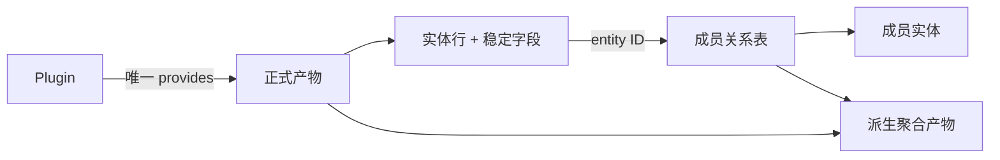
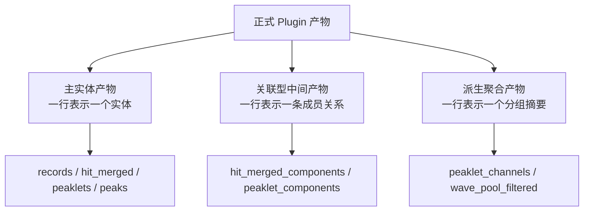
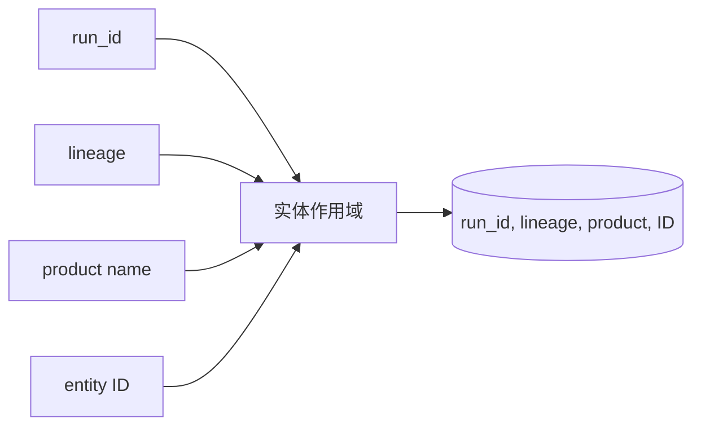
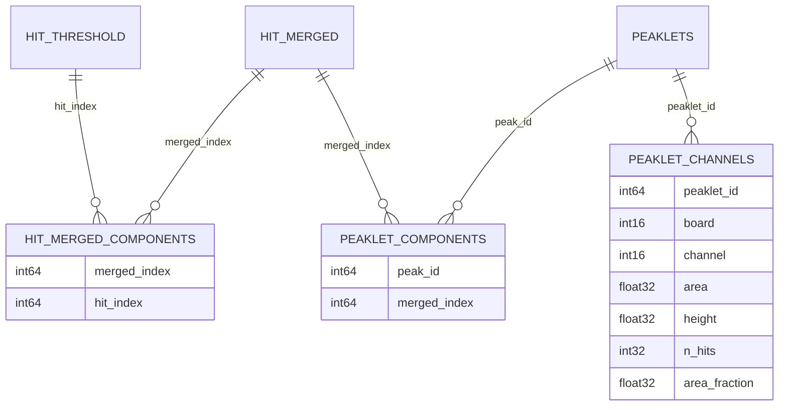
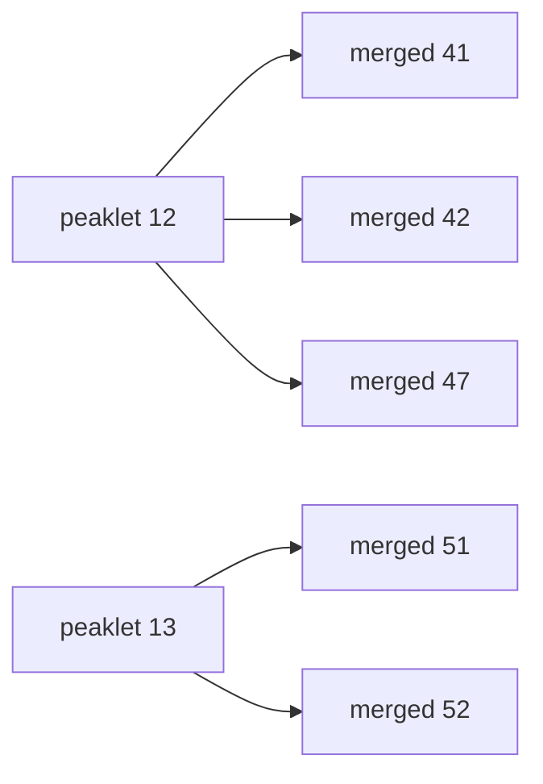
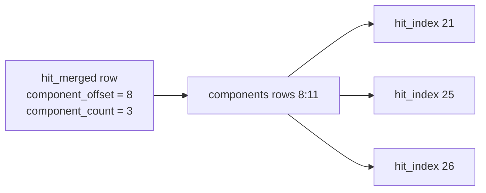
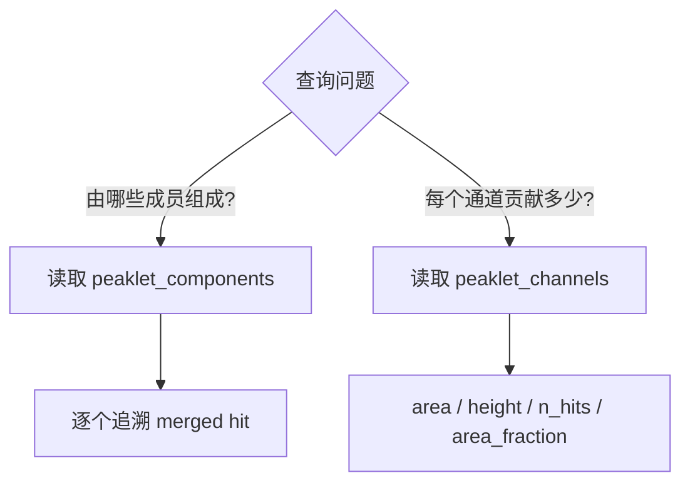
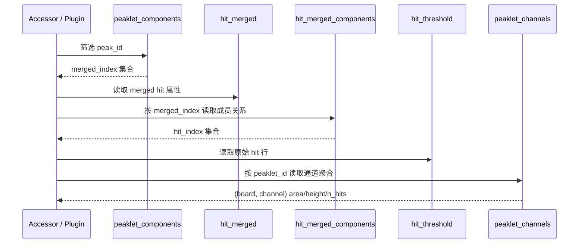

# 数据产物：实体关系与派生结果

**导航**: [文档中心](../README.md) > [系统架构与数据模型](README.md) > 数据产物：实体关系与派生结果

Plugin DAG 连接正式产物名称；数据模型用 ID 和关系表连接产物内部的实体。一个 Plugin 对应一个
唯一命名产物，复杂实体的成员关系单独发布为关联型中间产物，按通道或按类别计算的摘要再发布为
派生聚合产物。

## 1. 正式产物契约

### 1.1 唯一命名产物

正式产物由 Plugin 的 `provides` 发布，可被下游 Plugin 或 Accessor 通过 Context 获取。它不只是一个
NumPy 数组；以下内容共同组成对外契约：

| 契约面 | 包含内容 | 变化影响 |
| --- | --- | --- |
| 身份 | `provides`、Plugin version、lineage | 决定下游依赖和缓存复用 |
| 结构 | dtype、字段、shape/output kind | 决定消费者如何读取 |
| 语义 | 单位、时间域、缺失值、筛选条件 | 决定数值如何解释 |
| 顺序 | 排序键、稳定性、是否按 ID 对齐 | 决定能否做顺序相关操作 |
| 关联 | ID 的生成规则、作用域和目标表 | 决定能否安全 join |

“一个 Plugin，一个正式产物”并不要求内部只有一个中间数组。昂贵构建可以被内部 builder 复用，
但每个对外结果仍由独立 `provides` 发布，使下游能够精确声明所需数据。

### 1.2 三类产物

| 类型 | 一行回答的问题 | 当前例子 |
| --- | --- | --- |
| 主实体产物 | “这个实体是什么、有哪些属性？” | `records`、`hit_merged`、`peaklets`、`peaks` |
| 关联型中间产物 | “这个父实体由哪些成员组成？” | `hit_merged_components`、`peaklet_components` |
| 派生聚合产物 | “按稳定维度聚合后得到什么？” | `peaklet_channels` |

`wave_pool_filtered` 是与 records 索引契约对齐的派生波形池，不是成员关系表。关联表和派生表都可能
依赖同一主实体，但解决的问题不同。

## 2. 实体 ID

### 2.1 ID 不是数组行号

`record_id`、`hit_id`、`merged_index`、`peak_id` 或 `peaklet_id` 必须按各自产物契约解释。数组排序、
筛选、分片合并或缓存重建后，行位置不一定保持不变；只有字段明确声明为索引时，行号才可用于定位。

ID 通常是产物内局部标识，不是跨 run、跨配置的全局主键。跨 run 报表至少保留 `(run_id,
entity_id)`；跨 lineage 比较还必须记录产物身份或配置标识。

### 2.2 Join 前提

| 前提 | 原因 | 不满足时的风险 |
| --- | --- | --- |
| 相同 `run_id` | 不同 run 可复用同一局部 ID | 连接到另一次采集的实体 |
| 兼容 lineage | 过滤、聚类或 ID 生成规则可能不同 | 同名 ID 指向不同计算结果 |
| 字段语义匹配 | `peak_id`、`peaklet_id` 等名称不自动等价 | 连接到错误 ID 空间 |
| 关系完整性成立 | 父表和关系表需要共同演进 | 丢成员、重复成员或孤立关系 |

## 3. 成员关系表

成员关系（例如一个 peak/peaklet 由哪些 hit 组成）作为独立正式表发布。主实体保持定长结构，关系表
用多行表达一对多或多对多关系；关系本身因此能够单独缓存、版本化、查询和测试。

### 3.1 当前关系链

图中的关系是当前实现的字段契约：

- `hit_merged_components` 的每一行把一个 `merged_index` 连接到一个 `hit_index`；
- `peaklet_components` 的每一行把一个 `peak_id` 连接到一个 `merged_index`；
- `peaklet_channels` 不是成员表，它把成员特征按 `(peaklet_id, board, channel)` 聚合。

### 3.2 平铺关系表的布局

假设 `peak_id=12` 包含三个 merged hit，`peak_id=13` 包含两个。关系表使用五行表达，而不是在
peaklets 的一行中保存 Python list：

| `peak_id` | `merged_index` |
| ---: | ---: |
| 12 | 41 |
| 12 | 42 |
| 12 | 47 |
| 13 | 51 |
| 13 | 52 |

平铺布局保持固定 dtype，支持排序、向量化、分片、memmap 和批量 join。若未来关系需要顺序、角色或
权重，应增加明确的关系字段并升级契约，而不是把隐式含义编码在行出现顺序中。

### 3.3 父表中的 offset/count 与关系表

`hit_merged` 当前包含 `component_offset` 与 `component_count`，用于指向
`hit_merged_components` 中的成员切片。这是显式声明的布局契约，不是一般性的“行号等于 ID”。

父表的 offset/count 与关系表必须由同一算法语义生成并共同验证。只重建其中一方，会使切片仍在
数组范围内却指向错误成员，属于可能静默发生的数据错误。

## 4. 关系表与派生聚合表

### 4.1 两类问题

成员表保留可追溯性；派生聚合表提供可复用摘要。仅保留聚合结果无法恢复成员，反复从成员表临时计算
通道摘要又会让多个消费者重复实现同一算法。因此二者应作为不同 Plugin 产物存在。

### 4.2 `peaklet_channels` 的分组契约

`peaklet_channels` 依赖 `peaklets`、`peaklet_components`、`hit_merged_features` 和
`peaklet_features`，按 `(peaklet_id, board, channel)` 分组：

| 字段 | 聚合语义 |
| --- | --- |
| `area` | 分组成员 area 求和 |
| `height` | 分组成员 height 最大值 |
| `n_hits` | 分组成员 n_hits 求和 |
| `area_fraction` | 通道 area / 对应 peaklet 总 area |

通道唯一键使用 `(board, channel)`。缺少 board 的 channel 值不能作为跨硬件板的唯一维度。

## 5. 端到端追溯例子

目标是从一个 `peak_id` 得到成员 hit 和每通道摘要：

这条路径中每一步都读取正式产物。Accessor 可以把结果组合成一个查询视图；若组合结果需要成为其他
Plugin 的上游或长期复用，则应由新的单一职责 Plugin 正式发布。

## 6. 空输入与完整性

关系产物必须定义空输入行为。父表为空时，关系表返回具有完整声明 dtype 的零行数组，而不是
`None` 或无字段数组。非空数据至少验证以下不变量：

1. 每个关系行的父 ID 与成员 ID 均在允许范围内；
2. 父表声明 `component_count` 时，按父 ID 计数与其一致；
3. 关系行没有契约不允许的重复成员；
4. offset/count 切片不越界，且切片成员属于对应父实体；
5. 关系表、父表和成员表来自同一 run 与兼容 lineage；
6. 派生聚合表的分组键唯一，数值能由对应成员关系重算验证。

## 7. 契约演进

以下变化需要更新 Plugin `version`、下游消费者、Agent 参考页和定向测试：

- 增删字段、改变 dtype、单位或缺失值语义；
- 改变 ID 生成、连续性、排序或作用域；
- 改变关系方向、成员覆盖范围、去重或顺序规则；
- 改变父表 offset/count 与关系表之间的布局；
- 改变派生聚合的分组键或聚合函数；
- 改变默认筛选条件，使同一 `provides` 代表另一组实体。

关系表是正式产物，不能只升级父表而保留旧关系缓存。上游 lineage 正常会沿 DAG 传播，但 Plugin 自身
关系语义改变时仍需要主动升级 version。

## 8. 故障原因

| 现象 | 可能原因 | 检查 |
| --- | --- | --- |
| 父实体缺少成员 | 关系生成漏行、筛选条件不同或缓存版本不一致 | 父 ID 计数、上游 lineage、空输入路径 |
| 同一成员重复出现 | 聚类边界或分片合并重复 | `(parent_id, member_id)` 与允许的多重关系规则 |
| 成员指向错误实体 | 把行号当 ID，或混用 run/lineage | ID 字段定义、run_id、缓存键 |
| `component_count` 正确但成员错误 | offset 指向另一段合法切片 | offset/count 与关系行内容的联合验证 |
| Accessor 返回旧字段 | 产物 schema 改变但 version/缓存未同步 | Plugin version、dtype 元数据、缓存清理 |
| 通道聚合对不上总量 | `(board, channel)` 分组、无效 feature 或分母语义不同 | `peaklet_components`、feature valid 标志、总 area |

## 9. 测试清单

最小测试覆盖正常关系、空输入、越界 ID、重复成员、父子计数、offset/count 切片、dtype、排序、跨
配置 lineage 失效和派生聚合守恒。需要读取波形时继续使用[波形数据：records 与 Wave Pool 的配对访问](RECORDS_WAVE_POOL.md)；
需要理解执行和缓存传播时参见
[插件执行链：DAG、动态依赖、Lineage 与缓存](PLUGIN_DAG_LINEAGE_CACHE.md)。
