# 数据产物与波形访问

**导航**: [文档中心](../README.md) > [系统架构与数据模型](README.md) > 数据产物与波形访问

Plugin DAG 连接正式产物名称；数据模型用 ID 和关系表连接产物内部的实体。一个 Plugin 对应一个
唯一命名产物，复杂实体的成员关系单独发布为关联型中间产物，按通道或按类别计算的摘要再发布为
派生聚合产物。

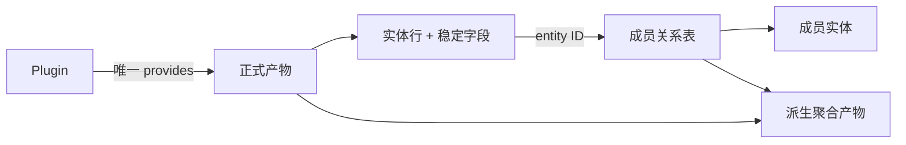

## 1. 正式产物契约

### 1.1 唯一命名产物

正式产物由 Plugin 的 `provides` 发布，可被下游 Plugin 或 Accessor 通过 Context 获取。它不只是一个
NumPy 数组；以下内容共同组成对外契约：

| 契约面 | 包含内容 | 变化影响 |
| --- | --- | --- |
| 身份 | `provides`、Plugin version、lineage | 决定下游依赖和缓存复用 |
| 结构 | dtype、字段、shape/output kind | 决定消费者如何读取 |
| 语义 | 单位、时间域、缺失值、筛选条件 | 决定数值如何解释 |
| 顺序 | 排序键、稳定性、是否按 ID 对齐 | 决定能否做顺序相关操作 |
| 关联 | ID 的生成规则、作用域和目标表 | 决定能否安全 join |

“一个 Plugin，一个正式产物”并不要求内部只有一个中间数组。昂贵构建可以被内部 builder 复用，
但每个对外结果仍由独立 `provides` 发布，使下游能够精确声明所需数据。

### 1.2 三类产物

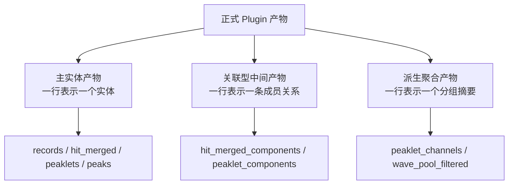

| 类型 | 一行回答的问题 | 当前例子 |
| --- | --- | --- |
| 主实体产物 | “这个实体是什么、有哪些属性？” | `records`、`hit_merged`、`peaklets`、`peaks` |
| 关联型中间产物 | “这个父实体由哪些成员组成？” | `hit_merged_components`、`peaklet_components` |
| 派生聚合产物 | “按稳定维度聚合后得到什么？” | `peaklet_channels` |

`wave_pool_filtered` 是与 records 索引契约对齐的派生波形池，不是成员关系表。关联表和派生表都可能
依赖同一主实体，但解决的问题不同。

## 2. 实体 ID

### 2.1 ID 不是数组行号

`record_id`、`hit_id`、`merged_index`、`peak_id` 或 `peaklet_id` 必须按各自产物契约解释。数组排序、
筛选、分片合并或缓存重建后，行位置不一定保持不变；只有字段明确声明为索引时，行号才可用于定位。

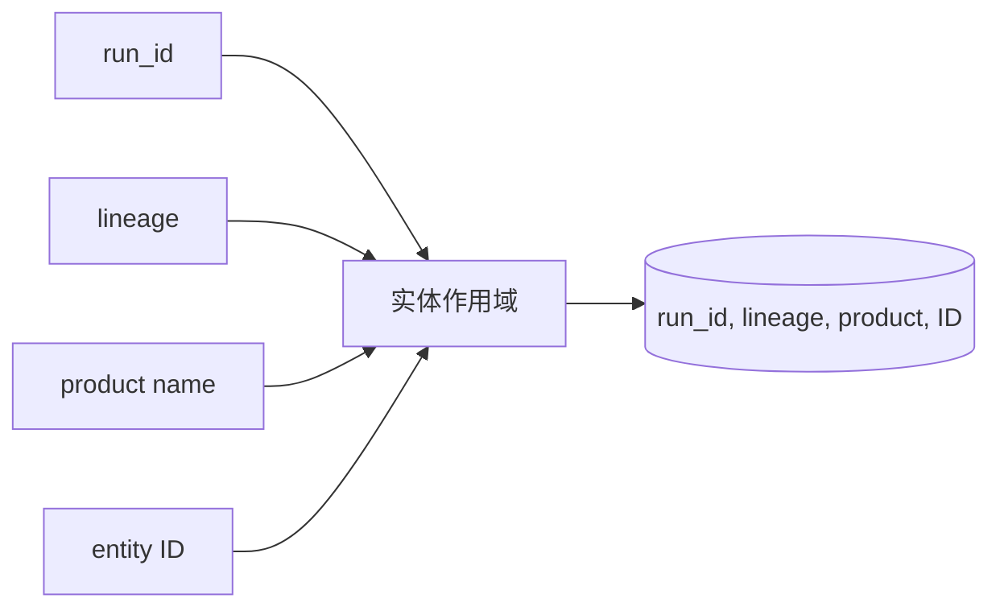

ID 通常是产物内局部标识，不是跨 run、跨配置的全局主键。跨 run 报表至少保留 `(run_id,
entity_id)`；跨 lineage 比较还必须记录产物身份或配置标识。

### 2.2 Join 前提

| 前提 | 原因 | 不满足时的风险 |
| --- | --- | --- |
| 相同 `run_id` | 不同 run 可复用同一局部 ID | 连接到另一次采集的实体 |
| 兼容 lineage | 过滤、聚类或 ID 生成规则可能不同 | 同名 ID 指向不同计算结果 |
| 字段语义匹配 | `peak_id`、`peaklet_id` 等名称不自动等价 | 连接到错误 ID 空间 |
| 关系完整性成立 | 父表和关系表需要共同演进 | 丢成员、重复成员或孤立关系 |

## 3. 成员关系表

成员关系（例如一个 peak/peaklet 由哪些 hit 组成）作为独立正式表发布。主实体保持定长结构，关系表
用多行表达一对多或多对多关系；关系本身因此能够单独缓存、版本化、查询和测试。

### 3.1 当前关系链

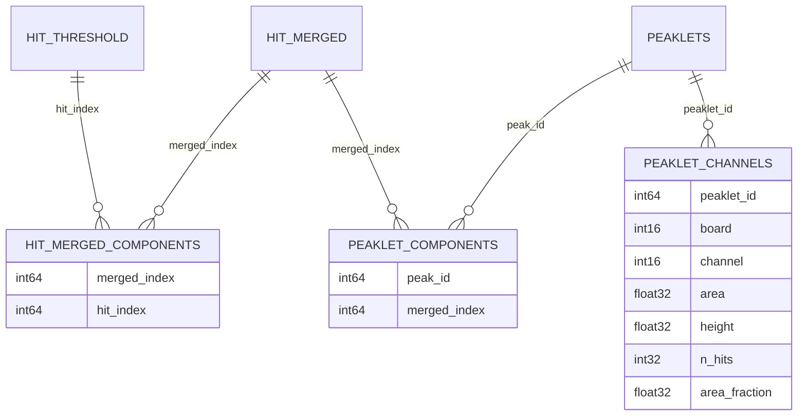

图中的关系是当前实现的字段契约：

- `hit_merged_components` 的每一行把一个 `merged_index` 连接到一个 `hit_index`；
- `peaklet_components` 的每一行把一个 `peak_id` 连接到一个 `merged_index`；
- `peaklet_channels` 不是成员表，它把成员特征按 `(peaklet_id, board, channel)` 聚合。

### 3.2 平铺关系表的布局

假设 `peak_id=12` 包含三个 merged hit，`peak_id=13` 包含两个。关系表使用五行表达，而不是在
peaklets 的一行中保存 Python list：

| `peak_id` | `merged_index` |
| ---: | ---: |
| 12 | 41 |
| 12 | 42 |
| 12 | 47 |
| 13 | 51 |
| 13 | 52 |

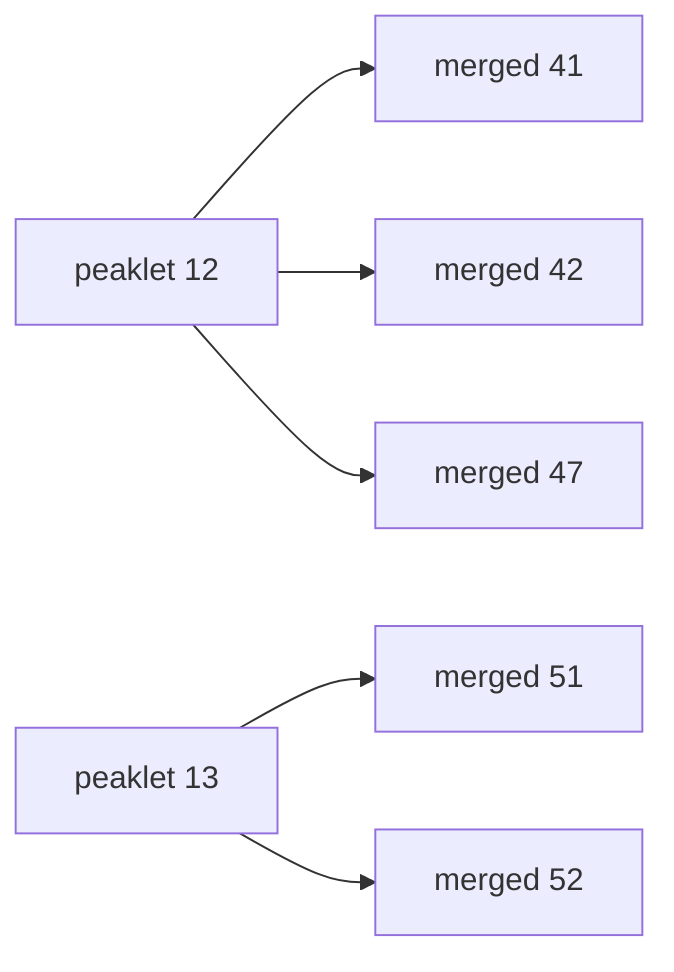

平铺布局保持固定 dtype，支持排序、向量化、分片、memmap 和批量 join。若未来关系需要顺序、角色或
权重，应增加明确的关系字段并升级契约，而不是把隐式含义编码在行出现顺序中。

### 3.3 父表中的 offset/count 与关系表

`hit_merged` 当前包含 `component_offset` 与 `component_count`，用于指向
`hit_merged_components` 中的成员切片。这是显式声明的布局契约，不是一般性的“行号等于 ID”。

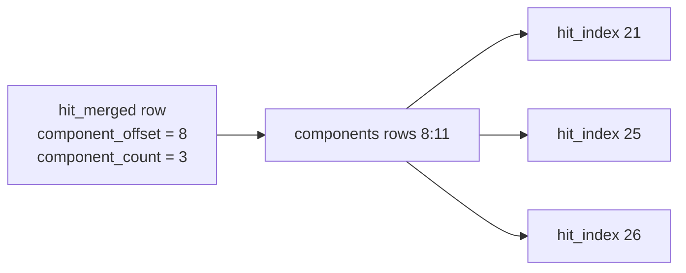

父表的 offset/count 与关系表必须由同一算法语义生成并共同验证。只重建其中一方，会使切片仍在
数组范围内却指向错误成员，属于可能静默发生的数据错误。

## 4. 关系表与派生聚合表

### 4.1 两类问题

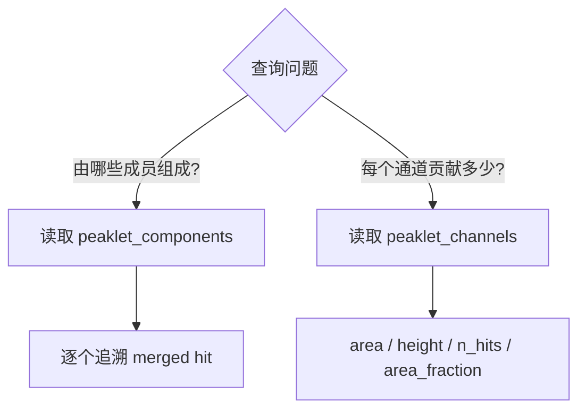

成员表保留可追溯性；派生聚合表提供可复用摘要。仅保留聚合结果无法恢复成员，反复从成员表临时计算
通道摘要又会让多个消费者重复实现同一算法。因此二者应作为不同 Plugin 产物存在。

### 4.2 `peaklet_channels` 的分组契约

`peaklet_channels` 依赖 `peaklets`、`peaklet_components`、`hit_merged_features` 和
`peaklet_features`，按 `(peaklet_id, board, channel)` 分组：

| 字段 | 聚合语义 |
| --- | --- |
| `area` | 分组成员 area 求和 |
| `height` | 分组成员 height 最大值 |
| `n_hits` | 分组成员 n_hits 求和 |
| `area_fraction` | 通道 area / 对应 peaklet 总 area |

通道唯一键使用 `(board, channel)`。缺少 board 的 channel 值不能作为跨硬件板的唯一维度。

## 5. 端到端追溯例子

目标是从一个 `peak_id` 得到成员 hit 和每通道摘要：

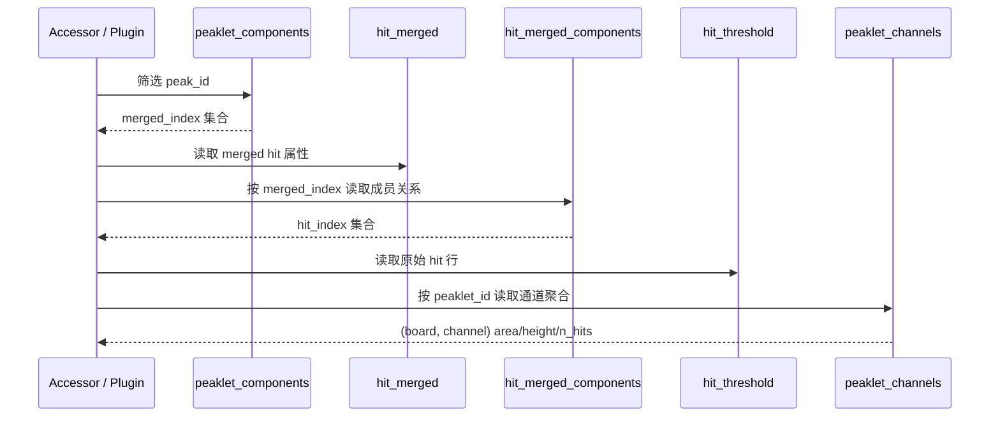

这条路径中每一步都读取正式产物。Accessor 可以把结果组合成一个查询视图；若组合结果需要成为其他
Plugin 的上游或长期复用，则应由新的单一职责 Plugin 正式发布。

## 6. 空输入与完整性

关系产物必须定义空输入行为。父表为空时，关系表返回具有完整声明 dtype 的零行数组，而不是
`None` 或无字段数组。非空数据至少验证以下不变量：

1. 每个关系行的父 ID 与成员 ID 均在允许范围内；
2. 父表声明 `component_count` 时，按父 ID 计数与其一致；
3. 关系行没有契约不允许的重复成员；
4. offset/count 切片不越界，且切片成员属于对应父实体；
5. 关系表、父表和成员表来自同一 run 与兼容 lineage；
6. 派生聚合表的分组键唯一，数值能由对应成员关系重算验证。

## 7. 契约演进

以下变化需要更新 Plugin `version`、下游消费者、Agent 参考页和定向测试：

- 增删字段、改变 dtype、单位或缺失值语义；
- 改变 ID 生成、连续性、排序或作用域；
- 改变关系方向、成员覆盖范围、去重或顺序规则；
- 改变父表 offset/count 与关系表之间的布局；
- 改变派生聚合的分组键或聚合函数；
- 改变默认筛选条件，使同一 `provides` 代表另一组实体。

关系表是正式产物，不能只升级父表而保留旧关系缓存。上游 lineage 正常会沿 DAG 传播，但 Plugin 自身
关系语义改变时仍需要主动升级 version。

## 8. 故障原因

| 现象 | 可能原因 | 检查 |
| --- | --- | --- |
| 父实体缺少成员 | 关系生成漏行、筛选条件不同或缓存版本不一致 | 父 ID 计数、上游 lineage、空输入路径 |
| 同一成员重复出现 | 聚类边界或分片合并重复 | `(parent_id, member_id)` 与允许的多重关系规则 |
| 成员指向错误实体 | 把行号当 ID，或混用 run/lineage | ID 字段定义、run_id、缓存键 |
| `component_count` 正确但成员错误 | offset 指向另一段合法切片 | offset/count 与关系行内容的联合验证 |
| Accessor 返回旧字段 | 产物 schema 改变但 version/缓存未同步 | Plugin version、dtype 元数据、缓存清理 |
| 通道聚合对不上总量 | `(board, channel)` 分组、无效 feature 或分母语义不同 | `peaklet_components`、feature valid 标志、总 area |

## 9. 测试清单

最小测试覆盖正常关系、空输入、越界 ID、重复成员、父子计数、offset/count 切片、dtype、排序、跨
配置 lineage 失效和派生聚合守恒。需要理解执行和缓存传播时参见
[插件执行链与缓存](PLUGIN_DAG_LINEAGE_CACHE.md)。

---

## 10. 波形数据：索引表与样本池

WaveformAnalysis 用"结构化索引产物 + 一维连续波形池"表达可变长度波形。`records + wave_pool`
是该模型的一个实例，`records + wave_pool_filtered` 和
`peaklet_waveforms + peaklet_waveform_pool` 是另外两组配对。不同数据使用各自对应的 pool。

### 10.1 索引表与样本池

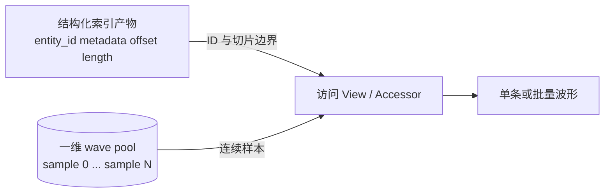

索引产物的一行表示一个实体，保存时间、通道、基线等元数据，以及该实体波形在 pool 中的起点和
长度。pool 只保存连续样本，不独立解释样本属于哪个实体。

```text
pool:  [ record 7 samples ][ record 12 samples ][ record 18 samples ] ...
index: record_id=7  offset=0   length=5
       record_id=12 offset=5   length=8
       record_id=18 offset=13  length=4
```

这种布局避免在结构化表的每一行嵌入固定上限数组，也允许不同实体拥有不同波形长度。数组可连续
存储、压缩或 memmap，访问层则集中处理 ID、切片边界、padding 与 dtype。

### 10.2 配对是完整契约

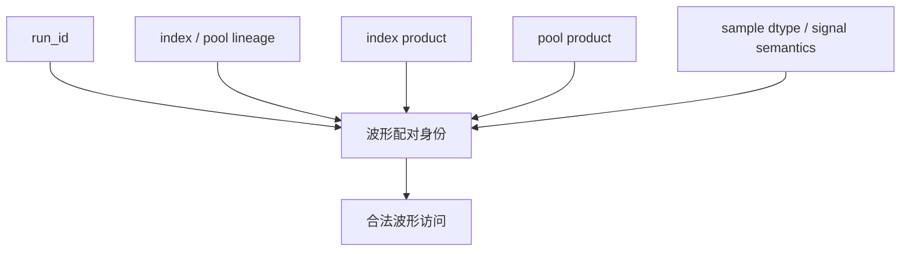

两组 pool 即使长度和 dtype 相同，只要生成算法或索引语义不同，也不能互换。

## 11. 当前配对实例

### 11.1 配对矩阵

| 索引产物 | 波形池 | ID | 切片字段 | 样本语义 | 公开访问 |
| --- | --- | --- | --- | --- | --- |
| `records` | `wave_pool` | `record_id` | `wave_offset`, `event_length` | 原始 record 波形 | `records_view(ctx, run_id)` |
| `records` | `wave_pool_filtered` | `record_id` | `wave_offset`, `event_length` | 与 records 对齐的滤波波形 | `records_view(..., wave_pool_name="wave_pool_filtered")` |
| `peaklet_waveforms` | `peaklet_waveform_pool` | `peak_id` | `wave_offset`, `wave_length` | peaklet 求和波形 | 对应 peaklet Accessor / Plugin |

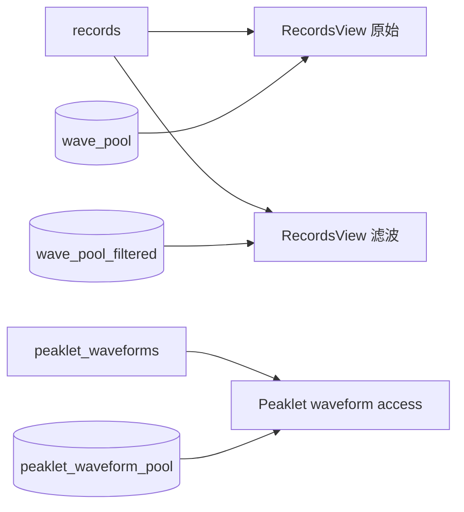

`wave_pool_filtered` 复用 records 的 offset/length 布局，所以仍以 `record_id` 查询；它改变的是样本
内容与信号语义。`peaklet_waveform_pool` 使用另一张索引表和 `wave_length` 字段，不能交给
RecordsView 解释。

### 11.2 Records + WavePool 作为构建实例

`RecordsPlugin` 和 `WavePoolPlugin` 分别发布 `records` 与 `wave_pool`，但内部可通过
`get_records_bundle(context, run_id)` 复用同一次 DAQ 读取和构建。共享 bundle 是实现细节，不是
下游依赖名称。

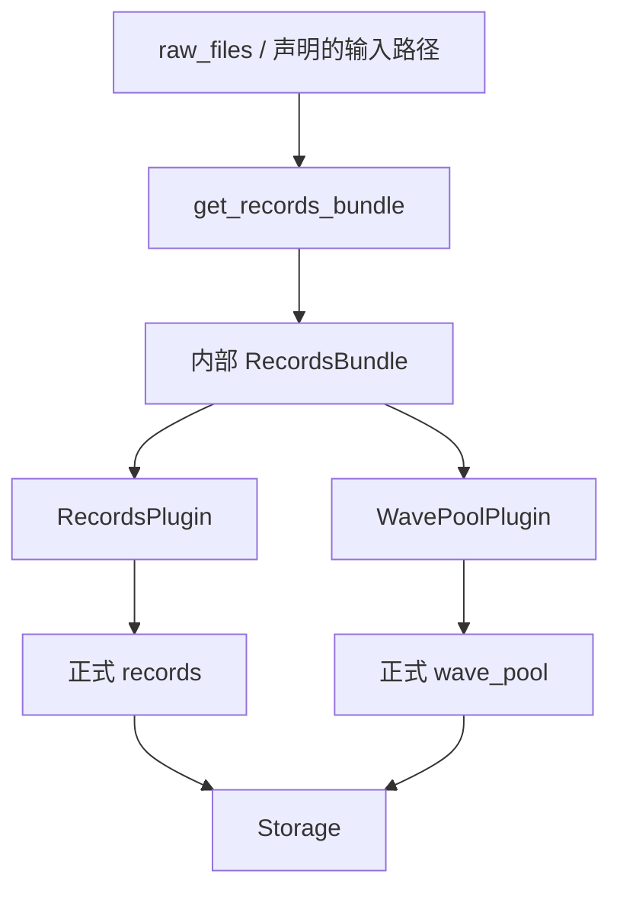

| 条件 | 上游 | 构建路径 |
| --- | --- | --- |
| 非 V1725 默认 | `raw_files` | `build_records_from_raw_files(...)` |
| 非 V1725 且 `input_source="st_waveforms"` | `st_waveforms` | `build_records_from_st_waveforms_sharded(...)` |
| V1725 | 二进制 `raw_files` | `build_records_from_v1725_files(...)` |

当 `records` 与 `wave_pool` 同时注册时，共享构建配置由 `records` 命名空间持有。V1725 使用专用
二进制读取路径，不支持 `input_source="st_waveforms"`。

## 12. RecordsView 访问契约

### 12.1 构造与校验

```python
from waveform_analysis.core.data import records_view

raw = records_view(ctx, "run_001")
filtered = records_view(
    ctx,
    "run_001",
    wave_pool_name="wave_pool_filtered",
)
```

`records_view` 通过 Context 获取指定 run 的 `records` 与 pool。`RecordsView` 构造时验证：

1. records 是结构化数组；
2. 包含 `record_id`、`wave_offset`、`event_length`、`timestamp` 和 `baseline`；
3. `record_id` 唯一；
4. offset 和 length 非负；
5. `wave_offset + event_length <= len(wave_pool)`。

这些验证只能证明数组布局自洽。run 与 lineage 配对由 Context 的正式产物获取路径保证；手工把两份
数组传给 `RecordsView` 时，调用方必须自行保证来源兼容。

### 12.2 ID 定位

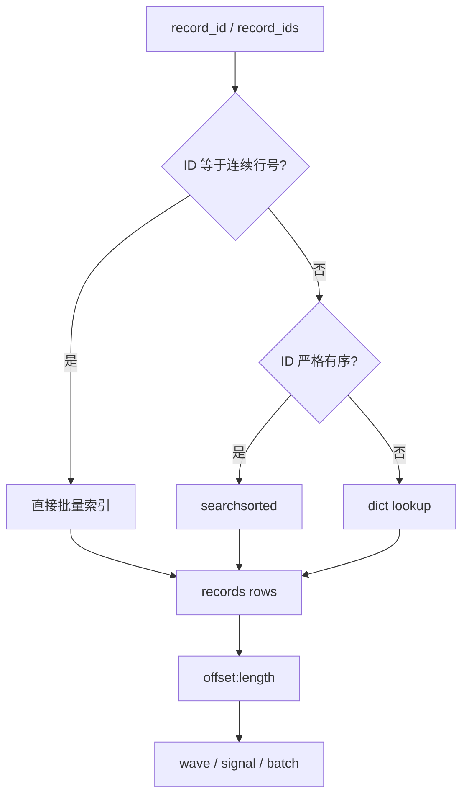

调用 API 使用 `record_id`，不要求它等于数组行号。实现对连续 ID、有序 ID 和一般 ID 分别采用快速
路径，但三条路径必须返回同一语义；未知 ID 抛出 `KeyError`。

### 12.3 Wave、signal 与批量形状

| 返回概念 | 处理 |
| --- | --- |
| wave | pool 中的样本切片，可选 baseline correction 和 dtype 转换 |
| signal | 根据 baseline 和 polarity 归一化后的信号 |
| 批量 wave/signal | 按输入 ID 顺序组织，变长数据通过 padding 与 mask 表达有效区 |
| pool view | 返回对齐的 pool、offset 和 length 数组视图，供向量化消费者使用 |

单条、批量、时间窗和 padding 的具体签名以总站 RecordsView 参考页为准。架构约束是所有入口都先按
ID 定位，再按正式 offset/length 切片，而不是用 records 当前行号猜测波形位置。

## 13. 不同 Pool 的选择

选择 pool 应由数据语义决定，并作为 Plugin 依赖或 Accessor 参数显式出现。

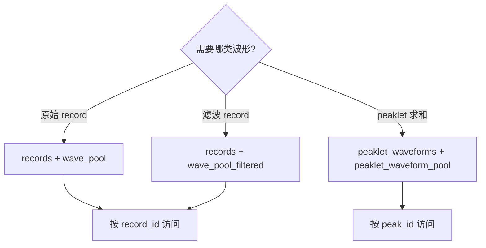

下游 Plugin 若可在原始和滤波 pool 间切换，应通过 `resolve_depends_on()` 把实际 pool 名称加入当前
DAG。仅在 `compute` 中根据配置改字符串，会使 lineage 看不到真实数据来源。

## 14. 构建、分片与合并

构建期可以把 records 和 pool 写入多个临时分片，以限制峰值内存；合并后必须重建全局 offset。

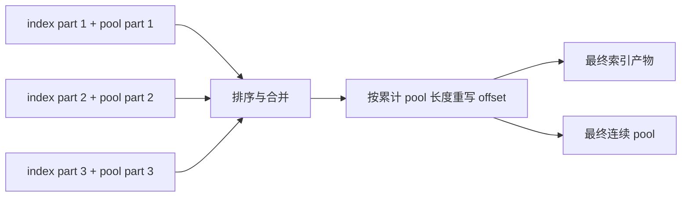

- 普通 adapter 使用 `records_part_size` 控制 records 中间分片；
- V1725 使用 `v1725_part_size` 控制单文件内波形分片，`n_jobs` 控制文件级并行；
- 临时 `RecordsBundleRef` 或 memmap 只属于构建层，不构成 Plugin 间接口；
- 合并、排序、滤波或重采样改变内容时，索引和 pool 的 version/lineage 必须同步演进。

## 15. 内存与复制边界

连续 pool 的主要收益是避免每行固定容量浪费，并支持对单条波形返回切片 view。以下操作仍可能产生
复制：dtype 转换、baseline/polarity 运算、padding 后的定长批量矩阵、跨不连续切片的合并，以及
从压缩缓存加载后的解码。

性能评估不能只看 `records` 表大小，还应同时测量 pool、批量输出矩阵和临时转换数组。对大数据集，
优先使用批量 ID 查询、窗口切片和流式消费，避免一次物化所有 padding 波形。

## 16. 波形访问故障原因

| 现象 | 可能原因 | 检查 |
| --- | --- | --- |
| `outside wave_pool bounds` | pool 合并截断、offset 未重定位或配错 pool | 最大 end、pool 长度、分片累计 offset |
| 波形数值正确但属于别的实体 | 混用 run/lineage，或用行号替代 `record_id` | 两个产物缓存键、ID 查询路径 |
| 滤波结果形状不一致 | `wave_pool_filtered` 未保持 records 布局 | 每行 offset/length 与 pool 总长度 |
| peaklet 波形无法用 RecordsView 读取 | 使用了错误索引表和 length 字段 | 改用 peaklet 对应访问入口 |
| 批量结果内存暴涨 | 大量变长波形被 padding 到最大长度 | 窗口、batch size、mask 与返回 dtype |
| 第二个正式产物重复读取 DAQ | 内部 bundle 未在当前 Context 复用 | `get_records_bundle` 路由与配置所有权 |

## 17. 波形维护检查

1. 新增波形产物时同时定义索引表、pool、ID、offset、length、dtype 和访问入口。
2. 下游只依赖正式产物名，不依赖 bundle、临时 memmap 或构建缓存键。
3. 动态 pool 选择进入依赖解析和 lineage。
4. 空输入、重复 ID、负 offset、越界 end、不同长度和分片重定位均有测试。
5. 冷/热缓存下索引与 pool 配对一致，且跨 run 不共享局部 ID。

参见[插件执行链与缓存](PLUGIN_DAG_LINEAGE_CACHE.md)了解动态来源和缓存身份。
