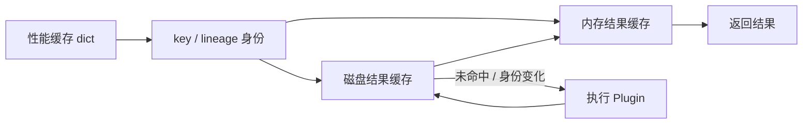
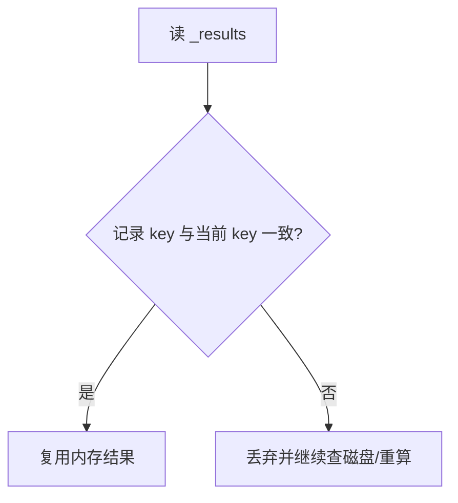
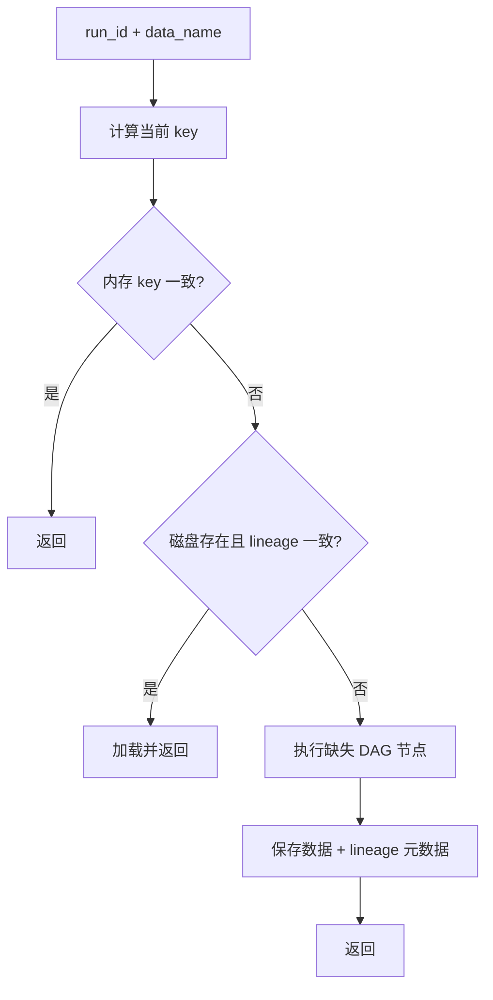

# 插件缓存架构

**导航**: [文档中心](../README.md) > 系统架构与数据模型 > 插件缓存架构

插件缓存把「结果身份」与「结果本体」分层组织：lineage 决定某份结果应该由什么产生，Storage 再按
该身份判断能否复用已有数据。本文说明缓存的分层、键的生成、命中与写盘路径，以及各类失效触发。



## 1. 三层缓存总览

| 层 | 存储位置 | 作用 | 主要字段 |
| --- | --- | --- | --- |
| 性能缓存 | 进程内存 | 加速键、谱系、计划的计算 | `_lineage_cache`、`_lineage_hash_cache`、`_key_cache`、`_execution_plan_cache` 等 |
| 内存结果缓存 | 进程内存 | 已加载/已计算的结果对象 | `_results`、`_results_lineage` |
| 磁盘结果缓存 | 持久化目录 | 跨进程复用正式产物 | `{key}.bin`、`{key}.meta`、`{key}_ch{i}` |

三层由同一个 key 串联：性能缓存负责算出 key，内存结果缓存按 `(run_id, data_name)` 存数据并记录写入
时的 key，磁盘缓存按 key 落盘并校验 lineage 元数据。

## 2. 缓存键与结果身份

### 2.1 key 的组成

```python
key = f"{run_id}-{data_name}-{lineage_hash}"
# lineage_hash = sha1( json(get_lineage(data_name), sort_keys=True) )[:8]
```

`lineage_hash` 只依赖 `data_name`，与 run_id 无关，因此可以预计算一次、跨 run 复用（见第 7 节）。

### 2.2 lineage 内容

默认 lineage 是可序列化配方，递归包含：

- Plugin 类名、`version`、`description`；
- 受跟踪配置（`track=True` 的 resolved option 值）；
- 规范化 dtype、`output_schema`、已验证 spec hash；
- 递归上游 lineage；
- 顶层 adapter 信息（`daq_adapter` 的解释结果）。

Plugin 可通过 `get_lineage(context, *, dependency_resolver=None)` 补充自身构建语义；自定义 hook
应使用 Context 传入的 `dependency_resolver` 构建依赖 lineage。旧的 `get_lineage(context)` 签名仍兼容。
Context 在递归过程中只缓存不含 `adapter_info` 的基础 lineage，并仅在顶层返回值补充一次 adapter
信息，因此冷缓存、热缓存和不同遍历顺序会得到相同 key。lineage 不包含数组内容，也不表示缓存一定存在。

### 2.3 什么会改变 key

| 变化 | 效果 |
| --- | --- |
| 配置（`track=True`）、`version`、dtype/schema/spec 变化 | `lineage_hash` 变化 → 新 key → 旧磁盘结果自动失效 |
| 上游身份变化 | 沿 DAG 传播，下游 lineage 随之变化 |
| `run_id` 不同 | 即使 lineage 相同，key 也不同，同名单名产物不跨 run 复用 |
| 纯资源配置（`track=False`） | 不影响 key |

文件存在本身不是命中；只有「当前 key 与落盘 key/lineage 一致」才是命中。为兼容历史上
`adapter_info` 附着层级不稳定所产生的旧 key，读取端还会检查同一 run/product 的历史 key：仅当元数据
存在，递归移除 `adapter_info` 后其余 lineage 完全相同，并且双方声明的 adapter 信息不冲突时才复用。
版本、配置、dtype/schema/spec、依赖和 run 的差异不会被该兼容规则忽略。历史文件保持只读，新计算始终
写入当前规范 key。

## 3. 内存结果缓存

`_results[(run_id, data_name)]` 保存结果对象；`_results_lineage[(run_id, data_name)]` 记录写入该结果
时的 key。读取时（`_get_data_from_memory`）把 `_results_lineage` 里的旧 key 与当前 `key_for` 重新计算
的 key 比较，不一致说明配置/谱系已变，丢弃该内存项。



## 4. 磁盘结果缓存

### 4.1 目录布局

`MemmapStorage` 按 run 组织缓存目录：

```text
work_dir/{run_id}/_cache/{key}.bin       # 数组本体（memmap / 二进制）
work_dir/{run_id}/_cache/{key}.meta      # JSON 元数据：lineage、dtype、type 等
work_dir/{run_id}/_cache/{key}_ch{i}     # 多通道产物拆分的通道文件
work_dir/{run_id}/_cache/{key}.lock      # 写入锁
```

- DataFrame 产物另存为 parquet/pkl。
- 支持压缩与 checksum，由 Storage 层统一处理，不影响 key 语义。
- 多通道产物保存为 `{key}_ch0`、`{key}_ch1`…；读取时按元数据中的 `channel_count` 组装。

### 4.2 元数据中的 lineage

`{key}.meta` 保存写入时的 lineage（JSON）。读取校验的核心是：把元数据里的 lineage 与当前
`get_lineage(data_name)` 做 JSON 比较。规范 key 优先；历史 key 必须通过上节所述的严格
adapter-placement 兼容检查，缺少 lineage 元数据的历史 key 不会复用。

## 5. 命中与校验路径

`Context.get_data(run_id, target)` 依次检查：

1. **内存命中**：`_get_data_from_memory` 校验 `_results_lineage` 中的 key。
2. **磁盘命中**：`key_for` 得到当前 key，共享解析器按“规范 key → 可证明等价的历史 key”校验；
   validity、执行预览和实际加载使用同一解析结果。
3. **执行计划**：`resolve_execution_plan` 拓扑序 + `compute_needed_set` 剪枝未命中节点。
4. **执行**：只跑缺失节点，`save_plugin_result` 写盘。

`preview_execution` 走相同的依赖与缓存判断，但不执行目标，适合在大规模运行前确认重算范围。



## 6. 写盘路径

`save_plugin_result` 按结果类型分流：

| 结果类型 | 落盘方式 |
| --- | --- |
| `np.ndarray` | `save_memmap(key, ...)` + 写 lineage 元数据 |
| `pd.DataFrame` | `save_dataframe`（parquet/pkl）+ 元数据 |
| list-of-arrays（多通道） | 每个数组存 `{key}_ch{i}` |
| 生成器 / 流式 | 先写 `{key}.bin.tmp`，`finalize_save` 时改名 + 写元数据 + 释放锁 |

写入会失效对应 run 的目录扫描缓存，保证后续读取能看到新键。

## 7. 性能缓存

`ContextCacheDomain` 维护一组纯内存 dict，避免每次请求重复计算：

| 字段 | 键 → 值 | 用途 |
| --- | --- | --- |
| `_lineage_cache` | data_name → 基础谱系 dict | 全节点缓存谱系，顶层再补 adapter_info |
| `_lineage_hash_cache` | data_name → 谱系摘要 | 供 key 拼接 |
| `_key_prefix_cache` | data_name → `"{data_name}-{lineage_hash}"` | run_id 无关前缀，预计算一次 |
| `_key_cache` | (run_id, data_name) → 完整 key | 避免重复拼接；有容量上限（FIFO 淘汰） |
| `_execution_plan_cache` | (run_id, data_name) → 执行计划 | 按 run 键控，避免跨 run 串计划 |
| `_run_key_list_cache` | (id(storage), run_id) → 目录键列表 | 减少磁盘全目录扫描 |
| `_reverse_deps_cache` | (run_id, registry_version) → 反向依赖图 | 级联失效时复用下游收集结果 |

## 8. 失效机制

| 触发 | 动作 |
| --- | --- |
| `register` / 覆盖注册 | 清该 `provides` 的谱系/hash/key 缓存与计划缓存 |
| `clear_cache_for(run_id, name, downstream=True)` | 清内存 `_results`，可选删磁盘，沿下游递归 |
| 节点重算后级联失效 | 逐下游 pop 谱系/键缓存，再用新鲜谱系复查磁盘，失败的加入执行集重算 |
| `clear_performance_caches` | 全清性能缓存 dict |
| 配置变化（`set_config`） | 清 resolved config 与性能缓存 |

级联失效的意义：上游谱系变化后，仅清上游自身缓存不够——下游的缓存里内嵌旧上游身份。必须沿 DAG 对
每个下游失效并用新鲜谱系复查，才能避免命中基于旧身份的磁盘结果。

## 9. 存储层抽象

`Context._storage_call` 统一封装存储方法调用，自动判断方法是否接受 `run_id`；`_get_storage_for_data_name`
允许按 data_name 选择不同后端（`plugin_backends`），默认使用 `self.storage`。这样 key/lineage 逻辑与
具体后端（memmap、压缩、DB）解耦，新增后端不影响缓存身份。

## 10. 相关文档

- [插件执行链与缓存](PLUGIN_DAG_LINEAGE_CACHE.md) - 身份语义、DAG 到缓存复用的主线
- [系统架构与数据流](ARCHITECTURE.md) - 各层职责边界与一次请求的完整路径
- [数据产物与波形访问](DATA_PRODUCTS.md) - 正式产物契约与实体关系
