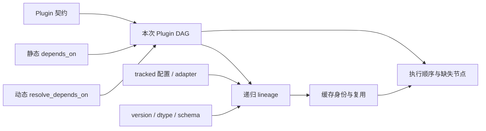
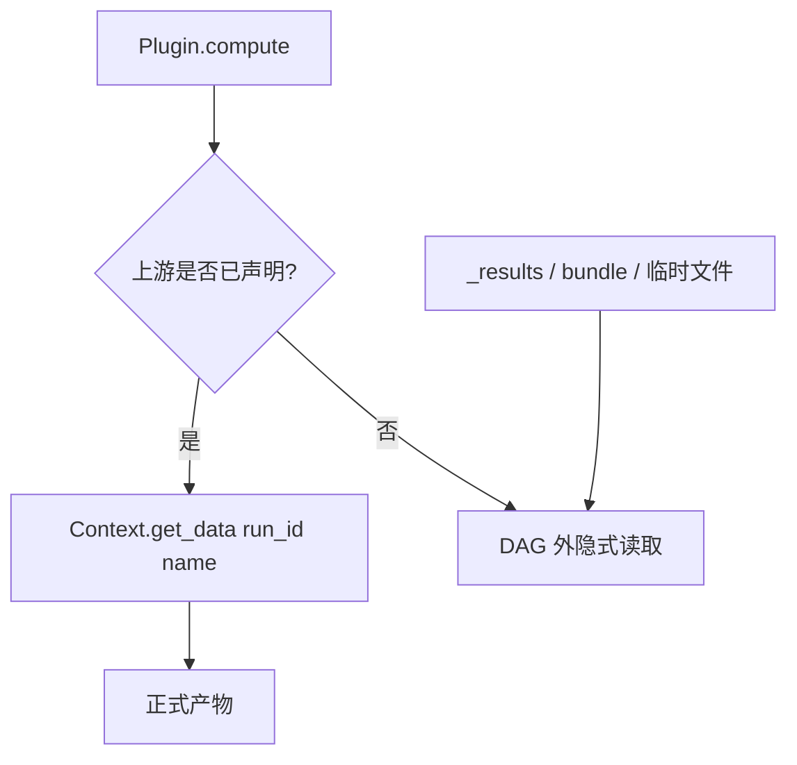
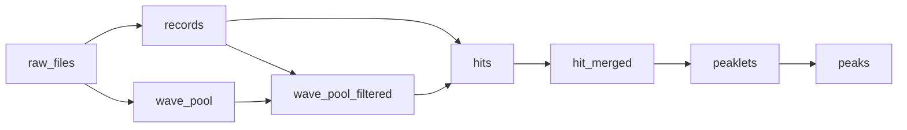
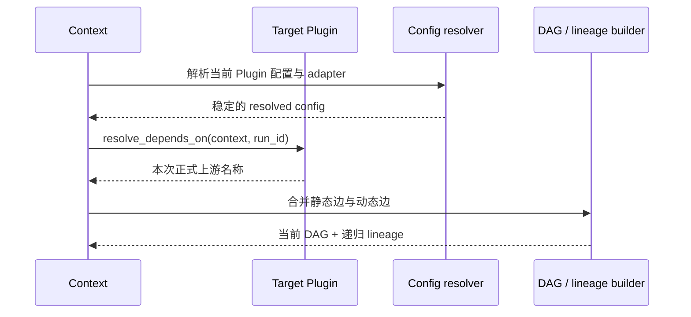
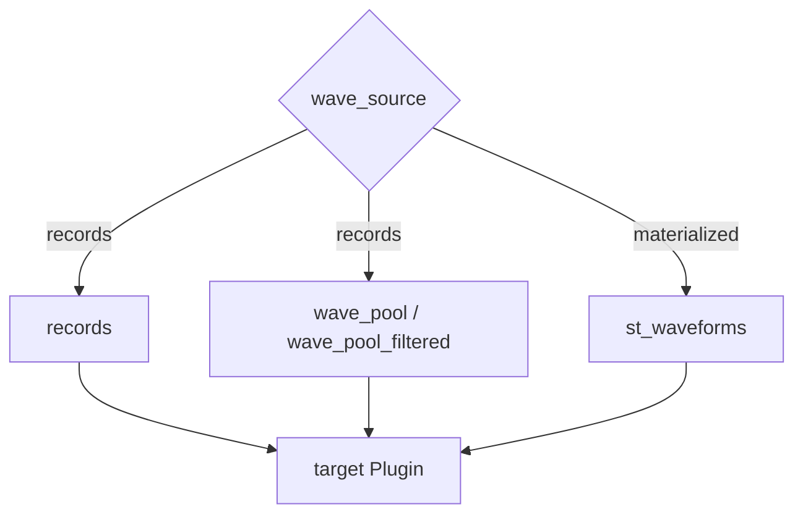
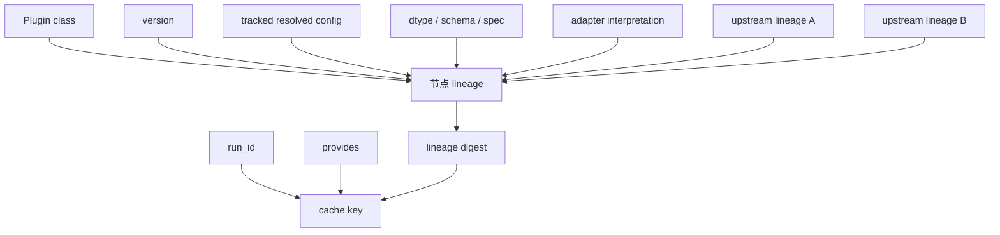
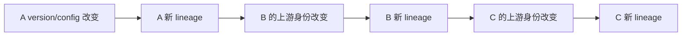
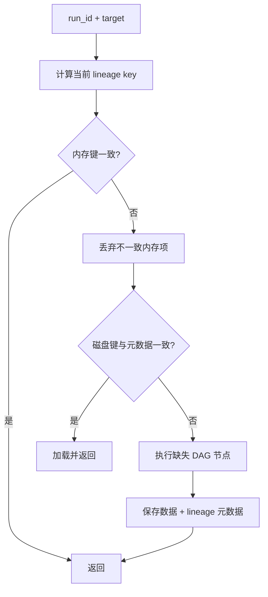

# 插件执行链与缓存

**导航**: [文档中心](../README.md) > [系统架构与数据模型](README.md) > 插件执行链与缓存

一次 `Context.get_data(run_id, target)` 请求同时使用四类信息：Plugin 契约声明节点，静态和动态
依赖组成当前 DAG，lineage 在该 DAG 上递归建立结果身份，缓存用 `(run_id, provides, lineage)`
判断结果能否复用。

DAG 与 lineage 是协同关系：DAG 提供结果的计算结构，lineage 把结构上每个节点使用的实现、配置和
上游身份固定下来。缓存既不能只看图，也不能脱离图单独计算身份。

## 1. Plugin 契约

### 1.1 一个 Plugin 发布一个正式产物

`provides` 是注册表中的唯一数据名。一个 Plugin 可以在内部创建多个数组、索引或临时对象，但只能
对外拥有一个稳定的结果语义。多个正式结果应由多个 Plugin 分别发布，即使它们共享同一次内部构建。

| 契约项 | 运行时用途 | 变化后的处理 |
| --- | --- | --- |
| `provides` | 注册表键、DAG 节点、缓存键的一部分 | 重命名属于公开契约迁移 |
| `depends_on` | 始终存在的上游边 | 新增或删除依赖需同步 lineage 与测试 |
| `resolve_depends_on()` | 本次请求真实存在的条件边 | 必须在执行前确定且可重复解析 |
| `options` | 配置声明、类型校验、来源与跟踪策略 | 语义变化需升级 version |
| `version` | 实现/行为身份 | 行为改变后主动失效旧结果 |
| `output_dtype` / `output_schema` | 字段、类型和结构约束 | 契约变化需执行 schema 检查 |

### 1.2 Plugin 内数据获取

Plugin 通过 `context.get_data(run_id, name)` 读取正式上游，且 `name` 必须出现在静态或动态依赖中。
这条约束让执行预览、lineage、缓存清理和实际运行看到同一张图。

读取 `_results`、共享 builder 的私有键、另一个 Plugin 实例属性或临时文件，会绕过正式依赖关系。
即使当前运行能得到数组，预览和缓存也无法知道真实输入，属于契约错误。

## 2. 静态 DAG

### 2.1 节点与边

节点是 `provides`，边是产物依赖。Context 从目标向上递归解析，得到拓扑顺序；缺失目标、缺失上游
或依赖环在执行前失败。

图只示意依赖方向，不替代当前 Plugin 注册表。运行时图以
`Context.resolve_dependencies(target, run_id=...)` 的结果为准。

### 2.2 DAG 不变量

1. 每个 `provides` 在一个 Context 注册表中唯一。
2. 目标及所有上游必须已注册或由合法输入边界提供。
3. 图必须无环，拓扑顺序中上游先于下游。
4. `compute` 实际读取的全部正式数据必须出现在本次图中。
5. 单次 Plugin 执行只处理请求中的一个 `run_id`。

## 3. 动态依赖

### 3.1 解析时机

`resolve_depends_on(context, run_id=None)` 用于 adapter、配置或 run 条件决定上游的情况。动态边在
lineage 与缓存查询之前解析，因此选择结果同时影响执行计划和结果身份。

动态依赖只能基于已解析配置、adapter 信息和请求上下文作选择，不能先调用未声明的 `get_data()`
探测哪条上游“有数据”。后者会先在 DAG 外触发计算，使预览、缓存键和真实执行分叉。

### 3.2 分支例子

以波形输入选择为例：records-backed 算法依赖结构化索引与对应 pool，另一种输入模式可能依赖已经
物化的波形产物。目标 Plugin 名称可以不变，但不同配置下的依赖集合和 lineage 必须不同。

同一 resolved config 和 run 条件应得到确定的依赖集合。若解析依赖依赖随机状态、调用顺序或上次
执行留下的内存对象，则无法形成稳定缓存身份。

## 4. 从 DAG 到执行计划

### 4.1 Cache-aware plan

Context 先解析目标的依赖顺序，再计算各节点当前缓存键。执行计划保留逻辑 DAG，但只运行未命中或
身份变化的节点。

| 节点状态 | 执行动作 |
| --- | --- |
| 内存结果存在且 lineage 一致 | 直接复用 |
| 磁盘结果存在、元数据和 lineage 一致 | 加载并复用 |
| 上游命中、当前节点缺失 | 只执行当前节点 |
| 上游 lineage 改变 | 从变化节点向下游重算 |
| 动态依赖选择另一分支 | 计算新分支对应的缺失节点 |

`preview_execution(run_id, target)` 使用同类依赖与缓存判断，但不执行目标。它适合在大规模运行前
确认动态分支、缓存命中和预计重算范围。

## 5. Lineage

### Lineage 与缓存身份

#### 5.1 结果身份的组成

默认 lineage 是可序列化配方，包含 Plugin 类、version、描述、受跟踪配置和递归上游 lineage；
存在时还会加入规范化 dtype、`output_schema`、已验证 spec hash 和顶层 adapter 信息。Plugin 可用
`get_lineage(context)` 补充自身构建语义。

lineage 不包含数组内容，也不表示缓存一定存在。它回答“这份结果应该由什么产生”；Storage 再根据
该身份检查是否存在可读取结果。

### 5.2 传播规则

上游变化沿 DAG 传播。下游代码完全未改，只要输入身份改变，它仍应得到新 lineage。反过来，纯资源
配置若声明 `track=False`，不应仅因 worker 数或批大小变化而使全链失效。

## 6. 缓存复用与失效

### 6.1 命中顺序

当前缓存键包含 `run_id`、产物名称和 lineage 摘要。同名产物在不同 run 中不会共享键；同一 run
中配置、version、输出契约或上游身份变化也会产生不同键。

### 6.2 失效矩阵

| 变化 | 正常行为 | 失败时的表现 |
| --- | --- | --- |
| Plugin 行为变化并升级 `version` | 当前节点及下游新键 | 未升级时静默复用旧算法结果 |
| tracked 配置变化 | 当前节点及下游新键 | 错标 `track=False` 时旧结果命中 |
| 动态依赖切换 | lineage 包含另一上游分支 | 动态边遗漏时预览与执行不一致 |
| dtype/schema/spec 变化 | 新输出身份并执行兼容检查 | 契约未进入 lineage 时旧文件被误读 |
| 上游缓存损坏 | 读取失败、诊断或重算 | 只看文件存在会把损坏条目当命中 |
| `track=False` 资源参数变化 | 结果身份保持不变 | 若结果并非等价，会形成错误复用 |

外部文件内容如果不在 Plugin 配方、受跟踪配置或上游 lineage 中，框架不能自动感知变化。解决方式是
修正输入契约或显式清理缓存，而不是假设文件时间戳总会进入身份。

## 7. 故障原因与诊断

### 检查与诊断

| 现象 | 可能原因 | 验证入口 |
| --- | --- | --- |
| 本应命中却重算 | resolved config、adapter、version、schema 或上游身份变化 | `preview_execution`、`get_resolved_config`、`get_lineage` |
| 本应重算却命中 | 行为未升级 version，或语义配置未跟踪 | Plugin options、version 与缓存元数据 |
| 动态路径错误 | `resolve_depends_on` 读到另一配置来源或依赖不确定状态 | `resolve_dependencies(..., run_id=...)` |
| 预览与运行不同 | `compute` 在 DAG 外读取数据，或运行期临时切换来源 | 静态/动态依赖与所有 `get_data` 调用 |
| 磁盘条目损坏或孤立 | 写入中断、checksum 失败、旧元数据遗留 | `waveform-cache diagnose --run <run_id> --dry-run` |
| 清理后仍看到结果 | 清理范围、run 或产物名不一致，或内存项仍在 | `clear_cache_for(run_id, ..., downstream=True)` |

## 8. 维护检查

1. `provides` 唯一且只表达一个正式产物。
2. 静态和动态依赖覆盖 `compute` 的全部正式输入。
3. 动态分支在执行前稳定，并同时进入 DAG 与 lineage。
4. 影响结果的配置受跟踪，纯资源配置才使用 `track=False`。
5. 行为、字段、dtype、默认配置或依赖语义改变时升级 `version`。
6. 冷缓存、部分缓存和热缓存得到相同结果，并产生可解释的执行计划。
7. schema、lineage、动态分支和下游失效均有定向测试。

## 9. 相关专题

- [数据产物与波形访问](DATA_PRODUCTS.md)
- [分析查询与批量运行](ACCESSOR_ANALYSIS.md)
