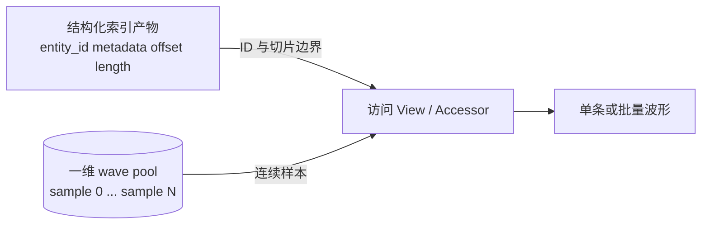
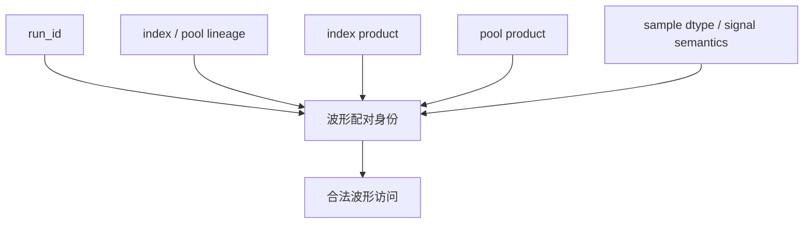
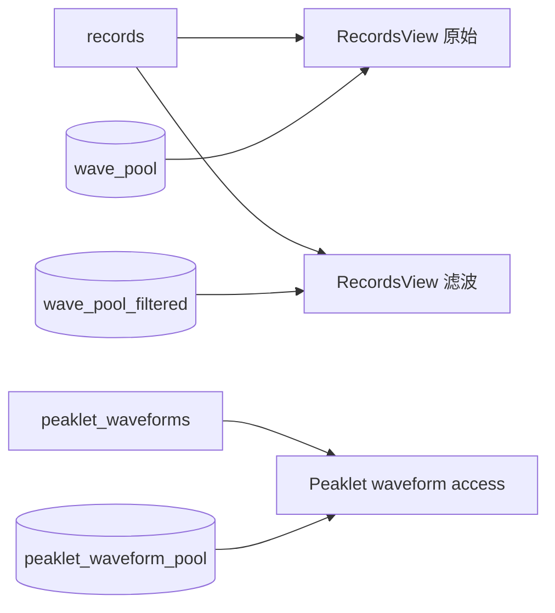
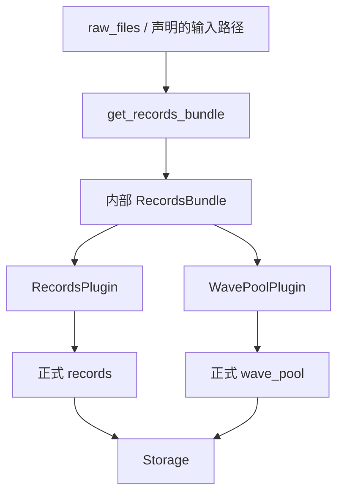
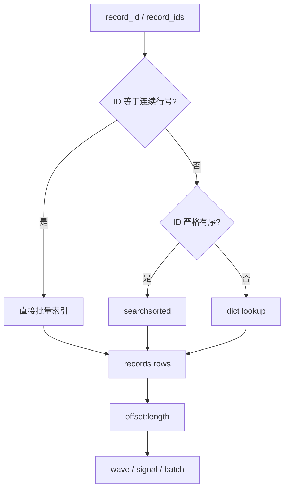
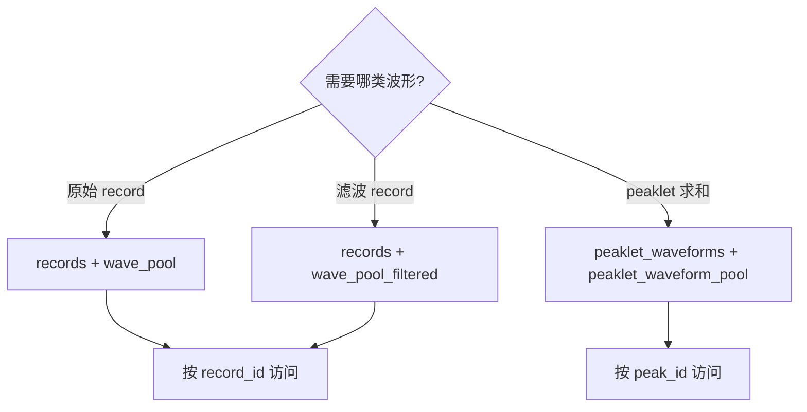
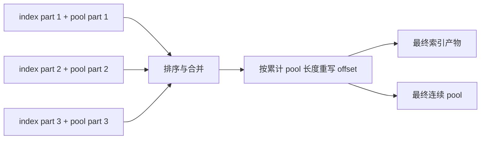

# 波形数据：records 与 Wave Pool 的配对访问

**导航**: [文档中心](../README.md) > [系统架构与数据模型](README.md) > 波形数据：records 与 Wave Pool 的配对访问

WaveformAnalysis 用“结构化索引产物 + 一维连续波形池”表达可变长度波形。`records + wave_pool`
是该模型的一个实例，`records + wave_pool_filtered` 和
`peaklet_waveforms + peaklet_waveform_pool` 是另外两组配对。不同数据使用各自对应的 pool。

## 1. 通用数据布局

### 1.1 索引表与样本池



索引产物的一行表示一个实体，保存时间、通道、基线等元数据，以及该实体波形在 pool 中的起点和
长度。pool 只保存连续样本，不独立解释样本属于哪个实体。

```text
pool:  [ record 7 samples ][ record 12 samples ][ record 18 samples ] ...
index: record_id=7  offset=0   length=5
       record_id=12 offset=5   length=8
       record_id=18 offset=13  length=4
```

这种布局避免在结构化表的每一行嵌入固定上限数组，也允许不同实体拥有不同波形长度。数组可连续
存储、压缩或 memmap，访问层则集中处理 ID、切片边界、padding 与 dtype。

### 1.2 配对是完整契约



两组 pool 即使长度和 dtype 相同，只要生成算法或索引语义不同，也不能互换。

## 2. 当前配对实例

### 2.1 配对矩阵

| 索引产物 | 波形池 | ID | 切片字段 | 样本语义 | 公开访问 |
| --- | --- | --- | --- | --- | --- |
| `records` | `wave_pool` | `record_id` | `wave_offset`, `event_length` | 原始 record 波形 | `records_view(ctx, run_id)` |
| `records` | `wave_pool_filtered` | `record_id` | `wave_offset`, `event_length` | 与 records 对齐的滤波波形 | `records_view(..., wave_pool_name="wave_pool_filtered")` |
| `peaklet_waveforms` | `peaklet_waveform_pool` | `peak_id` | `wave_offset`, `wave_length` | peaklet 求和波形 | 对应 peaklet Accessor / Plugin |



`wave_pool_filtered` 复用 records 的 offset/length 布局，所以仍以 `record_id` 查询；它改变的是样本
内容与信号语义。`peaklet_waveform_pool` 使用另一张索引表和 `wave_length` 字段，不能交给
RecordsView 解释。

### 2.2 Records + WavePool 作为构建实例

`RecordsPlugin` 和 `WavePoolPlugin` 分别发布 `records` 与 `wave_pool`，但内部可通过
`get_records_bundle(context, run_id)` 复用同一次 DAQ 读取和构建。共享 bundle 是实现细节，不是
下游依赖名称。



| 条件 | 上游 | 构建路径 |
| --- | --- | --- |
| 非 V1725 默认 | `raw_files` | `build_records_from_raw_files(...)` |
| 非 V1725 且 `input_source="st_waveforms"` | `st_waveforms` | `build_records_from_st_waveforms_sharded(...)` |
| V1725 | 二进制 `raw_files` | `build_records_from_v1725_files(...)` |

当 `records` 与 `wave_pool` 同时注册时，共享构建配置由 `records` 命名空间持有。V1725 使用专用
二进制读取路径，不支持 `input_source="st_waveforms"`。

## 3. RecordsView 访问契约

### 3.1 构造与校验

```python
from waveform_analysis.core.data import records_view

raw = records_view(ctx, "run_001")
filtered = records_view(
    ctx,
    "run_001",
    wave_pool_name="wave_pool_filtered",
)
```

`records_view` 通过 Context 获取指定 run 的 `records` 与 pool。`RecordsView` 构造时验证：

1. records 是结构化数组；
2. 包含 `record_id`、`wave_offset`、`event_length`、`timestamp` 和 `baseline`；
3. `record_id` 唯一；
4. offset 和 length 非负；
5. `wave_offset + event_length <= len(wave_pool)`。

这些验证只能证明数组布局自洽。run 与 lineage 配对由 Context 的正式产物获取路径保证；手工把两份
数组传给 `RecordsView` 时，调用方必须自行保证来源兼容。

### 3.2 ID 定位



调用 API 使用 `record_id`，不要求它等于数组行号。实现对连续 ID、有序 ID 和一般 ID 分别采用快速
路径，但三条路径必须返回同一语义；未知 ID 抛出 `KeyError`。

### 3.3 Wave、signal 与批量形状

| 返回概念 | 处理 |
| --- | --- |
| wave | pool 中的样本切片，可选 baseline correction 和 dtype 转换 |
| signal | 根据 baseline 和 polarity 归一化后的信号 |
| 批量 wave/signal | 按输入 ID 顺序组织，变长数据通过 padding 与 mask 表达有效区 |
| pool view | 返回对齐的 pool、offset 和 length 数组视图，供向量化消费者使用 |

单条、批量、时间窗和 padding 的具体签名以总站 RecordsView 参考页为准。架构约束是所有入口都先按
ID 定位，再按正式 offset/length 切片，而不是用 records 当前行号猜测波形位置。

## 4. 不同 Pool 的选择

选择 pool 应由数据语义决定，并作为 Plugin 依赖或 Accessor 参数显式出现。



下游 Plugin 若可在原始和滤波 pool 间切换，应通过 `resolve_depends_on()` 把实际 pool 名称加入当前
DAG。仅在 `compute` 中根据配置改字符串，会使 lineage 看不到真实数据来源。

## 5. 构建、分片与合并

构建期可以把 records 和 pool 写入多个临时分片，以限制峰值内存；合并后必须重建全局 offset。



- 普通 adapter 使用 `records_part_size` 控制 records 中间分片；
- V1725 使用 `v1725_part_size` 控制单文件内波形分片，`n_jobs` 控制文件级并行；
- 临时 `RecordsBundleRef` 或 memmap 只属于构建层，不构成 Plugin 间接口；
- 合并、排序、滤波或重采样改变内容时，索引和 pool 的 version/lineage 必须同步演进。

## 6. 内存与复制边界

连续 pool 的主要收益是避免每行固定容量浪费，并支持对单条波形返回切片 view。以下操作仍可能产生
复制：dtype 转换、baseline/polarity 运算、padding 后的定长批量矩阵、跨不连续切片的合并，以及
从压缩缓存加载后的解码。

性能评估不能只看 `records` 表大小，还应同时测量 pool、批量输出矩阵和临时转换数组。对大数据集，
优先使用批量 ID 查询、窗口切片和流式消费，避免一次物化所有 padding 波形。

## 7. 故障原因

| 现象 | 可能原因 | 检查 |
| --- | --- | --- |
| `outside wave_pool bounds` | pool 合并截断、offset 未重定位或配错 pool | 最大 end、pool 长度、分片累计 offset |
| 波形数值正确但属于别的实体 | 混用 run/lineage，或用行号替代 `record_id` | 两个产物缓存键、ID 查询路径 |
| 滤波结果形状不一致 | `wave_pool_filtered` 未保持 records 布局 | 每行 offset/length 与 pool 总长度 |
| peaklet 波形无法用 RecordsView 读取 | 使用了错误索引表和 length 字段 | 改用 peaklet 对应访问入口 |
| 批量结果内存暴涨 | 大量变长波形被 padding 到最大长度 | 窗口、batch size、mask 与返回 dtype |
| 第二个正式产物重复读取 DAQ | 内部 bundle 未在当前 Context 复用 | `get_records_bundle` 路由与配置所有权 |

## 8. 维护检查

1. 新增波形产物时同时定义索引表、pool、ID、offset、length、dtype 和访问入口。
2. 下游只依赖正式产物名，不依赖 bundle、临时 memmap 或构建缓存键。
3. 动态 pool 选择进入依赖解析和 lineage。
4. 空输入、重复 ID、负 offset、越界 end、不同长度和分片重定位均有测试。
5. 冷/热缓存下索引与 pool 配对一致，且跨 run 不共享局部 ID。

参见[数据产物：实体关系与派生结果](DATA_PRODUCTS.md)了解 ID 与关系表，参见
[插件执行链：DAG、动态依赖、Lineage 与缓存](PLUGIN_DAG_LINEAGE_CACHE.md)了解动态来源和缓存身份。
