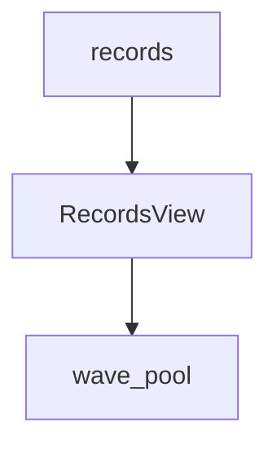

# waveform-docs 命令参考

**导航**: [文档中心](../README.md) > [命令行工具](README.md) > waveform-docs 命令参考

`waveform-docs` 是 WaveformAnalysis 的文档生成工具，用于自动生成插件文档、检查 Markdown 链接和文档覆盖率。
文档工具要求 Python 3.10 或更高版本；仓库同时安装多个解释器时，可通过
`WAVEFORM_PYTHON=/path/to/python` 选择解释器（Makefile 和文档同步脚本会沿用该选择）。

---

## 命令概述

`waveform-docs` 提供以下功能：
- 自动生成内置插件文档
- 生成完全离线的 HTML 文档总站或兼容的独立插件站点，并在本机预览
- 检查文档覆盖率

---

## 基本用法

```bash
waveform-docs <命令> [选项]
```

---

## 子命令

### generate - 生成文档

生成指定类型的文档。

```bash
waveform-docs generate <文档类型> [选项]
```

### check - 检查文档

检查文档链接或插件覆盖率。

```bash
waveform-docs check links [选项]
waveform-docs check coverage [选项]
```

`check links` 离线扫描 `docs/` 下的 Markdown，检查相对文件链接、图片等本地资源，以及同页和跨页
fragment。HTTP(S)、`mailto:` 等外部链接不会被网络请求；链接错误返回退出码 `1`。

### serve - 本地预览

只服务已存在的静态站点目录，不生成站点，也不打开浏览器。

```bash
waveform-docs serve --directory docs/_site --host 127.0.0.1 --port 8000
```

如需让全局 DAG 读取一个已配置的运行时 `Context`，可传入一个可信的无参工厂：

```bash
waveform-docs serve \
  --directory docs/_site \
  --host 0.0.0.0 \
  --lineage-context-factory my_project.docs:create_context
```

此时浏览器访问 `?lineage=live` 会从同源 `GET /api/lineage` 读取当前插件与配置解析出的
端口级 DAG。接口只返回拓扑和文档元数据，不接受 `run_id`、不读取运行数据，也不会执行插件。
未提供工厂、接口不可用或请求失败时，页面自动使用生成时写入的静态 DAG。

---

## 文档类型

| 类型 | 说明 | 默认输出 |
|------|------|----------|
| `plugins-auto` | 自动生成内置插件文档 | `docs/plugins/reference/builtin/auto/` |
| `plugins-agent` | 生成 agent 导向插件文档 | `docs/plugins/reference/agent/` |
| `plugins-web` | 生成离线插件 HTML 站点 | `docs/_site/` |
| `site-web` | 生成包含插件、Context、Accessor 与可视化参考的离线 HTML 文档总站 | `docs/_site/` |

---

## 选项

### generate 选项

| 参数 | 简写 | 类型 | 默认值 | 说明 |
|------|------|------|--------|------|
| `--output` | `-o` | str | - | 输出路径（目录） |
| `--plugin` | `-p` | str | - | 生成单个插件文档 |

### check 选项

| 参数 | 简写 | 类型 | 默认值 | 说明 |
|------|------|------|--------|------|
| `--docs-dir` | `-d` | str | - | 文档目录路径 |
| `--strict` | - | flag | False | 严格模式（也检查 spec 质量） |
| `--fail-on-warning` | - | flag | False | 有警告时也失败 |

`--docs-dir` 同时适用于 `check links` 和 `check coverage`。质量门禁统一使用退出码：`0` 表示通过或
默认容忍的 warning，`1` 表示错误，`2` 表示在传入 `--fail-on-warning` 后仍存在 warning。
传入该选项可明确表达“警告也不能被忽略”的 CI 意图。

---

## 使用示例

### 1. 生成内置插件文档

```bash
# 生成所有内置插件文档
waveform-docs generate plugins-auto

# 指定输出目录
waveform-docs generate plugins-auto -o docs/plugins/reference/builtin/auto/

# 生成单个插件文档
waveform-docs generate plugins-auto --plugin raw_files

# 生成所有 agent 插件文档
waveform-docs generate plugins-agent

# 指定输出目录
waveform-docs generate plugins-agent -o docs/plugins/reference/agent/

# 生成单个插件文档
waveform-docs generate plugins-agent --plugin raw_files

# 生成离线 HTML 站点
waveform-docs generate plugins-web -o docs/_site

# 生成包含插件、Context、Accessor 与可视化参考的 HTML 文档总站
waveform-docs generate site-web

# 检查 docs/ 下的 Markdown 本地链接、资源和 fragment
waveform-docs check links --docs-dir docs
```

`site-web` 生成总站首页，并将插件站放在 `plugins/`、Context 参考放在 `contexts/`、Accessor 参考放在 `accessors/`，统计图与波形图参考放在 `visualizations/`。`Context.plot_lineage()` 归入 Context 的 DAG 专题，不作为绘图参考页。
总站只支持全量生成，因此不能与 `--plugin` 同时使用。`plugins-web` 继续保留原有参数、默认输出和
文件布局，适合只需要插件参考或依赖旧路径的调用。

`site-web` 会先在输出目录旁生成并校验完整站点，再整体替换目标目录。生成或本地链接校验失败时，
原站点保持不变；成功发布会移除上一轮遗留文件。因此 `docs/_site` 应仅存放生成产物，不应放置
需要保留的手工文件。运行中的 `waveform-docs serve` 无需重启，后续请求会读取新发布的文件。
该服务对 HTML、JSON、脚本和样式统一发送禁缓存响应头，避免浏览器或转发层继续复用旧页面。

发布前校验还会检查 HTML `href`/`src` 对应文件和 fragment、搜索索引中的每个 URL，以及每个
`aria-controls` 是否指向当前页面存在的 DOM 节点。任一项失败都会阻断原子发布并保留旧站点。

`site-web` 还会读取 `docs/site-guides.yaml`，把显式收录的 Markdown 渲染进同一 HTML 外壳，
并同步加入左侧分类导航与全站搜索。清单按栏目收录 Markdown 正文：系统架构与数据模型、功能特性、
插件系统、Context 与适配器、Accessor 接口、可视化、API 参考、命令行工具与开发者指南。Markdown
文件是正文唯一真源；生成的 HTML 只负责统一发布，不应手工维护同一份正文。

清单使用 `schema_version: 2`，每个分类声明 `id`、`title` 与 `index_route`；`source_dirs` 目录扫描
自动收录 Markdown，也可用显式 `pages` 声明个别页面：

```yaml
schema_version: 2
sections:
  - id: architecture
    title: 系统架构与数据模型
    index_route: architecture/index.html
    source_dirs:
      - docs/architecture
    pages:
      - source: docs/architecture/ARCHITECTURE.md
        route: architecture/system.html
```

`source` 必须是 `docs/` 内存在的 Markdown 文件，`route` 必须是无 `..` 的相对 `.html` 路径；
重复 source、重复 route、路径逃逸、缺失资源或与总站已有页面冲突都会阻断生成。清单内页面链接、
分类索引和插件参考会改写为对应 HTML 地址；仓库内未收录的 Markdown 链接显示为不可点击文本，
并在命令结束时输出警告。本地图片等资源会复制到 `assets/content/`。

清单中的 Markdown 支持 Mermaid fenced block，包括 `flowchart TD`、子图、边标签和样式：

````markdown

````

站点固定使用本地 Mermaid 11.12.0，不访问 CDN。只有包含 Mermaid block 的页面才加载
`assets/mermaid/mermaid.min.js`，并以 `securityLevel: "strict"` 渲染。加载或语法解析失败时，
页面保留原始 Mermaid 源码并显示错误说明；切换明暗主题时该页面会刷新一次，以当前主题重新绘图。
Mermaid bundle 与 MIT 许可证随站点一起发布。

站点使用本地 MDN 风格的文档外壳：顶部导航、左侧文档树、详情页右侧章节目录，以及窄屏下可
展开的目录抽屉。所有页面均可打开全站搜索；生成器把插件、Accessor 和主要章节写入本地
`assets/search-index.js`，因此通过 `file://` 直接打开时也不依赖 `fetch`、CDN 或在线服务。
插件索引原有的页面内筛选仍保留，用于快速过滤当前卡片集合。

生成后的 HTML 首页使用本地 Plotly 提供可点击、可缩放、可拖拽的紧凑全局插件总览。`Core` 是
默认视图，保留以 `events` 为主终点的处理链；`All outputs` 额外显示 `df_paired`、
`waveform_width_integral` 等默认配置下无消费者的终点输出。两个视图从同一次完整图布局派生，
共享核心节点坐标；终点输出位于其生产者下方的疏松轨道。点击插件会在首页右侧打开
只包含该插件、直接输入和直接消费者的端口级 Plotly 谱系图，端口图复用运行时 Context 的渲染器，
并提供到完整插件参考页的链接。全局依赖使用弧形箭头以区分并行连接；`?focus=<provides>` 可直接
恢复该选择，`?view=core|all&focus=<provides>` 可分享完整页面状态。聚焦终点输出会自动切换到
`all`，视图切换、聚焦以及浏览器前进/后退会保持 URL 同步。下方卡片按正式 `PLUGIN_SETS` 的
执行顺序分组，搜索会隐藏无匹配的整个集合；`cache_analysis` 不属于处理 DAG，单独列在
`Standalone Tools`。

动态依赖使用独立的文档 profile 解析：共享值为 `wave_source=records`、`use_filtered=false`、
文档默认画像为 `documentation-default-v1`：共享值是 `wave_source=records`、`use_filtered=false`、
`daq_adapter=vx2730`，另为 `hit_threshold` 设置 `asymmetry_cut_enabled=true`。优先级依次为插件
专属值、共享 profile、`Option.default`，因此 `hit_threshold` 在静态文档图中精确依赖 `records`、
`wave_pool`、`records_asymmetry_mask`。解析只调用 `resolve_depends_on()`，不读取 run data、缓存或
执行插件 compute。每个插件页仍包含直接上游和下游的局部 SVG 图，并可跳转到首页
对应插件的全局定位视图。站点包含本地 `plotly.min.js` 和 `lineage-details.json`，不引用 CDN 或外部
资源。Core/All 数据另存为 `lineage-overviews.json`，同时嵌入首页，直接通过 `file://` 打开时无需
fetch。图中 `Docs` 表示可用文档字段的加权完整度，`Impact` 表示该插件在默认解析图中的相对下游
覆盖范围；两者均为静态文档指标，不表示运行时性能、数据质量或缓存 lineage。

### 2. 检查文档覆盖率

```bash
# 基本检查
waveform-docs check coverage

# 严格模式（检查 spec、生成内容、源码 fingerprint 与 Auto/Agent 漂移）
waveform-docs check coverage --strict

# 有警告时失败（退出码 2）
waveform-docs check coverage --fail-on-warning
```

覆盖率以插件文档 frontmatter 的真实 `provides` 为准，而不是以文件名猜测身份。普通检查会报告缺失、
版本过期、多余页面、frontmatter `provides` 与文件名不一致，以及重复声明；严格检查还会比较当前
代码事实与两套生成页面，拒绝动态依赖解析漂移、空的工作流/行为/失败模式/示例、无来源 fingerprint、
失效的 published AgentDoc 和占位说明。生成器在提取失败或插件实例化失败时会直接报错，不再静默跳过。

---

## 输出文件说明

### 插件文档

每个插件生成一个 Markdown 文件，包含：
- 基本信息（类名、版本、provides、声明依赖与默认画像下的解析依赖）
- 输出容器、执行模式、保存策略、`run_id`/运行配置契约
- 配置选项表（默认值、单位、范围/choices、弃用信息）
- 输出 schema（dtype 字段、单位和字段含义）
- 源码/AgentDoc 叙述来源与 `source_fingerprint`
- 基于当前插件 profile 的可运行使用示例、工作流和失败模式

生成的文件位于 `docs/plugins/reference/builtin/auto/` 目录：
- `raw_files.md`
- `st_waveforms.md`
- `records.md`
- `hit_threshold.md`
- `peaklets.md`
- `peaks.md`
- `events.md`
- `INDEX.md`（索引页）
- ...

Agent 导向文档默认位于 `docs/plugins/reference/agent/`：
- `INDEX.md`（agent 索引页）
- `<provides>.md`（每个插件一页）

`plugins-web` 站点位于 `docs/_site/`，包含 `index.html`、`plugins/<provides>.html` 与
本地 `assets/site.css` / `assets/site.js`。`site-web` 使用同一输出根目录，生成
`index.html`、`plugins/index.html`、`plugins/<provides>.html`、`contexts/index.html`、`contexts/context.html`、`accessors/index.html`、`visualizations/index.html`、两个可视化详情页、两个 Accessor 详情页以及共享的 `assets/`。两种模式都不引用 CDN 或外部资源，可直接打开
`index.html`，也可通过 `waveform-docs serve --directory docs/_site` 预览。该目录属于派生产物，
不会提交到仓库。

---

## 依赖要求

Markdown 和插件文档生成需要以下依赖：

```bash
pip install jinja2
```

或者安装开发依赖：

```bash
pip install -e ".[docgen]"
```

`site-web` 使用 Mistune 3 渲染清单中的 Markdown，并使用本地 Pygments 为 Accessor、Context 与
可视化 Python 示例生成语法高亮；两项 Python 依赖都包含在 `docgen` extra 中，不作为
WaveformAnalysis 的主运行时依赖。Mermaid 是固定版本的站点前端资产，不需要 Python 包。
缺少 Python 文档依赖时，命令会明确提示安装 `.[docgen]`。

---

## 错误处理

### 常见错误

1. **缺少依赖**
   ```
   ❌ 缺少依赖: No module named 'jinja2'
   提示: 运行 'pip install jinja2' 安装依赖
   ```
   解决: 安装 `jinja2` 包

2. **插件不存在**
   ```
   ❌ 错误: Plugin 'xxx' not found
   ```
   解决: 检查插件名称是否正确

---

## 使用场景

### 场景 1: 更新插件文档

在插件代码更新后，重新生成文档：

```bash
waveform-docs generate plugins-auto
waveform-docs generate plugins-agent
```

### 场景 2: CI/CD 集成

在 CI 中检查文档覆盖率：

```bash
waveform-docs check coverage --strict --fail-on-warning
```

---

## 注意事项

1. **文档准确性**: 生成的文档基于插件的 `SPEC` 和 `options`，确保插件定义完整
2. **输出路径**:
   - `plugins-auto` 默认输出到 `docs/plugins/reference/builtin/auto/`
   - `plugins-agent` 默认输出到 `docs/plugins/reference/agent/`
   - `plugins-web` 与 `site-web` 默认输出到 `docs/_site/`
   均会覆盖已有文件
3. **INDEX.md**: 自动生成索引页，包含所有插件的概览表

---

**相关文档**:
[CLI 工具总览](README.md) |
[API 参考](../api/README.md) |
[插件开发指南](../plugins/README.md)
