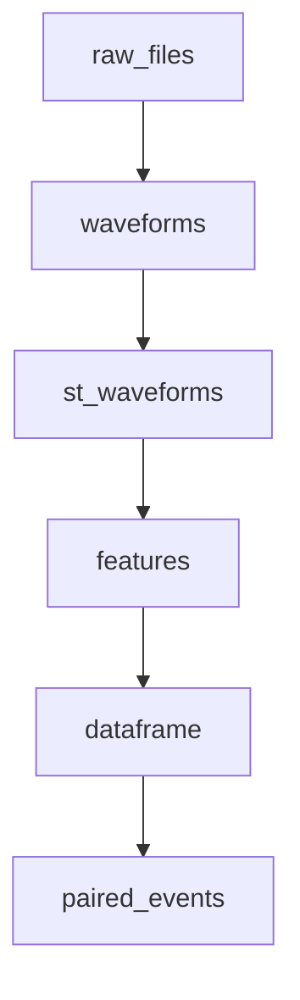

**导航**: [文档中心](../../README.md) > [功能特性](../README.md) > [Context 功能](README.md) > 血缘可视化功能使用指南

---

# 血缘可视化功能使用指南

> **适合人群**: 数据分析用户、开发者 | **阅读时间**: 20 分钟 | **难度**: ⭐⭐ 中级

本指南介绍如何使用 WaveformAnalysis 的血缘（Lineage）可视化功能，帮助你理解数据处理的完整流程和插件之间的依赖关系。

---

## 📋 目录

1. [功能概述](#功能概述)
2. [快速开始](#快速开始)
3. [三种可视化模式](#三种可视化模式)
4. [智能颜色高亮](#智能颜色高亮)
5. [交互式功能](#交互式功能)
6. [与依赖分析集成](#与依赖分析集成)
7. [自定义样式](#自定义样式)
8. [完整示例](#完整示例)
9. [常见问题](#常见问题)

---

## 功能概述

血缘可视化功能可以帮助你：

- 🔍 **理解数据流**：可视化数据从原始文件到最终结果的完整处理流程
- 📊 **查看依赖关系**：清晰看到每个插件依赖哪些数据，产生哪些数据
- 🎨 **智能颜色分类**：自动识别节点类型并应用不同颜色
- 🖱️ **交互式探索**：鼠标悬停查看详情，点击高亮依赖路径
- 🔗 **集成分析**：与依赖分析功能结合，高亮关键路径和瓶颈节点

---

## 快速开始

### 基础用法

最简单的使用方式是通过 Context 的 `plot_lineage` 方法：

```python
from waveform_analysis.core.context import Context

# 创建 Context 并注册插件
ctx = Context(storage_dir="./cache")
# ... 注册插件并处理数据 ...

# 可视化目标数据的血缘图
ctx.plot_lineage("df_paired")
```

### 选择可视化模式

支持三种可视化模式：

```python
# LabVIEW 风格（默认，静态或交互式）
ctx.plot_lineage("df_paired", kind="labview")

# Plotly 高级交互式（推荐用于复杂图形）
ctx.plot_lineage("df_paired", kind="plotly")

# Mermaid 文本格式（用于文档）
mermaid_code = ctx.plot_lineage("df_paired", kind="mermaid")
print(mermaid_code)
```

---

## 三种可视化模式

### 1. LabVIEW 风格（`kind="labview"`）

LabVIEW 风格的静态或交互式可视化，适合大多数场景。

#### 基础用法

```python
# 静态图
ctx.plot_lineage("df_paired", kind="labview")

# 交互式图（鼠标悬停显示详情、点击显示依赖）
ctx.plot_lineage("df_paired", kind="labview", interactive=True)

# 显示详细信息
ctx.plot_lineage("df_paired", kind="labview", verbose=2, interactive=True)
```

#### 特性

- ✅ 支持静态和交互式模式
- ✅ 智能颜色高亮（自动识别节点类型）
- ✅ 鼠标悬停显示详细信息
- ✅ 点击节点显示上游依赖
- ✅ 支持依赖分析高亮（关键路径、瓶颈节点、并行组）
- ✅ 适合静态导出和简单交互

#### 交互式功能

当 `interactive=True` 时：

- **鼠标悬停**：显示节点的详细信息（插件名、key、class、配置等）
- **点击节点**：高亮该节点及其所有上游依赖节点
- **再次点击**：取消高亮

```python
ctx.plot_lineage(
    "df_paired",
    kind="labview",
    interactive=True,
    verbose=2  # 显示更多信息
)
```

---

### 2. Plotly 高级交互式（`kind="plotly"`）

使用 Plotly 绘制的高级交互式可视化，适合复杂图形的深度探索。

#### 基础用法

```python
# Plotly 高级交互式图（始终支持缩放、平移、悬停）
ctx.plot_lineage("df_paired", kind="plotly", verbose=2)
```

#### 特性

- ✅ **真实矩形绘制**：使用 shapes API 绘制节点，尺寸精确
- ✅ **完整交互性**：缩放、平移、框选、悬停提示
- ✅ **坐标同步修复**：拖拽时光标和节点位置完全同步
- ✅ **智能颜色高亮**：自动识别节点类型并应用配色
- ✅ **端口可见**：显示彩色输入/输出端口
- ✅ **类型标注**：悬停提示包含节点类型信息
- ✅ **始终交互式**：不需要 `interactive` 参数

#### 安装要求

```bash
pip install plotly
```

#### 交互功能

Plotly 模式始终是交互式的，支持：

- **缩放**：鼠标滚轮或工具栏按钮
- **平移**：拖拽图形
- **悬停**：鼠标悬停显示详细信息
- **框选**：选择区域进行缩放

```python
ctx.plot_lineage(
    "df_paired",
    kind="plotly",
    verbose=2,  # 显示详细信息
    data_wires=True  # 在连线上显示数据类型
)
```

---

### 3. Mermaid 文本格式（`kind="mermaid"`）

生成 Mermaid 格式的文本，可用于文档或在线编辑器。

#### 基础用法

```python
# 生成 Mermaid 代码
mermaid_code = ctx.plot_lineage("df_paired", kind="mermaid")
print(mermaid_code)

# 可以复制到 Mermaid 在线编辑器或文档中
# https://mermaid.live/
```

#### 输出示例



---

## 智能颜色高亮

系统自动根据节点类型应用颜色方案，无需额外配置。

### 颜色方案

| 节点类型     | 颜色      | 识别规则                                    |
|-------------|----------|-------------------------------------------|
| 原始数据     | 🔵 蓝色系 | RawFiles, Loader, Reader                  |
| 结构化数组   | 🟢 绿色系 | 多字段 dtype（如 `[('time', '<f8'), ...]`）|
| DataFrame   | 🟠 橙色系 | DataFrame, df 关键词                       |
| 聚合数据     | 🟣 紫色系 | Group, Pair, Aggregate, Merge             |
| 副作用       | 🌸 粉红色系| Export, Save, Write                       |
| 中间处理     | ⚪ 灰色系 | 其他所有节点                               |

### 自动识别

颜色高亮完全自动，框架会根据以下信息识别节点类型：

1. **插件类名**：检查类名中的关键词
2. **数据 key**：检查数据名称中的关键词
3. **数据类型**：检查输出端口的 dtype
4. **插件描述**：检查插件描述信息

```python
# 颜色会自动应用，无需配置
ctx.plot_lineage("df_paired", kind="plotly", verbose=2)
```

---

## Verbose 等级

控制节点上显示的信息量：

| verbose | 显示内容 |
|---------|---------|
| `0` | 仅显示插件标题 |
| `1` | 显示标题 + key |
| `2` | 显示标题 + key + class（推荐） |
| `>=3` | 同 verbose=2 |

### 使用示例

```python
# 简洁模式
ctx.plot_lineage("df_paired", verbose=0)

# 标准模式（推荐）
ctx.plot_lineage("df_paired", verbose=1)

# 详细模式
ctx.plot_lineage("df_paired", verbose=2)
```

---

## 交互式功能

### LabVIEW 模式的交互功能

当 `interactive=True` 时：

#### 鼠标悬停

鼠标悬停在节点或端口上时，会显示详细信息：

- 插件名称和类型
- Key 和 Class
- 配置参数
- 输入/输出端口信息
- 描述信息

#### 点击高亮

点击节点会：

1. 高亮该节点
2. 高亮所有上游依赖节点
3. 高亮连接这些节点的边
4. 在控制台打印依赖列表

再次点击同一节点会取消高亮。

```python
ctx.plot_lineage(
    "df_paired",
    kind="labview",
    interactive=True,
    verbose=2
)
```

### Plotly 模式的交互功能

Plotly 模式始终是交互式的，支持：

- **缩放**：鼠标滚轮或工具栏
- **平移**：拖拽图形
- **悬停**：自动显示详细信息
- **框选**：选择区域进行缩放

```python
ctx.plot_lineage(
    "df_paired",
    kind="plotly",
    verbose=2
)
```

---

## 与依赖分析集成

可以将血缘可视化与依赖分析功能结合，高亮关键路径、瓶颈节点和并行组。

### 基础集成

```python
from waveform_analysis.core.context import Context

ctx = Context()
# ... 注册插件并处理数据 ...

# 执行依赖分析
analysis = ctx.analyze_dependencies("df_paired", include_performance=True)

# 可视化并高亮分析结果
ctx.plot_lineage(
    "df_paired",
    kind="labview",
    interactive=True,
    analysis_result=analysis,
    highlight_critical_path=True,      # 高亮关键路径
    highlight_bottlenecks=True,        # 高亮瓶颈节点
    highlight_parallel_groups=True     # 标记并行组
)
```

### 高亮效果

#### 关键路径

关键路径上的节点会显示红色边框（`node_edge_width=4`）：

```python
ctx.plot_lineage(
    "df_paired",
    kind="labview",
    analysis_result=analysis,
    highlight_critical_path=True
)
```

#### 瓶颈节点

瓶颈节点会根据严重程度显示不同颜色：

- **高严重性**：浅红色背景 + 红色边框
- **中等严重性**：浅橙色背景 + 橙色边框
- **低严重性**：浅黄色背景

```python
ctx.plot_lineage(
    "df_paired",
    kind="labview",
    analysis_result=analysis,
    highlight_bottlenecks=True
)
```

#### 并行组

并行组会用彩色徽章标记（P1, P2, P3...）：

```python
ctx.plot_lineage(
    "df_paired",
    kind="labview",
    analysis_result=analysis,
    highlight_parallel_groups=True
)
```

### 完整示例

```python
# 1. 执行依赖分析
analysis = ctx.analyze_dependencies(
    "df_paired",
    include_performance=True
)

# 2. 可视化并高亮所有分析结果
ctx.plot_lineage(
    "df_paired",
    kind="plotly",
    verbose=2,
    analysis_result=analysis,
    highlight_critical_path=True,
    highlight_bottlenecks=True,
    highlight_parallel_groups=True,
    data_wires=True  # 显示数据类型
)
```

---

## 自定义样式

### 使用 LineageStyle

可以自定义节点大小、间距、颜色等样式：

```python
from waveform_analysis.core.foundation.utils import LineageStyle

# 创建自定义样式
style = LineageStyle(
    node_width=4.0,      # 节点宽度
    node_height=2.0,     # 节点高度
    x_gap=6.0,           # 水平间距
    y_gap=3.0,           # 垂直间距
    verbose=2            # 显示详细信息
)

# 使用自定义样式
ctx.plot_lineage(
    "df_paired",
    kind="labview",
    style=style,
    interactive=True
)
```

### 通过 kwargs 覆盖样式

也可以直接通过 kwargs 传递样式参数：

```python
ctx.plot_lineage(
    "df_paired",
    kind="labview",
    node_width=5.0,
    node_height=2.5,
    x_gap=8.0,
    y_gap=4.0,
    verbose=2
)
```

### 可用的样式参数

| 参数 | 说明 | 默认值 |
|------|------|--------|
| `node_width` | 节点宽度 | 4.0 |
| `node_height` | 节点高度 | 2.0 |
| `x_gap` | 水平间距 | 6.0 |
| `y_gap` | 垂直间距 | 3.0 |
| `verbose` | 信息详细程度 | 1 |
| `wire_linewidth` | 连线宽度 | 1.5 |
| `wire_alpha` | 连线透明度 | 0.6 |

---

## 完整示例

### 示例 1: 基础可视化

```python
from waveform_analysis.core.context import Context
from waveform_analysis.core.plugins import (
    RawFilesPlugin,
    WaveformsPlugin,
    StWaveformsPlugin,
    BasicFeaturesPlugin,
    DataFramePlugin,
    GroupedEventsPlugin,
    PairedEventsPlugin,
)

# 创建 Context
ctx = Context(storage_dir="./cache")

# 注册插件
ctx.register(
    RawFilesPlugin(),
    WaveformsPlugin(),
    StWaveformsPlugin(),
    BasicFeaturesPlugin(),
    DataFramePlugin(),
    GroupedEventsPlugin(),
    PairedEventsPlugin(),
)

# 处理数据
run_name = "my_run"
ctx.get_data(run_name, "df_paired")

# 可视化血缘图
ctx.plot_lineage("df_paired", kind="plotly", verbose=2)
```

### 示例 2: 交互式探索

```python
# 使用 LabVIEW 交互式模式
ctx.plot_lineage(
    "df_paired",
    kind="labview",
    interactive=True,
    verbose=2,
    data_wires=True  # 在连线上显示数据类型
)
```

### 示例 3: 与依赖分析结合

```python
# 1. 启用性能统计
ctx = Context(
    storage_dir="./cache",
    enable_stats=True,
    stats_mode='detailed'
)

# 2. 注册插件并处理数据
# ... (注册和处理代码) ...

# 3. 执行依赖分析
analysis = ctx.analyze_dependencies(
    "df_paired",
    include_performance=True
)

# 4. 可视化并高亮分析结果
ctx.plot_lineage(
    "df_paired",
    kind="plotly",
    verbose=2,
    analysis_result=analysis,
    highlight_critical_path=True,
    highlight_bottlenecks=True,
    highlight_parallel_groups=True
)
```

### 示例 4: 导出 Mermaid 代码

```python
# 生成 Mermaid 代码用于文档
mermaid_code = ctx.plot_lineage("df_paired", kind="mermaid")

# 保存到文件
with open("lineage.md", "w") as f:
    f.write("```mermaid\n")
    f.write(mermaid_code)
    f.write("\n```\n")

print("Mermaid 代码已保存到 lineage.md")
```

---

## 常见问题

### Q1: 如何选择可视化模式？

**A**: 根据你的需求选择：

- **LabVIEW 模式**：适合大多数场景，支持静态和交互式
- **Plotly 模式**：适合复杂图形（节点数 > 20），交互性更好
- **Mermaid 模式**：适合文档和在线编辑器

```python
# 简单场景
ctx.plot_lineage("df", kind="labview")

# 复杂场景
ctx.plot_lineage("df_paired", kind="plotly")
```

### Q2: Plotly 模式需要安装什么？

**A**: 需要安装 plotly：

```bash
pip install plotly
```

如果未安装，会抛出 `ImportError`。

### Q3: 如何控制显示的信息量？

**A**: 使用 `verbose` 参数：

```python
# 简洁
ctx.plot_lineage("df", verbose=0)

# 标准（推荐）
ctx.plot_lineage("df", verbose=1)

# 详细
ctx.plot_lineage("df", verbose=2)
```

### Q4: 如何高亮特定节点？

**A**: 使用依赖分析结果：

```python
analysis = ctx.analyze_dependencies("df_paired")
ctx.plot_lineage(
    "df_paired",
    analysis_result=analysis,
    highlight_critical_path=True,
    highlight_bottlenecks=True
)
```

### Q5: 可以导出图片吗？

**A**: 

- **LabVIEW 模式**：可以使用 matplotlib 的保存功能
- **Plotly 模式**：可以使用 plotly 的导出功能（需要 kaleido）

```python
# LabVIEW 模式
fig = ctx.plot_lineage("df", kind="labview")
fig.savefig("lineage.png", dpi=300)

# Plotly 模式
fig = ctx.plot_lineage("df", kind="plotly")
fig.write_image("lineage.png")  # 需要 pip install kaleido
```

### Q6: 节点颜色是如何确定的？

**A**: 系统自动根据以下规则识别：

1. 插件类名中的关键词
2. 数据 key 中的关键词
3. 输出端口的 dtype
4. 插件描述信息

无需手动配置，框架会自动应用合适的颜色。

### Q7: 如何查看原始血缘数据？

**A**: 使用 `get_lineage` 方法：

```python
lineage_dict = ctx.get_lineage("df_paired")
print(lineage_dict)
```

### Q8: 交互式功能不工作怎么办？

**A**: 

- **LabVIEW 模式**：确保 `interactive=True`
- **Plotly 模式**：始终是交互式的，如果不行可能是浏览器问题

```python
# LabVIEW 模式需要显式启用
ctx.plot_lineage("df", kind="labview", interactive=True)

# Plotly 模式始终交互式
ctx.plot_lineage("df", kind="plotly")
```

---

## 技术实现

### LabVIEW 模式

- 使用 Matplotlib Patches（Rectangle, FancyArrowPatch）绘制
- 交互功能基于 matplotlib 事件系统
- 适合静态导出和简单交互

### Plotly 模式

- 使用 plotly shapes API 绘制矩形节点和端口
- 使用 annotations 添加文本和箭头
- 使用隐藏的 scatter traces 实现 hover 效果
- 明确设置坐标范围和 1:1 比例保证拖拽同步
- 适合复杂图形的深度探索

### Mermaid 模式

- 生成标准的 Mermaid 文本格式
- 可以在 Mermaid Live Editor 中查看
- 适合文档和在线编辑器

---

## 相关资源

- [依赖分析指南](DEPENDENCY_ANALYSIS_GUIDE.md) - 依赖分析功能
- [预览执行计划](PREVIEW_EXECUTION.md) - 预览执行计划
- [API 参考](../../api/README.md) - 完整 API 文档

---

**快速链接**:
[依赖分析](DEPENDENCY_ANALYSIS_GUIDE.md) |
[预览执行](PREVIEW_EXECUTION.md) |
[API 参考](../../api/README.md)
