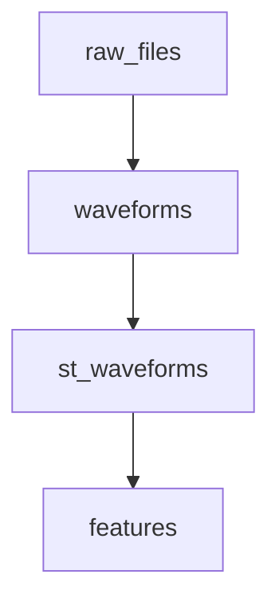

**导航**: [文档中心](../../README.md) > [功能特性](../README.md) > [Context 功能](README.md) > 血缘可视化功能使用指南

---

# 血缘可视化功能使用指南

本指南介绍如何使用 WaveformAnalysis 的血缘（Lineage）可视化功能，帮助你理解数据处理的完整流程和插件之间的依赖关系。

## 功能概述

血缘可视化功能可以帮助你：

- **理解数据流**：可视化数据从原始文件到最终结果的完整处理流程
- **查看依赖关系**：清晰看到每个插件依赖哪些数据，产生哪些数据
- **智能颜色分类**：自动识别节点类型并应用不同颜色
- **交互式探索**：鼠标悬停查看详情，点击高亮依赖路径
- **集成分析**：与依赖分析功能结合，高亮关键路径和瓶颈节点

## 快速开始

最简单的使用方式是通过 Context 的 `plot_lineage` 方法：

```python
from waveform_analysis.core.context import Context

# 创建 Context 并注册插件
ctx = Context(storage_dir="./cache")
# ... 注册插件并处理数据 ...

# 可视化目标数据的血缘图
ctx.plot_lineage("df_paired")
```

支持三种可视化模式：

```python
# LabVIEW 风格（默认，静态或交互式）
ctx.plot_lineage("df_paired", kind="labview")

# Plotly 高级交互式（推荐用于复杂图形）
ctx.plot_lineage("df_paired", kind="plotly")

# Mermaid 文本格式（用于文档）
mermaid_code = ctx.plot_lineage("df_paired", kind="mermaid")
```

---

## 三种可视化模式

### LabVIEW 风格（`kind="labview"`）

LabVIEW 风格的静态或交互式可视化，适合大多数场景。

```python
# 静态图
ctx.plot_lineage("df_paired", kind="labview")

# 交互式图（鼠标悬停显示详情、点击显示依赖）
ctx.plot_lineage("df_paired", kind="labview", interactive=True)

# 显示详细信息
ctx.plot_lineage("df_paired", kind="labview", verbose=2, interactive=True)
```

特性：
- 支持静态和交互式模式
- 智能颜色高亮（自动识别节点类型）
- 鼠标悬停显示详细信息
- 点击节点显示上游依赖
- 支持依赖分析高亮（关键路径、瓶颈节点、并行组）

### Plotly 高级交互式（`kind="plotly"`）

使用 Plotly 绘制的高级交互式可视化，适合复杂图形的深度探索。

```python
# Plotly 高级交互式图（始终支持缩放、平移、悬停）
ctx.plot_lineage("df_paired", kind="plotly", verbose=2)
```

特性：
- 真实矩形绘制，尺寸精确
- 完整交互性：缩放、平移、框选、悬停提示
- 智能颜色高亮
- 端口可见，显示彩色输入/输出端口

安装要求：`pip install plotly`

### Mermaid 文本格式（`kind="mermaid"`）

生成 Mermaid 格式的文本，可用于文档或在线编辑器。

```python
mermaid_code = ctx.plot_lineage("df_paired", kind="mermaid")
print(mermaid_code)
```

输出示例：



## 智能颜色高亮

系统自动根据节点类型应用颜色方案，无需额外配置。

| 节点类型 | 颜色 | 识别规则 |
|---------|------|---------|
| 原始数据 | 蓝色系 | RawFiles, Loader, Reader |
| 结构化数组 | 绿色系 | 多字段 dtype |
| DataFrame | 橙色系 | DataFrame, df 关键词 |
| 聚合数据 | 紫色系 | Group, Pair, Aggregate, Merge |
| 副作用 | 粉红色系 | Export, Save, Write |
| 中间处理 | 灰色系 | 其他所有节点 |

颜色高亮完全自动，框架会根据插件类名、数据 key、数据类型和插件描述识别节点类型。

## Verbose 等级

控制节点上显示的信息量：

| verbose | 显示内容 |
|---------|---------|
| `0` | 仅显示标题（key） |
| `1` | 显示标题（key）+ class |
| `2` | 显示 class + description + config |

## 与依赖分析集成

可以将血缘可视化与依赖分析功能结合，高亮关键路径、瓶颈节点和并行组。

```python
# 执行依赖分析
analysis = ctx.analyze_dependencies("df_paired", include_performance=True)

# 可视化并高亮分析结果
ctx.plot_lineage(
    "df_paired",
    kind="labview",
    interactive=True,
    analysis_result=analysis,
    highlight_critical_path=True,      # 高亮关键路径（红色边框）
    highlight_bottlenecks=True,        # 高亮瓶颈节点（红/橙/黄背景）
    highlight_parallel_groups=True     # 标记并行组（彩色徽章）
)
```

高亮效果：
- **关键路径**：红色粗边框
- **高严重性瓶颈**：浅红色背景 + 红色边框
- **中等严重性瓶颈**：浅橙色背景 + 橙色边框
- **低严重性瓶颈**：浅黄色背景
- **并行组**：右上角带颜色徽章（P1, P2, ...）

## 自定义样式

### 使用 LineageStyle

```python
from waveform_analysis.core.foundation.utils import LineageStyle

style = LineageStyle(
    node_width=4.0,      # 节点宽度
    node_height=2.0,     # 节点高度
    x_gap=6.0,           # 水平间距
    y_gap=3.0,           # 垂直间距
    verbose=2            # 显示详细信息
)

ctx.plot_lineage("df_paired", kind="labview", style=style, interactive=True)
```

### 可用的样式参数

| 参数 | 说明 | 默认值 |
|------|------|--------|
| `node_width` | 节点宽度 | 4.0 |
| `node_height` | 节点高度 | 2.0 |
| `x_gap` | 水平间距 | 6.0 |
| `y_gap` | 垂直间距 | 3.0 |
| `verbose` | 信息详细程度 | 1 |
| `wire_linewidth` | 连线宽度 | 1.5 |
| `wire_alpha` | 连线透明度 | 0.6 |
| `layout_reorder` | 是否重排以减少交叉 | `True` |

### 线条语义化 + 端口分组

```python
style = LineageStyle(
    wire_style_overrides={
        "peaks": {"dash": "dash", "width": 2.0},
        "charges": {"dash": "dot", "alpha": 0.6},
    },
    port_groups={
        "dataframe": {
            "in": [["peaks"], ["st_waveforms"], ["charges"]],
        }
    },
)

ctx.plot_lineage("df_paired", kind="labview", style=style)
```

## 完整示例

### 示例 1: 基础可视化与交互式探索

```python
from waveform_analysis.core.context import Context
from waveform_analysis.core.plugins import (
    RawFilesPlugin, WaveformsPlugin, StWaveformsPlugin,
    BasicFeaturesPlugin, DataFramePlugin, PairedEventsPlugin,
)

# 创建 Context 并注册插件
ctx = Context(storage_dir="./cache")
ctx.register(
    RawFilesPlugin(), WaveformsPlugin(), StWaveformsPlugin(),
    BasicFeaturesPlugin(), DataFramePlugin(), PairedEventsPlugin(),
)

# 处理数据
ctx.get_data("my_run", "df_paired")

# 可视化血缘图
ctx.plot_lineage("df_paired", kind="plotly", verbose=2)

# 或使用 LabVIEW 交互式模式
ctx.plot_lineage("df_paired", kind="labview", interactive=True, verbose=2)
```

### 示例 2: 与依赖分析结合

```python
# 1. 启用性能统计
ctx = Context(
    storage_dir="./cache",
    stats_mode='detailed'
)

# 2. 注册插件并处理数据
# ... (注册和处理代码) ...

# 执行依赖分析
analysis = ctx.analyze_dependencies("df_paired", include_performance=True)

# 可视化并高亮分析结果
ctx.plot_lineage(
    "df_paired",
    kind="plotly",
    verbose=2,
    analysis_result=analysis,
    highlight_critical_path=True,
    highlight_bottlenecks=True,
    highlight_parallel_groups=True
)
```

## 常见问题

### Q1: 如何选择可视化模式？

根据你的需求选择：
- **LabVIEW 模式**：适合大多数场景，支持静态和交互式
- **Plotly 模式**：适合复杂图形（节点数 > 20），交互性更好
- **Mermaid 模式**：适合文档和在线编辑器

### Q2: 如何控制显示的信息量？

使用 `verbose` 参数：`verbose=0`（简洁）、`verbose=1`（标准）、`verbose=2`（详细）

### Q3: 可以导出图片吗？

```python
# 通用方式（自动导出）
ctx.plot_lineage("df", kind="labview", save_path="lineage.png")
ctx.plot_lineage("df", kind="plotly", save_path="lineage.png")  # 需要 pip install kaleido

# LabVIEW 模式
fig = ctx.plot_lineage("df", kind="labview")
fig.savefig("lineage.png", dpi=300)

# Plotly 模式
fig = ctx.plot_lineage("df", kind="plotly")
fig.write_image("lineage.png")  # 需要 pip install kaleido
```

### Q4: 如何查看原始血缘数据？

```python
lineage_dict = ctx.get_lineage("df_paired")
print(lineage_dict)
```

## 相关文档

- [依赖分析指南](DEPENDENCY_ANALYSIS_GUIDE.md)
- [预览执行计划](PREVIEW_EXECUTION.md)
- [API 参考](../../api/README.md)
