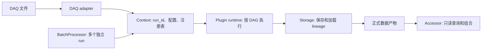
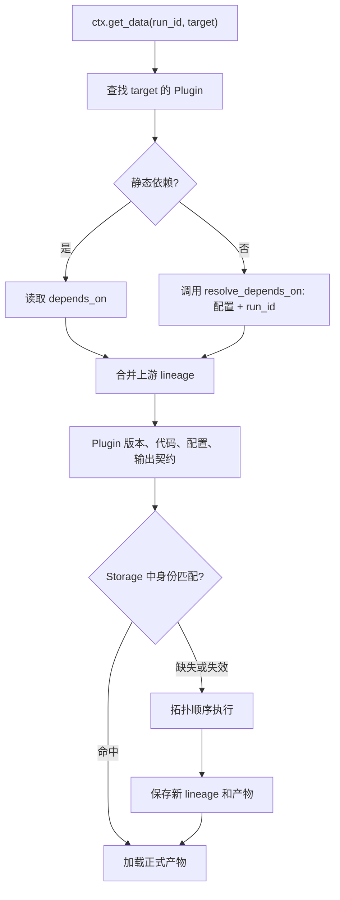

# 插件系统与模板 API

WaveformAnalysis 把每个分析步骤发布为一个唯一命名的数据产物。调用方请求产物，`Context` 根据
`run_id`、注册表和已解析配置构建依赖关系，执行缺失的插件，并由 Storage 按 lineage 保存结果。
插件负责一个产物的计算；Accessor 负责已经计算结果的组合查询；跨 run 的编排属于批量处理器。

## 系统边界与数据流

本节只说明请求和结果如何穿过系统边界；`provides`、`depends_on`、版本和输出字段等插件自身
契约放在下一节，避免把“系统中的一层”和“插件如何声明自己”混为一谈。



| 边界 | 在这一步发生什么 | 不负责什么 |
| --- | --- | --- |
| DAQ adapter | 把文件格式、目录布局、采样率和时间语义转换为统一输入 | 不决定分析算法、插件依赖或缓存键 |
| `Context` | 接收带 `run_id` 的请求，持有注册表，解析配置和依赖并协调执行 | 不实现具体信号算法，也不维护隐式当前 run |
| Plugin runtime | 按 Context 解析出的 DAG 调用插件，并传递已经声明的上游结果 | 不定义插件的输出字段，也不负责交互式组合查询 |
| Storage | 按 run 和 lineage 保存、加载和校验计算结果 | 不定义产物的物理含义，也不替插件决定依赖 |
| Accessor | 组合正式产物，按 ID、时间或通道组织只读查询 | 不发布新的缓存产物，也不重新实现处理算法 |
| `BatchProcessor` | 为多个独立 run 调度同一目标产物并收集结果 | 不把多个 run 合并成一个插件状态 |

一次请求可以概括为：调用方提供 `run_id` 和目标名称，Context 解析配置与 DAG，runtime 执行缺失的
节点，Storage 复用或保存结果，最后由调用方或 Accessor 读取正式产物。插件实例可以被多个 run
复用，因此插件内部的每一次数据访问都必须显式带上 `run_id`。

## Plugin 身份与输出契约

最小插件由四个互相配合的声明组成：`provides` 标识产物，`depends_on` 标识输入，`version` 标识
语义版本，`compute()` 产生实际结果。它们描述的是插件自身的可追踪身份，不是上一节的系统层次。

```python
import numpy as np

from waveform_analysis.core.plugins.core.base import Option, Plugin


class RecordScalePlugin(Plugin):
    # Context 用这个名称查找插件，也把它作为缓存和 lineage 的数据名。
    provides = "record_scale"
    # compute() 会读取 records，因此必须把它声明为上游依赖。
    depends_on = ["records"]
    # 算法、配置语义或输出契约变化时升级版本，旧缓存才不会被误复用。
    version = "1.0.0"
    # 结构化输出的字段和 dtype 是下游可以依赖的公开契约。
    output_dtype = np.dtype([("record_id", "i8"), ("value", "f4")])
    options = {
        # Option 负责默认值、类型和范围检查；实际值由 Context 解析。
        "scale": Option(default=1.0, type=float, min_value=0.0, help="输出缩放系数"),
    }

    def compute(self, context, run_id, **kwargs):
        # 上游数据必须通过显式 run_id 获取，不能依赖隐式当前 run。
        records = context.get_data(run_id, "records")
        # 不直接读取 context.config，统一走配置解析和校验流程。
        scale = context.get_config(self, "scale")
        # 即使 records 为空，也要返回同一 output_dtype 的空数组。
        result = np.empty(len(records), dtype=self.output_dtype)
        result["record_id"] = records["record_id"]
        result["value"] = records["area"] * scale
        return result
```

| 声明 | 运行时含义 | 必须保持的事实 |
| --- | --- | --- |
| `provides` | 结果的全局名称和请求入口 | 同一注册表中唯一，语义变化视为契约变化 |
| `depends_on` | 静态上游产物和 DAG 边 | 只列出 `compute()` 实际读取的产物 |
| `version` | 插件语义版本，参与 lineage | 算法、配置语义、依赖或输出契约变化时升级 |
| `output_dtype` | 结构化 NumPy 输出的字段、类型和顺序 | 实际返回值必须匹配，空输入也返回同一 dtype |
| `output_schema` | 非 ndarray 输出的正式结构 | 用于 list、dict、DataFrame 等非结构化结果 |
| `output_kind` | `static` 或 `stream` | 流式插件返回 chunk 迭代器 |
| `save_when` | `never`、`target` 或 `always` | 只改变持久化时机，不改变产物语义 |

插件只发布一个正式产物。需要把多个产物组合成用户查询结果时，由 Accessor 通过 ID 或索引关系
组织数据，而不是让一个插件同时发布一组互相隐含的结果。

## 注册与配置解析

注册只把插件加入 Context 的注册表，不会立即计算数据。`Context.register()` 接受插件实例、插件类、
插件模块以及嵌套的 list/tuple/set；传入插件类时会自动无参实例化，传入模块时会发现其中的 Plugin
子类。注册阶段会调用 `Plugin.validate()`，并检查 `provides`、依赖格式、`Option`、`save_when`、
`output_kind` 和输出 schema。

```python
from waveform_analysis.core.context import Context
from waveform_analysis.core.plugins import profiles

# Context 保存配置、插件注册表和 Storage；storage_dir 可按项目需要指定。
ctx = Context(config={"data_root": "DAQ", "daq_adapter": "vx2730"})

# profile 返回一组已经组织好的插件；register() 会逐个加入注册表。
ctx.register(*profiles.cpu_default())

# 自定义插件实例也可以单独注册。此处不会执行 compute()。
record_scale = RecordScalePlugin()
ctx.register(record_scale)

# 查看解析后的配置，再请求目标产物；get_data() 才会按需触发 DAG 执行。
ctx.show_resolved_config("record_scale", verbose=True)
scaled = ctx.get_data("run_001", "record_scale")
```

如果同一个 `provides` 已经注册，默认会拒绝覆盖；只有明确传入 `allow_override=True` 才会替换旧
实现。严格的 `require_spec=True` 还会要求插件提供有效的 `spec()` 或 `SPEC`，适合在插件集成和
发布前检查时使用。注册覆盖或插件版本变化会清理相关执行计划、lineage 和配置缓存。

配置项可以通过类属性 `options`、`@option` 或 `@takes_config` 声明。

### 配置优先级与来源

Context 对一个选项按下面的顺序寻找值，越靠前优先级越高：

1. 插件专属嵌套配置，例如 `{"record_scale": {"scale": 0.5}}`；
2. 点号配置，例如 `{"record_scale.scale": 0.5}`；
3. 共享配置，例如 `{"scale": 0.5}`；
4. 已注册 DAQ adapter 对可推断选项提供的值；
5. `Option.default` 插件默认值。

例如，下面三种显式写法分别对应插件专属、点号和共享配置；同一次运行只需要选择一种，避免让
同一个选项出现多个来源：

```python
ctx = Context(
    config={
        "daq_adapter": "vx2730",
        # 推荐：把插件配置放在 provides 名称下面，最容易定位来源。
        "record_scale": {"scale": 0.5},
        # 等价的点号写法是："record_scale.scale": 0.5
        # 共享写法是："scale": 0.5，但会影响所有同名 option。
    }
)
ctx.register(RecordScalePlugin())

plugin = ctx.get_plugin("record_scale")
scale_value = ctx.get_config_value(plugin, "scale")
print(scale_value.value, scale_value.source, scale_value.original_key)

# 运行中修改配置会清除解析缓存；下一次读取时重新校验并生成新配置身份。
ctx.set_config({"scale": 0.75}, plugin_name="record_scale")
resolved = ctx.get_resolved_config("record_scale")
print(resolved.to_dict())
```

| API | 用途 | 适合什么时候使用 |
| --- | --- | --- |
| `ctx.register(...)` | 加入插件实例、类、模块或插件集 | Context 初始化阶段 |
| `ctx.set_config(...)` | 修改全局或某个插件的原始配置 | 用户选择参数或运行前覆盖默认值 |
| `ctx.get_config(plugin, name)` | 读取已经校验后的单个值 | `compute()` 内部计算 |
| `ctx.get_config_value(plugin, name)` | 同时读取值、来源和原始键名 | 调试优先级、alias 或 adapter 推断 |
| `ctx.get_resolved_config(plugin)` | 获取插件完整的解析配置 | 生成配置快照、比较 lineage |
| `ctx.show_resolved_config(plugin, verbose=True)` | 打印按来源分组的配置 | 人工检查最终生效值 |

显式配置可以在创建 Context 时传入，也可以用 `ctx.set_config(config)` 更新；传入
`plugin_name="record_scale"` 时，更新只写入该插件的配置块。更新后 Context 会清除配置和相关性能
缓存，下次读取时重新解析。配置值经过 `Option` 的类型、choices、范围、单位和自定义校验；旧名称
alias 如果存在，会先规范化为当前选项名。

```python
from waveform_analysis.core.plugins.core.base import Option, option, takes_config


@option("threshold", default=12.0, type=float, min_value=0.0)
@takes_config({"mode": Option(default="standard", choices=["standard", "strict"])})
class ConfiguredPlugin(Plugin):
    provides = "configured_output"
    depends_on = []

    def compute(self, context, run_id, **kwargs):
        # get_config() 返回已经完成类型、范围和单位处理的值。
        threshold = context.get_config(self, "threshold")
        mode = context.get_config(self, "mode")
        return self._compute(threshold, mode)
```

插件内部使用 `context.get_config(self, name)` 只取值；需要判断值从哪里来时使用
`context.get_config_value(self, name)`，它返回值、来源、原始键名和规范键名。需要一次查看插件
全部配置时使用 `ctx.get_resolved_config("record_scale")`，可编程读取 `to_dict()`，或者使用
`ctx.show_resolved_config("record_scale", verbose=True)` 查看 explicit、adapter inferred 和默认值
分组。`track=False` 的选项不会进入用于 lineage 的配置快照，适合只影响日志或执行细节而不改变结果
语义的参数；会改变结果的选项应保持默认的 `track=True`。

## 依赖解析与 lineage

静态依赖来自类属性；动态依赖覆盖 `resolve_depends_on(context, run_id=None)`。动态解析器的返回值
就是本次运行的实际输入边，Context 会在构建执行计划、检查版本约束和计算 lineage 时使用同一结果。



动态插件应保持 `depends_on = []`，并让解析器返回所有 `compute()` 会读取的上游：

```python
class ChannelFeaturePlugin(Plugin):
    provides = "channel_features"
    depends_on = []
    version = "1.0.0"
    options = {"use_filtered": Option(default=False, type=bool)}

    def resolve_depends_on(self, context, run_id=None):
        source = "wave_pool_filtered" if context.get_config(self, "use_filtered") else "wave_pool"
        return ["records", source]

    def compute(self, context, run_id, **kwargs):
        records = context.get_data(run_id, "records")
        source = self.resolve_depends_on(context, run_id)[1]
        waves = context.get_data(run_id, source)
        return self._build_features(records, waves)
```

解析器不能读取临时文件、随机值或可变全局状态；同一配置和 run 必须返回同一依赖集合。静态依赖和
动态解析器同时存在时，注册校验会发出警告，因为两套来源无法准确表达实际 DAG。

| 现象 | 当前实现中的原因 | 排查方向 |
| --- | --- | --- |
| 注册时报 `provides` 冲突 | 两个插件声明了同一个产物名称 | 保留唯一生产者，或显式替换插件 |
| 动态结果反复重算 | 解析结果、版本、配置或输出契约改变 | 检查 `resolve_depends_on()`、`track` 和版本 |
| 依赖缺失或执行顺序错误 | `compute()` 读取了未声明产物 | 把所有读取加入静态或动态依赖返回值 |
| 缓存文件存在但未命中 | 文件的 lineage 与当前身份不一致 | 检查插件版本、代码、配置、dtype 和上游 lineage |

## Plugin 内部数据获取与生命周期

`compute(context, run_id, **kwargs)` 是普通插件唯一必须实现的计算入口。上游依赖由 Context 提前
解析，插件通过 `context.get_data(run_id, dependency)` 获取正式产物，通过 `context.get_config(self,
key)` 获取配置。插件不应保存跨 run 数据，也不应使用隐式“当前 run”。

返回值必须匹配 `output_dtype` 或 `output_schema`。空输入返回同一契约的空结果；`None`、临时字段或
不同 dtype 都会让下游和缓存身份失去确定性。

`on_error(context, exception)` 用于记录或释放计算失败时的诊断资源，不能吞掉异常或写入伪造成功结果。
`cleanup(context)` 在成功、失败和取消路径的 `finally` 阶段执行，适合关闭文件、临时缓冲区和设备会话。
清理失败只记录警告，不覆盖原始计算异常，因此清理函数必须幂等。

## Chunk Plugin：流式与批量计算

`Chunk` 封装一段数据及其半开时间范围 `[start, end)`。构造时会检查数据起点不早于 `start`，并检查
每条记录的结束时间不超过 `end`。这使相邻 chunk 可以拼接，也使边界越界在计算后立即暴露。


### `StreamingPlugin`

继承 `StreamingPlugin` 的插件实现 `compute_chunk(chunk, context, run_id, **kwargs)`。基类会：

1. 从第一个已解析依赖获取输入流；已有迭代器直接传递，静态 ndarray 按 `chunk_size` 转为 chunk。
2. 根据 `break_threshold_ps` 切分不连续时间段，并用 `required_halo_ns` 扩展边界上下文。
3. 调用 `compute_chunk()`，把普通 ndarray 包装为输出 `Chunk`。
4. 按 `main_start`/`main_end` 裁剪 halo 产生的重复区域，再验证时间边界。
5. 在并行模式下分批提交任务并保持输出顺序；不可 pickle 的进程任务回退到线程执行器。

```python
from waveform_analysis.core.plugins.core.streaming import StreamingPlugin
from waveform_analysis.core.processing.chunk import Chunk


class ThresholdStreamPlugin(StreamingPlugin):
    provides = "threshold_hits"
    depends_on = ["st_waveforms"]
    chunk_size = 50_000
    parallel = True

    def compute_chunk(self, chunk: Chunk, context, run_id, **kwargs):
        hits = detect_threshold(chunk.data)
        return Chunk(
            data=hits,
            start=chunk.start,
            end=chunk.end,
            run_id=run_id,
            data_type=self.provides,
            time_field=chunk.time_field,
            dt_field=chunk.dt_field,
            length_field=chunk.length_field,
            endtime_field=chunk.endtime_field,
            dt=chunk.dt,
        )
```

有状态插件必须保持输入顺序；当 `is_stateful=True` 且 `parallel=True` 时，运行时会警告并退回串行，
在 break 分段切换时按 `reset_on_break` 重置状态。需要跨 chunk 上下文时，应使用 halo 或显式状态协议，
不能依赖任务提交顺序以外的全局变量。

### `BatchProcessingPlugin`

`BatchProcessingPlugin` 是面向有限大数据集的 `StreamingPlugin` 语义封装。它默认使用 `chunk_size=50000`、
线程执行器和并行处理，子类实现 `compute_chunk()`；基类的 `compute()` 仍然返回 chunk 流。

```python
import numpy as np

from waveform_analysis.core.plugins.core.batch_processing import BatchProcessingPlugin
from waveform_analysis.core.processing.chunk import Chunk


class AreaBatchPlugin(BatchProcessingPlugin):
    provides = "area_features"
    depends_on = ["st_waveforms"]
    output_dtype = np.dtype([("time", "i8"), ("area", "f4")])
    chunk_size = 10_000

    def compute_chunk(self, chunk: Chunk, context, run_id, **kwargs):
        result = np.empty(len(chunk.data), dtype=self.output_dtype)
        result["time"] = chunk.data["timestamp"]
        result["area"] = integrate_waveforms(chunk.data)
        return Chunk(
            data=result,
            start=chunk.start,
            end=chunk.end,
            run_id=run_id,
            data_type=self.provides,
            time_field="time",
        )
```

`compute_array()` 是向后兼容的完整数组接口：它要求恰好一个输入依赖，逐块调用 `compute_chunk()`，
再合并非空结果。多个输入依赖、非 NumPy 结构化输入或越过 chunk 边界的输出会直接失败，原因是该接口
无法为多个来源推断单一的切块和合并语义。

## 失败模式与测试要求

| 约束 | 失败原因 | 最小测试 |
| --- | --- | --- |
| 唯一 `provides` | 注册表出现两个生产者 | 注册冲突测试 |
| 显式 `run_id` | 不同 run 共用内存或缓存 | 两个 run 顺序访问并比较 lineage |
| 输出契约稳定 | 返回 dtype、字段或空结果不一致 | 正常输入和空输入测试 |
| 动态依赖确定 | 同一配置返回不同上游 | 覆盖每个分支并重复解析 |
| chunk 边界合法 | 记录结束时间超过 chunk.end | 构造越界 Chunk 并断言失败 |
| 状态顺序保持 | 并行执行改变状态演化 | `is_stateful` 自动串行测试 |
| 配置进入 lineage | 结果参数被标记为 `track=False` | 改变配置并比较缓存身份 |

提交插件前还应验证：无效 option、缺失输入、不支持 adapter、进程 executor 的不可 pickle 回退、
`on_error()`/`cleanup()` 生命周期，以及内置插件参考页中的配置、输出字段和依赖是否同步。

交互式插件 DAG 仍可从站点的独立 DAG 工具查看；本页只保留依赖解析和执行所需的事实，不重复描述独立
可视化工具的使用方式。

---

Plugin bundle 是一个正式插件产物的独立 Python 包。它把实现、机器可读元数据、公开导出、
依赖声明和定向测试放在同一目录中，使插件的代码属主、缓存版本和维护边界保持一致。

> 本文中的 plugin bundle 指插件源码目录，不是 `RecordsBundle`、`RecordsBundleRef` 等运行时
> 数据容器。后者只是多个正式产物复用计算或存储的内部实现。

## 核心规则

内置插件遵循一个 `provides` 对应一个 bundle：

```text
waveform_analysis/core/plugins/builtin/
├── records/              # provides: records
├── wave_pool/            # provides: wave_pool
├── hit_threshold/        # provides: hit_threshold
├── hit_merged/           # provides: hit_merged
├── peaklets/             # provides: peaklets
└── peaklet_channels/     # provides: peaklet_channels
```

一个 bundle 只拥有一个正式插件产物。具有相近功能、共享底层计算或处于同一 DAG 家族，
都不构成把多个 `provides` 合并到同一插件中的理由。

## 标准目录

```text
<provides>/
├── manifest.yaml
├── __init__.py
├── plugin.py
├── _compute.py           # 可选
├── requirements.txt
└── tests/
    └── test_<provides>.py
```

| 文件 | 职责 |
| --- | --- |
| `manifest.yaml` | 声明 `provides`、插件类、版本和依赖关系 |
| `plugin.py` | 插件类、配置解析以及与 Context 的交互 |
| `_compute.py` | 可选的纯计算、Numba kernel 或共享实现 |
| `__init__.py` | bundle 的稳定公开 Python API |
| `requirements.txt` | bundle 的第三方运行依赖 |
| `tests/` | 与该产物契约直接对应的定向测试 |

`plugin.py` 与 `_compute.py` 的拆分不是强制的。只有在计算逻辑需要独立测试、跨实现复用，
或需要把编排层与热点算法分开时才增加 `_compute.py`。

## Manifest 是插件属主声明

典型 manifest：

```yaml
provides: hit_threshold
plugin_class: ThresholdHitPlugin
version: 1.2.0
depends_on:
  - records
third_party_dependencies:
  - numpy
plugin_dependencies: []
category: feature_extraction
```

字段含义：

- `provides`：DAG 和 Context 使用的正式数据产物名，全局唯一。
- `plugin_class`：拥有该产物的插件类。
- `version`：插件行为版本，参与缓存 lineage。
- `depends_on`：正式数据依赖，不表示 Python import 关系。
- `third_party_dependencies`：NumPy、SciPy 等外部 Python 依赖。
- `plugin_dependencies`：跨 bundle 的实现复用关系。
- `category`：文档和发现层使用的分类。

注册表只扫描含 `manifest.yaml` 的目录，因此缺少 manifest 的 legacy 模块不属于正式 bundle。

## `__all__` 是公开导出真源

bundle 的 `__init__.py` 隔离内部文件布局，并明确允许外部使用的名称：

```python
from waveform_analysis.core.plugins.builtin.peaklets._compute import PEAKLET_DTYPE
from waveform_analysis.core.plugins.builtin.peaklets.plugin import PeakletPlugin

__all__ = ["PeakletPlugin", "PEAKLET_DTYPE"]
```

推荐从 bundle 根路径导入：

```python
from waveform_analysis.core.plugins.builtin.peaklets import (
    PEAKLET_DTYPE,
    PeakletPlugin,
)
```

外部代码不应依赖 `plugin.py`、`_compute.py` 或其他私有文件的位置。内部实现可以调整，
但 `__all__` 中名称的对象身份和语义属于公开兼容契约。

## Canonical Bundle 与兼容转发

部分历史家族入口仍会转发兄弟 bundle。例如 `builtin.hit` 可导出
`ThresholdHitPlugin`，但该插件的 canonical bundle 是 `builtin.hit_threshold`；
`builtin.peaks` 也会转发 peaklet 家族的类和 dtype。

判断属主时遵循：

1. `manifest.yaml` 中 `plugin_class` 所在 bundle 是插件类的 canonical owner。
2. leaf bundle 自己声明的 dtype、常量和 helper 由该 leaf bundle 所有。
3. 家族入口中的 re-export 只用于兼容，不转移代码属主、版本或测试责任。
4. `builtin.cpu`、`builtin` 和 `core.plugins` 是兼容 facade，不是新的插件 bundle。

新代码应优先使用 canonical bundle 路径。维护兼容入口时必须保证转发结果与 canonical
对象相同，不能复制类、dtype 或常量。

## 共享计算不合并产物

一个 `provides` 一个 bundle 不禁止共享实现。例如 `records` 与 `wave_pool` 可以复用
`records/_compute.py` 中的底层构建逻辑，但仍由两个插件分别提供正式产物：

```text
records/_compute.py       # 共享底层构建逻辑
records/plugin.py         # provides: records
wave_pool/plugin.py       # provides: wave_pool
```

共享必须满足：

- 算法属主唯一，兄弟 bundle 单向依赖属主实现。
- 每个正式产物保持独立的插件类、`provides`、version 和 lineage。
- 下游插件只依赖正式产物，不依赖内部 bundle、临时文件或私有 Context 状态。
- 修改共享实现时同时检查所有消费方的行为、缓存版本和测试。

## Bundle、Plugin Set 与 Profile

三者解决不同问题：

| 概念 | 作用 | 是否拥有插件实现 |
| --- | --- | --- |
| Bundle | 封装一个正式产物的实现与契约 | 是 |
| Plugin Set | 组合一个职责域需要的若干插件 | 否 |
| Profile | 组合多组插件形成可执行 pipeline | 否 |
| 兼容 facade | 保留旧导入路径并转发公开名称 | 否 |

插件属于哪个 bundle 不会因为它被加入某个 Plugin Set 或 Profile 而改变。

## 新增 Bundle 检查单

1. 创建 `builtin/<provides>/`，确保目录名与 `provides` 一致。
2. 在 `manifest.yaml` 声明唯一 `provides`、`plugin_class`、version 和依赖。
3. 在 `plugin.py` 实现单一职责的插件类。
4. 在 `__init__.py` 用显式 `__all__` 暴露稳定接口。
5. 仅在需要时增加 `_compute.py`，避免复制兄弟 bundle 的算法。
6. 在 bundle 自己的 `tests/` 中覆盖正常路径、空输入、边界输入和 dtype。
7. 按使用场景把插件加入适当的 Plugin Set；不要把注册逻辑放回兼容 facade。
8. 生成插件参考文档，并运行影响、schema、文档同步与锚点检查。

插件契约、依赖、配置、lineage 和生命周期的完整说明见

---

## 插件 Version 升级策略

插件的 `version` 字段用于缓存 lineage 管理。当插件的行为、输出结构或配置语义发生变化时，必须升级 `version` 以触发下游缓存失效，确保数据一致性。

### 版本格式

插件 `version` 遵循语义化版本（Semantic Versioning）规范：

```
MAJOR.MINOR.PATCH
```

例如：`"1.2.3"`

- **MAJOR**（主版本号）：破坏性变更，不兼容旧数据或配置
- **MINOR**（次版本号）：向后兼容的功能变更或算法修改
- **PATCH**（修订号）：向后兼容的 bug 修复或性能优化

### 升级规则

#### MAJOR 升级（X.0.0）

**触发场景**：破坏性变更，导致输出结构、契约或依赖关系不兼容。

**具体情况**：

1. **输出 dtype 字段删除或重命名**
   - 删除已有字段（下游代码可能依赖该字段）
   - 重命名字段（例如 `record_id` 改为 `rid`）
   - 字段类型不兼容变更（例如 `i4` 改为 `i8`，可能导致精度或溢出问题）

2. **`provides` 名称变更**
   - 修改插件的 `provides` 值会破坏依赖关系

3. **不兼容的配置项变更**
   - 删除配置项（没有默认值的情况）
   - 配置项语义变更（例如时间单位从 ns 改为 us）
   - 配置项取值范围变更导致现有配置失效

4. **依赖关系破坏性变更**
   - 修改 `depends_on` 列表，移除原有依赖
   - 修改依赖的解析逻辑，导致无法兼容旧配置

**示例**：

```python
# MAJOR 升级示例：字段重命名
# 从 version "1.5.2" -> "2.0.0"

# 旧版本
output_dtype = np.dtype([
    ("record_id", "i8"),
    ("position", "i8"),
])

# 新版本（字段重命名）
output_dtype = np.dtype([
    ("rid", "i8"),  # record_id 改为 rid
    ("position", "i8"),
])
```

#### MINOR 升级（0.X.0）

**触发场景**：向后兼容的功能变更、算法逻辑修改或配置扩展。

**具体情况**：

1. **输出 dtype 新增字段（向后兼容）**
   - 在结构化数组中新增字段，不影响现有字段
   - 下游插件可以选择性使用新字段

2. **算法逻辑变更**
   - 内部实现路径变更，即使输出数值完全相同
   - 例如：从 tuple 构建改为预分配数组（hit_merged Phase 3）
   - 优化算法分支、数据结构或计算顺序

3. **依赖列表变更**
   - 新增依赖项（不删除原有依赖）
   - 调整依赖解析逻辑但保持兼容

4. **新增配置项（有默认值）**
   - 新增可选配置项，旧配置仍然有效
   - 配置项语义扩展但保持向后兼容

**示例**：

```python
# MINOR 升级示例 1：算法逻辑变更
# hit_merged Phase 3: 内部构建路径从 tuple 改为预分配数组
# 从 version "1.1.0" -> "1.2.0"

# 旧实现（tuple 构建）
def _emit_cluster(hits, indices):
    return (position, start, end, ...)

# 新实现（预分配数组）
def _build_merged_from_cluster_rows(cluster_count):
    output = np.empty(cluster_count, dtype=HIT_MERGED_DTYPE)
    # 原地填充
    return output

# MINOR 升级示例 2：新增字段
# 从 version "1.3.0" -> "1.4.0"

# 旧版本
output_dtype = np.dtype([
    ("position", "i8"),
    ("width", "f4"),
])

# 新版本（新增字段）
output_dtype = np.dtype([
    ("position", "i8"),
    ("width", "f4"),
    ("amplitude", "f4"),  # 新增字段
])

# MINOR 升级示例 3：新增配置项
# 从 version "1.2.0" -> "1.3.0"

options = [
    Option("merge_gap_ns", default=1000),
    Option("enable_feature_x", default=False),  # 新增配置项
]
```

#### PATCH 升级（0.0.X）

**触发场景**：向后兼容的 bug 修复或性能优化，输出结果可能变化但不改变契约。

**具体情况**：

1. **Bug 修复（输出结果变化）**
   - 修复边界条件错误
   - 修复计算错误
   - 修复数据类型转换错误

2. **纯性能优化（输出完全不变）**
   - Numba `parallel=True` 优化（输出数值完全一致）
   - 内存分配优化
   - 缓存友好性优化

3. **文档修正**
   - 修正注释、docstring 或 `agent_doc`
   - 不影响代码行为

4. **类型注解修正**
   - 修正类型提示，不影响运行时行为

**示例**：

```python
# PATCH 升级示例 1：bug 修复
# 从 version "1.2.3" -> "1.2.4"

# 旧实现（bug：边界条件错误）
if end_time < chunk_end:  # 应该是 <=
    process(data)

# 新实现（修复边界条件）
if end_time <= chunk_end:
    process(data)

# PATCH 升级示例 2：性能优化（输出不变）
# 从 version "1.2.4" -> "1.2.5"

# 旧实现
@njit
def compute(data):
    return data.sum()

# 新实现（并行优化，输出完全一致）
@njit(parallel=True)
def compute(data):
    return data.sum()
```

### 缓存失效机制

插件 `version` 的变更会触发缓存 lineage 重新计算：

1. **直接失效**：修改插件的 `version` 会导致该插件的所有缓存失效
2. **级联失效**：依赖该插件的所有下游插件缓存也会失效
3. **重新计算**：下次访问时，整条依赖链会重新执行

因此，即使是 PATCH 升级也应谨慎，确认变更确实需要触发缓存失效。

**示例场景**：

```
hit_threshold (v1.0.0) -> hit_merged (v1.2.0) -> hit_merged_features (v1.1.0)
```

如果 `hit_merged` 升级到 `v1.3.0`：
- `hit_merged` 的所有缓存失效
- `hit_merged_features` 的所有缓存失效
- `hit_threshold` 的缓存不受影响（上游独立）

### 特殊情况处理

#### 内部实现路径变更

即使输出结果完全相同，内部实现路径的变更也应触发 **MINOR 升级**。

**原因**：

- 缓存 lineage 基于插件代码的完整性
- 实现路径变更可能引入微小的数值差异（浮点运算顺序）
- 保守策略确保数据一致性

**案例参考**：

- `hit_merged` 优化（升级到 v1.1.2）：从 tuple 构建改为预分配数组。
- `hit_merged_features` 优化（升级到 v0.3.0）：从 Python 循环改为 Numba 单 pass。

#### 文档-only 变更

纯文档变更（修改 `agent_doc`、注释、docstring）**不需要**升级 `version`。

**判断标准**：

- 代码行为完全不变
- 输出结果完全不变
- 配置解析逻辑不变

#### 依赖版本约束

插件不直接声明依赖插件的版本约束。依赖关系通过 `provides` 名称解析，版本管理由缓存 lineage 自动处理。

### 升级 Checklist

升级 `version` 前确认以下事项：

- [ ] **明确升级原因**：记录为什么需要升级（bug 修复、功能变更、性能优化）
- [ ] **确定升级级别**：根据规则确定 MAJOR/MINOR/PATCH
- [ ] **更新变更日志**：在项目 CHANGELOG 或相关正式文档中记录变更
- [ ] **运行兼容性检查**：执行 `python scripts/schema_compat_check.py --base HEAD --run-smoke`
- [ ] **更新插件文档**：执行 `waveform-docs generate plugins-agent --plugin <provides>`
- [ ] **评估影响范围**：执行 `python scripts/assess_change_impact.py --base HEAD`
- [ ] **运行相关测试**：确保变更不引入回归
- [ ] **评估性能影响**：对于性能关键插件，执行性能回归检查

### 相关资源

- [AGENTS.md](https://github.com/SnowingWolf/WaveformAnalysis/blob/0bc56668c0d2ebf81fc391287fb0097cd94b49f7/AGENTS.md) - 插件契约 checklist（第 208-215 行）
- [schema_compat_check.py](https://github.com/SnowingWolf/WaveformAnalysis/blob/0bc56668c0d2ebf81fc391287fb0097cd94b49f7/scripts/schema_compat_check.py) - 兼容性检查工具
- [assess_change_impact.py](https://github.com/SnowingWolf/WaveformAnalysis/blob/0bc56668c0d2ebf81fc391287fb0097cd94b49f7/scripts/assess_change_impact.py) - 影响评估工具

### 总结

- **MAJOR**：破坏性变更（字段删除/重命名、配置不兼容）
- **MINOR**：向后兼容的功能变更或算法逻辑修改
- **PATCH**：bug 修复或性能优化（输出完全不变时谨慎使用）
- **内部实现路径变更**：即使输出相同，也应 MINOR 升级
- **文档-only 变更**：不需要升级 version

遵循本策略可确保缓存 lineage 的正确性和数据一致性。


---

本指南说明如何使用 **Plugin Set** 与 **Profile** 组合插件，形成可维护的处理链路。[^source]

> 文档同步说明：本页对应 `waveform_analysis/core/plugins/plugin_sets/*` 与
> `waveform_analysis/core/plugins/profiles.py` 中的 `# DOC` 引用。

---

## Plugin Sets

Plugin Set 是最小可复用插件组，每个 set 只关注单一职责。

| Set | 插件 | 说明 |
| --- | --- | --- |
| `io` | RawFileNamesPlugin | 扫描并分组原始文件 |
| `waveform` | WaveformsPlugin, FilteredWaveformsPlugin, RecordsPlugin | 波形提取、滤波与 records 构建 |
| `basic_features` | BasicFeaturesPlugin, WaveformWidthIntegralPlugin | 基础特征计算 |
| `tabular` | DataFramePlugin, GroupedEventsPlugin, PairedEventsPlugin | DataFrame 表格化输出，包括 legacy 事件分组与配对表 |
| `events` | S1S2PairCandidatesPlugin, S1S2PairSelectionPlugin, PositionReconstructionPlugin, EventPlugin, HitGroupedPlugin | 事件构建、S1/S2 配对、位置重建与 legacy hit 分组 |
| `peaks` | HitFinderPlugin, RecordsAsymmetryMaskPlugin, RecordsDetectorMaskPlugin, RecordsVetoMaskPlugin, ThresholdHitPlugin, HitMergeClustersPlugin, HitMergePlugin, HitMergedComponentsPlugin, HitMergedFeaturesPlugin, PeakletPlugin, PeakletComponentsPlugin, PeakletWaveformPlugin, PeakletWaveformPoolPlugin, PeakletFeaturesPlugin, PeakletChannelsPlugin, PeaksPlugin, WaveformWidthPlugin, S1S2ClassifierPlugin, PeakletS1S2ClassifierPlugin | 峰值检测、asymmetry 后通道角色分流、轻量 peaklet 聚类、records-backed peaklet 波形/特征、最终 peaks 输出与 S1/S2 分类 |

`plugins_peaks()` 中 `peaklets` 是轻量聚类产物，旧的 `area`、`height`、
`max_time`、`width`、`rise_time`、`fall_time` 字段由 `peaklet_features`
从 `peaklet_waveforms + peaklet_waveform_pool` 派生；面向用户的主分析表为
`peaks`。

示例：

```python
from waveform_analysis.core.plugins.plugin_sets import plugins_io, plugins_waveform

io_plugins = plugins_io()
waveform_plugins = plugins_waveform()
```

`plugins_waveform()` 已包含 `RecordsPlugin` 与 `WavePoolPlugin`，注册后可直接使用
`records_view`：

```python
from waveform_analysis.core.data import records_view
from waveform_analysis.core.plugins.plugin_sets import plugins_io, plugins_waveform

ctx.register(*plugins_io(), *plugins_waveform())
rv = records_view(ctx, run_id)
```

注意：`records_view(...)` 现在要求正式 `records + wave_pool` 产物同时可用，不会再
fallback 到内部 `RecordsBundle`。

其中 `rv.waves(record_id, ...)` 返回指定 `record_id` 的原始波形，`rv.signals(record_id, ...)`
返回做过 baseline 校正且按 `records.polarity` 统一为负极性的信号。批量访问同样使用
`rv.waves([record_id, ...], pad_to=..., mask=True)` / `rv.signals([record_id, ...], ...)`。

---

## Profiles

Profile 是对多个 Plugin Set 的组合，代表一条可执行 pipeline。

### CPU 默认 Profile

```python
from waveform_analysis.core.context import Context
from waveform_analysis.core.plugins import profiles

ctx = Context()
ctx.register(*profiles.cpu_default())
```

`cpu_default()` 等价于：

```
io + waveform + peaks + basic_features + tabular + events
```

---

## Profile 选择

CLI 可通过 `--profile` 选择执行链路：

```bash
waveform-process --run-name run_001 --profile cpu
```

目前 `streaming` 与 `jax` 仍为占位 Profile，会提示未实现。

---

## 兼容 standard_plugins

历史用法仍可使用：

```python
from waveform_analysis.core.plugins.builtin.cpu import standard_plugins
ctx.register(*standard_plugins)
```

推荐新代码使用 `profiles.cpu_default()`，便于后续扩展。

[^source]: 来源：`waveform_analysis/core/plugins/plugin_sets/`、`waveform_analysis/core/plugins/profiles.py`、`waveform_analysis/cli.py`。
